# 缘起

> 2018年时基于hexo搭建了自己的第一个博客，慢慢的对博客的需求越来越多，hexo博客并不能满足我的想法，因此便有了开发一个自己博客的想法
>
> 2022年毕业季，开始很迷茫，不确定要做什么方向，后来买了一个51单片机，由此，便开启了嵌入式软件开发的职业生涯，也随着coding水平的提升以及AI的强大
>
> 2025年终于可以随心所欲，创造任何自己所想

# react blog

下面展示一下目前有的功能，本人非前后端专业选手，爱敲代码，爱创造，喜欢实现自己想要的功能，喜欢造轮子。哈哈哈哈

## 首页

【导航页】用来记录自己的所有用到的东西，方便跳转

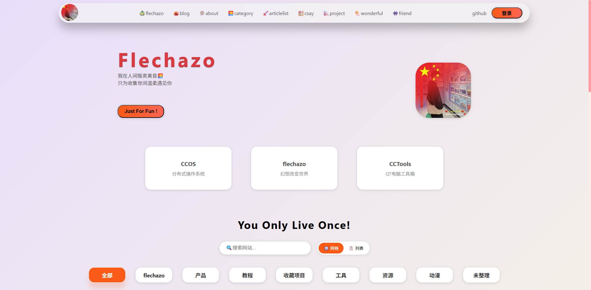

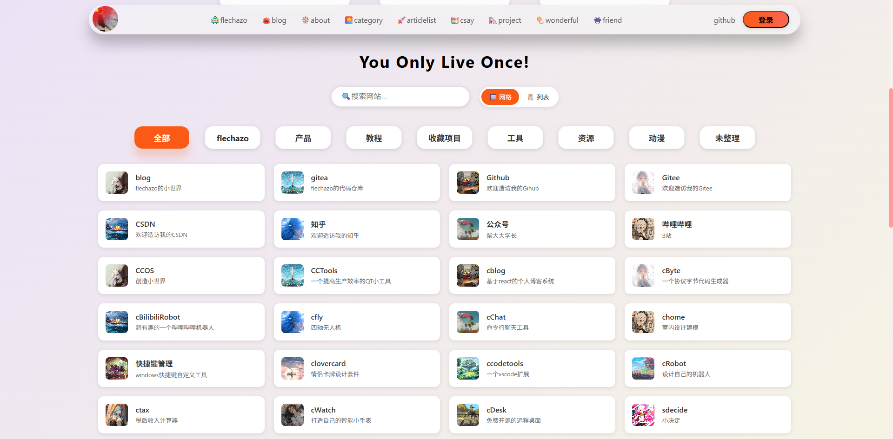

## 博客

【blog】属实是没有什么想法，先随便找个页面顶一顶

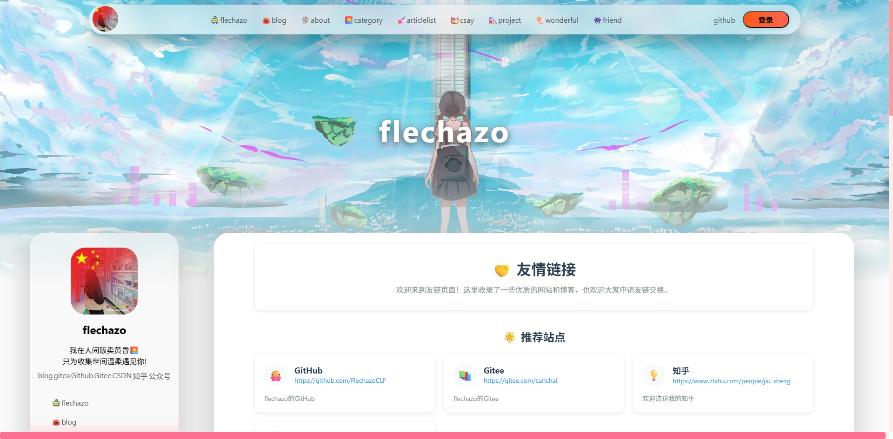

## 关于

【about】这里是渲染的一个markdown文档，哈哈哈有点懒得去整理他的排版

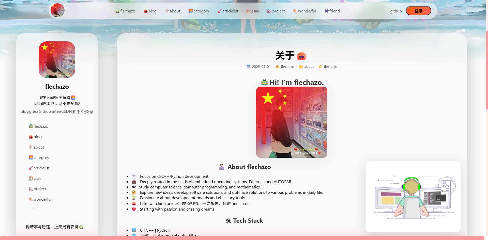

## 分类

【categorize】支持对文章进行分类，可以选择按照文件夹分类或者按照文章内配置

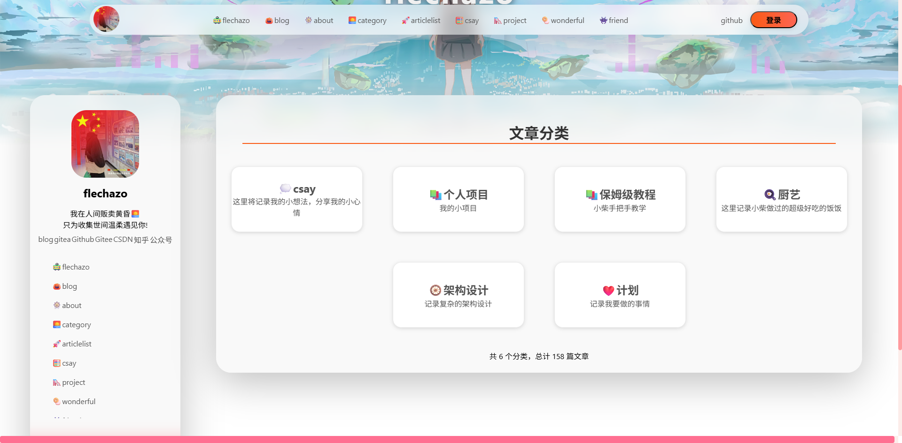

## 文章列表

【articles】这里列出了所有文章，当然这个页面其实我不常用，后面有更加方便的方式

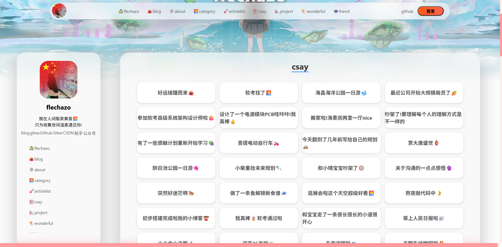

## 碎碎念

【csay】这里按照时间排序，同时支持优先级显示和时间区间显示，方便过滤筛选文章

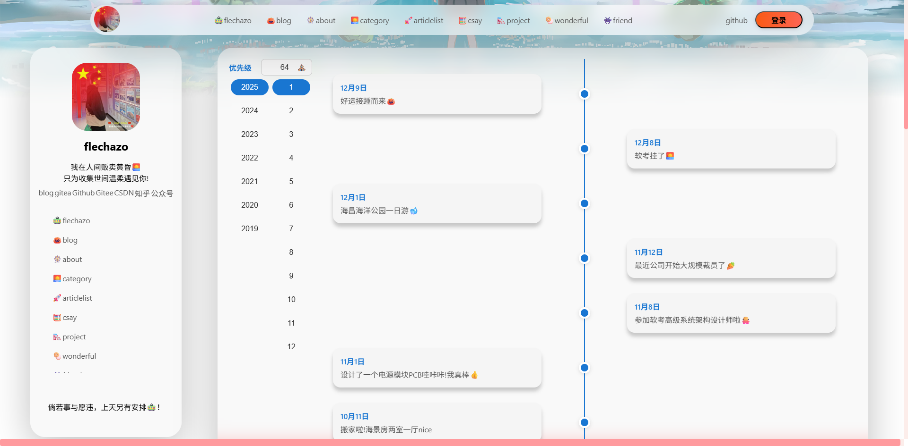

## 友链

【friends】朋友们

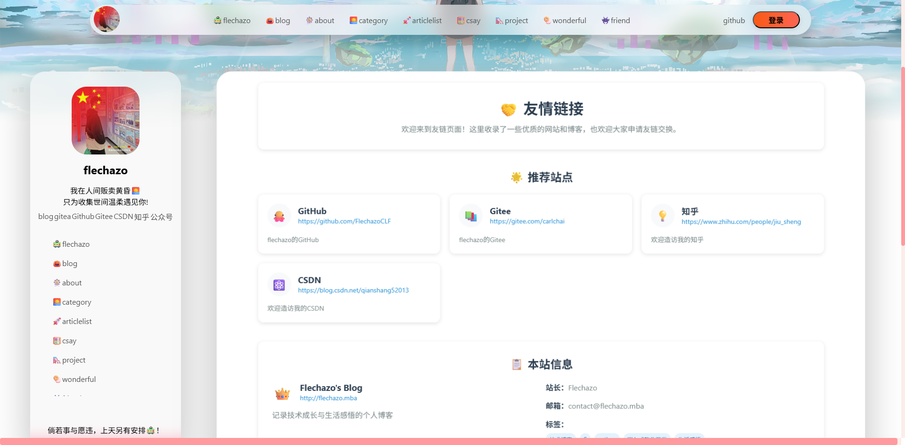

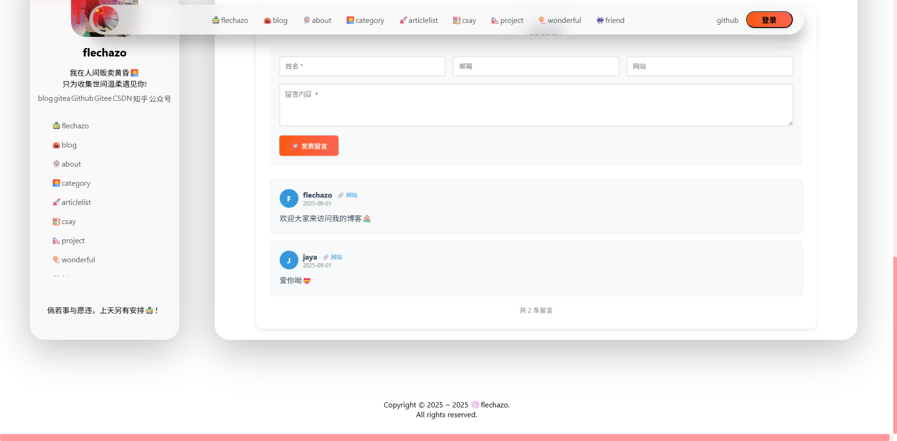

## 爱情

【love】这里计划用来规划一些和女朋友一起做的事情，可以链接到文章

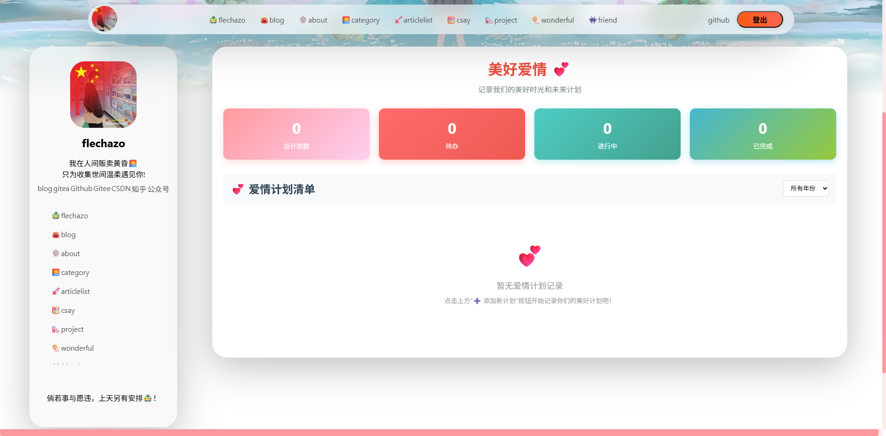

## 聊天

【chat】这里是一个有趣的对话记录，初衷是用来记录有趣的对话

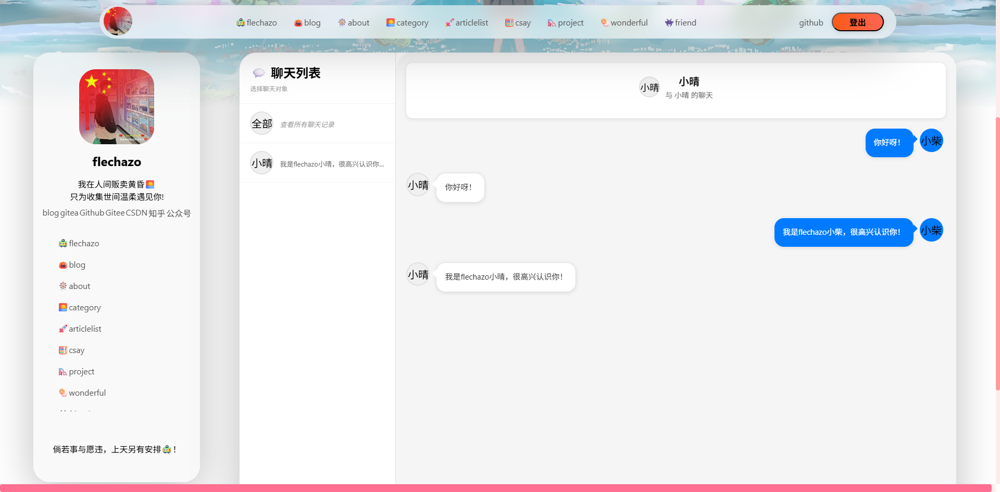

## 厨艺

【cook】记录食谱，当然这里没有图片哈哈哈，疏于维护，后面慢慢完善，每到饭店还在犹豫吃什么吗？来这里瞧瞧吧！可以按照食材，做法分类筛选哦

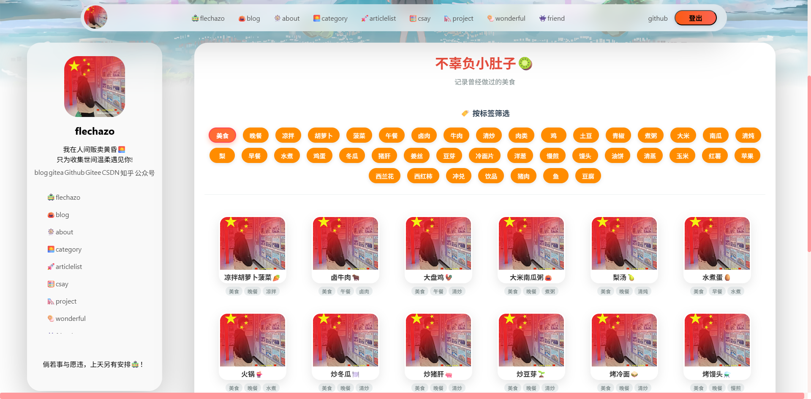

## 架构

【emerge】预期是要有一个可以层层显示的一个架构，可以很方便的展示出各种层级关系，目前完成了基本的层级识别，就差页面渲染优化一下了

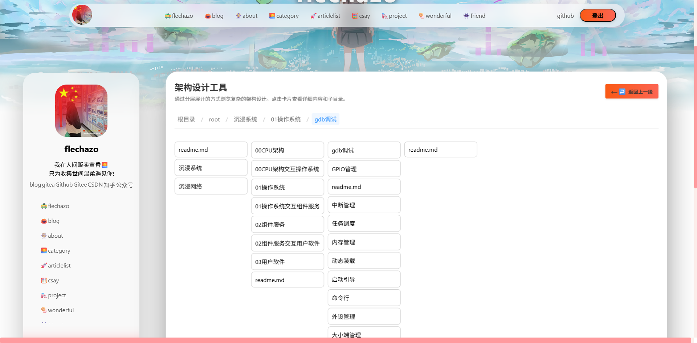

## 地图

【map】这里是最爱的功能，可以根据城市来看文章，很有回忆的样子

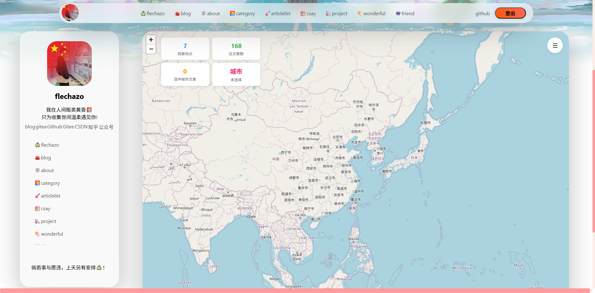

可以看到城市列表

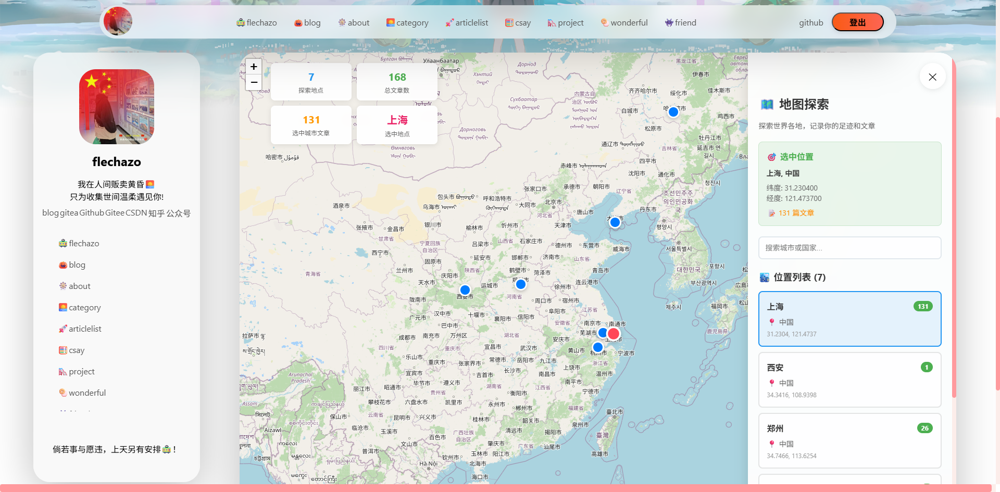

点击后可以展开在该城市发布的文章（这个功能超级爱）

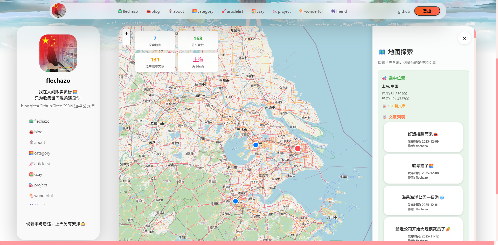

# 代码结构

## 整体结构

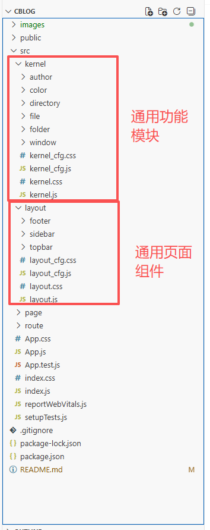

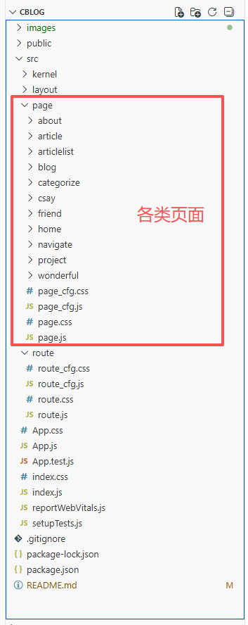

## 文章生成

这里根据输入输出路径去生成文章的索引

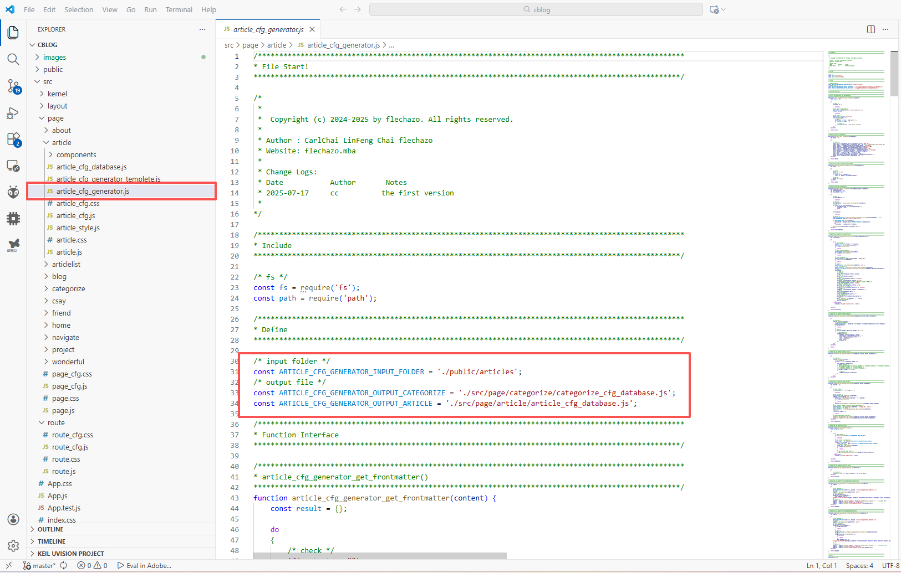

生成后在这里会有所有文章的属性，通过调用函数的方式去添加文章（也为了方便后期动态添加删除等等）

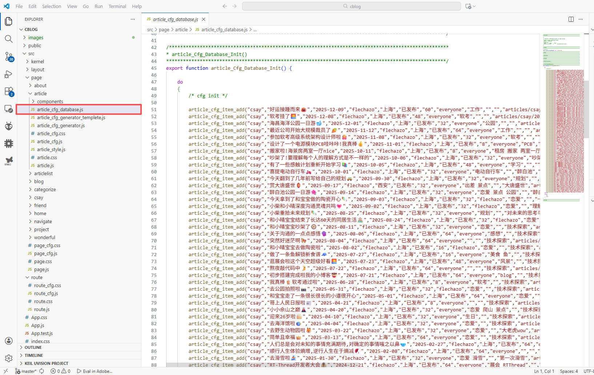

支持的文章头部信息

```markdown
title: 第一次来上海啦🗼
date: 2023-08-26
author: flechazo
location: 上海
state: 已发布
priority: 32
authority: everyone
category: 过往瞬间
tags: 上海
cover: 
description: 接下来的故事，就从这里开始吧
icon:
```


# 缘落

今天先到这里啦
