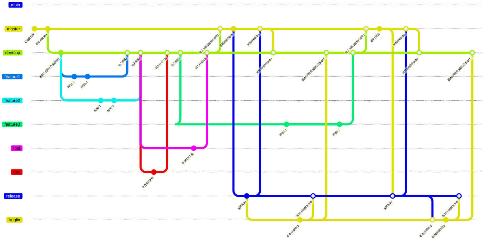
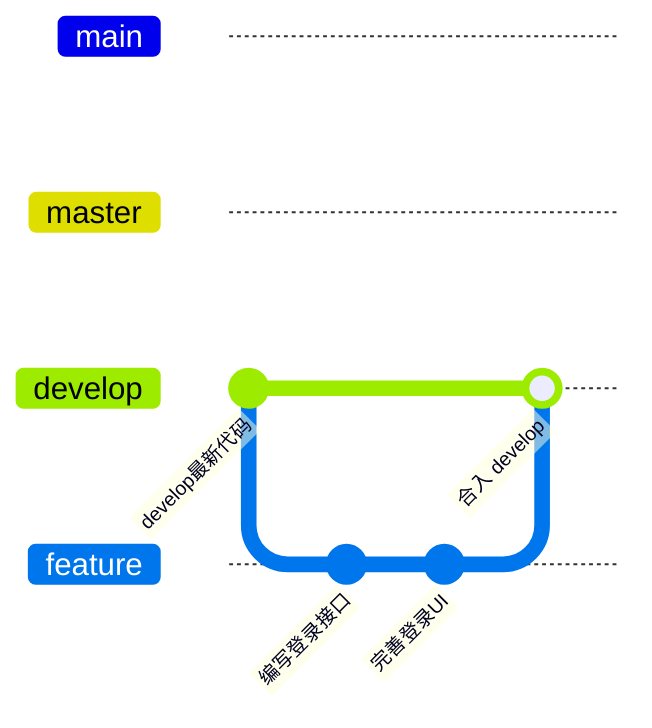
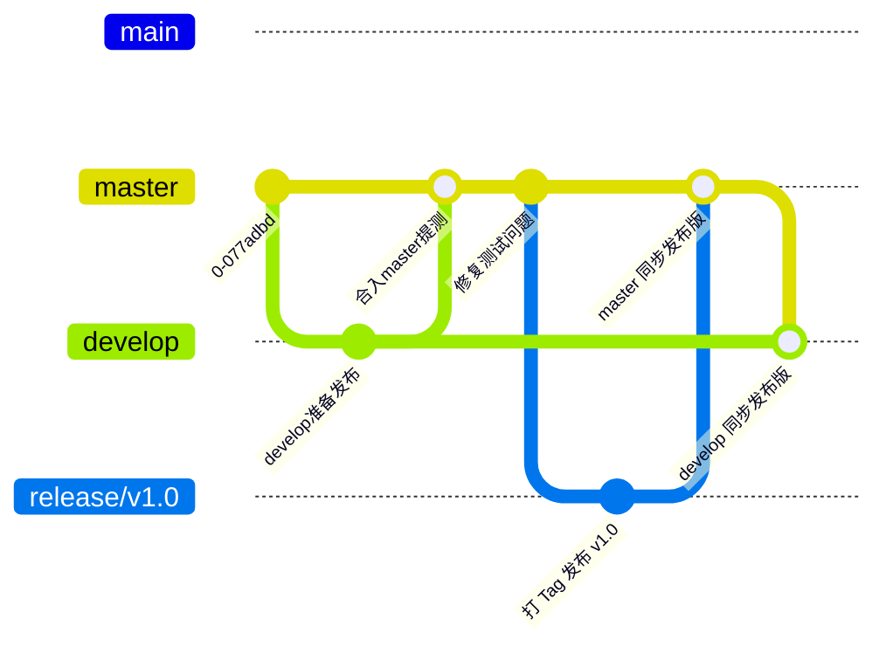
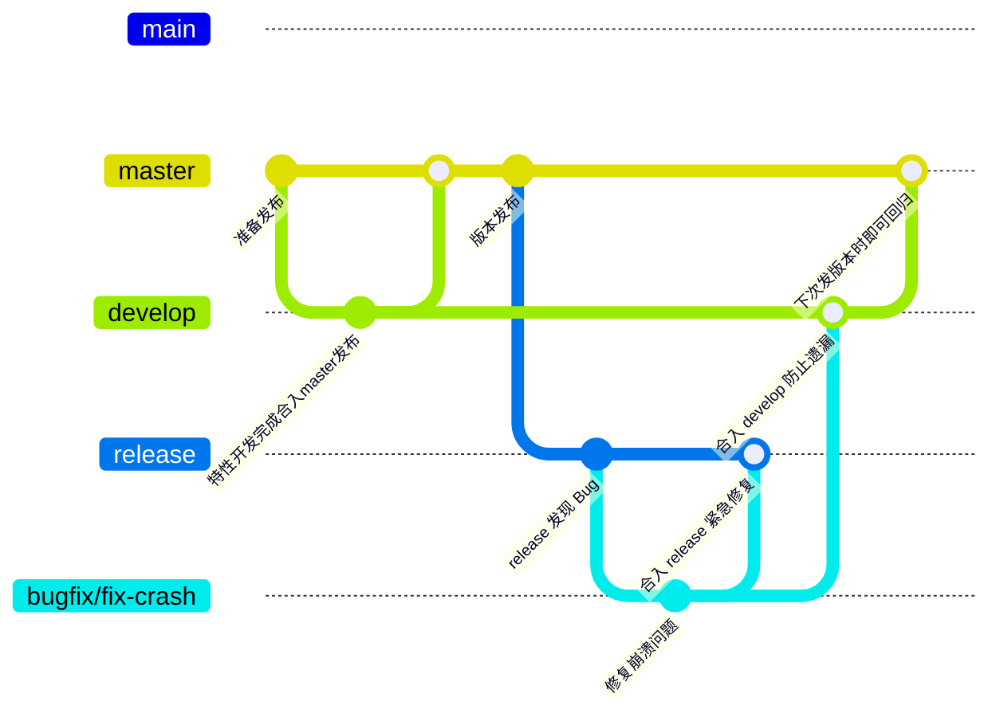
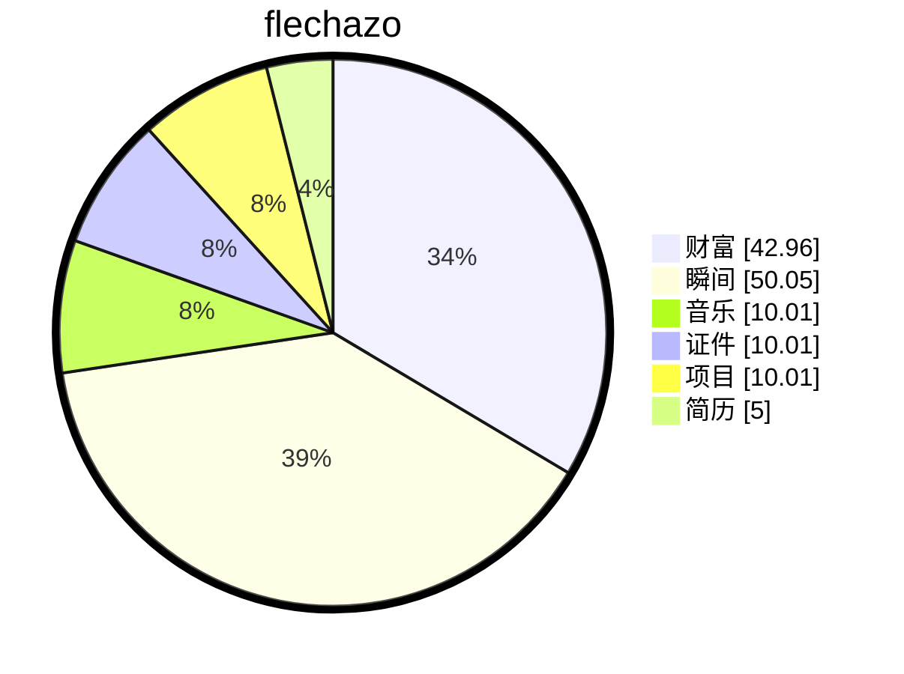

# 缘起

<details open>
    <summary>梦🫧开始的地方</summary>
<p>一切从这里开始</p>
<p>想要把人生梳理的井井有条💮</p>
</details>

# 🚀 打造丝滑的开发体验：企业级 Git 工作流与 Worktree 实践指南

> 在工作中，复杂的外部事件总是影响我们愉快的编程 🤯，因此建立一套清晰、规范的开发流就变得至关重要 💡。

下面是本人结合自身“捶打”经验整理的 Git 工作流，希望可以帮到大家 🤝！



# 🏗️ 项目起始

拿到一个仓库后，强烈建议使用 `git worktree` 创建出这些分支目录。

相比于频繁切换分支，worktree 能让你同时打开多个目录，互不干扰，效率拉满 ⚡！

**核心分支说明：**

- 🏆 **master**：与发布版本保持一致。研发确认提交完毕，测试拿来测试，之后提交给 release。
- 📦 **release**：给客户发布的定版版本（通常在这里打 Tag）。
- 🛠️ **develop**：研发开发的主线，汇聚所有最新特性。
- ✨ **feature**：研发在这里添加功能，完成一个功能后合入 develop。
- 🐛 **bugfix**：遇到任何问题，从这个分支往对应分支合并。
- 📖 **doc**：文档更新。
- 🔧 **tool**：工具/脚本更新。

# 💻 场景一：特性开发 (Feature)

**流程**：`feature` ➡️ `develop`

当需要开发一个新功能时，我们从 `develop` 拉取 `feature` 分支。开发完成后，经过 Code Review，合并回 `develop`。这样能保证主线代码的干净和稳定。



# 🚀 场景二：版本发布 (Release)

**流程**：`develop` ➡️ `master` ➡️ `release`

当 `develop` 分支上的功能积累到一定程度，准备发布新版本时，我们将 `develop` 合入 `master` 进行测试。测试通过后，生成 `release` 版本，并将变更同步回 `develop`，保证主线代码不落后。



# 🩹 场景三：BUG 修复 (Hotfix)

**流程**：`release` ➡️ `bugfix` ➡️ `release` & `develop`

线上版本（`release`）发现 Bug 时，**千万不要直接在 `release` 或 `master` 上改**！应该从 `release` 拉出 `bugfix` 分支，修复后同时合入 `release`（用于紧急发版）和 `develop`（保证后续版本包含此修复）。



# 🪄 小工具：一键初始化工作流

这里提供了一个 bat 脚本，大家赶快用起来吧！

🎉 只需要输入【1、本地目录】【2、远程仓库】即可完成上述工作环境的准备，彻底告别手动敲命令的烦恼。

```bat
@echo off
chcp 65001 >nul
echo "============全自动Git工作流脚本启动!!!============"

SET /P "FOLDER_URL=请输入本地文件夹路径: "
SET /P "GIT_URL=请输入git仓库路径: "

echo "============进入指定目录============"

echo cd %FOLDER_URL%
cd %FOLDER_URL%

echo "============调用git拉指定仓库============"

git clone %GIT_URL% origin
cd origin

echo "============创建远程Git分支============"

git checkout -b master
git push origin master

git checkout -b release
git push origin release

git checkout -b develop
git push origin develop

git checkout -b bugfix
git push origin bugfix

git checkout -b doc
git push origin doc

git checkout -b tool
git push origin tool

echo "============创建多个worktree============"
echo "- origin      ->     原始的仓库"
echo "- master     ->    主线代码"
echo "- release    ->     释放版本"
echo "- develop  ->     开发主线"
echo "- bugfix      ->     bug修复"
echo "- doc           ->     文档更新"
echo "- tool          ->     工具更新"

git worktree add ../master origin/master
git worktree add ../release origin/release
git worktree add ../develop origin/develop
git worktree add ../bugfix origin/bugfix
git worktree add ../doc origin/doc
git worktree add ../tool origin/tool

echo "============工作流创建完成!!!============"

pause
```

💡 **温馨提示**：使用 `worktree` 后，你的本地会多出几个平级的文件夹。

在 IDE（如 VSCode / IDEA）中，你可以直接将这几个文件夹分别打开为独立的工作区，妈妈再也不用担心我切错分支了！😎

# 缘落


