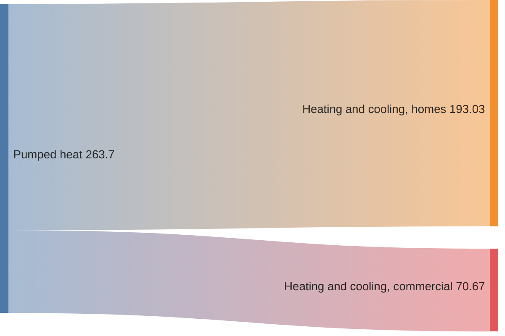

# 缘起

<details open>
    <summary>梦开始的地方</summary>
一切从这里开始
</details>

# 计划

## 整体规划

<details open>
    <summary>功能一</summary>
实现UI拖拽按照协议实现对应的字节定义
自动生成对应的结构体
自动生成对应的位置元素的获取接口
</details>
<details open>
    <summary>功能二</summary>
可以实现opencv功能，实现直接根据图片生成对应的结构定义，从而转为代码
</details>


## 代码路径

```

```

## 代码仓库

```

```

# 任务列表

<details open>
    <summary>任务一<progress value="50" max="100"></progress></summary>
具体详情
</details>

<details open>
    <summary>任务二<progress value="50" max="100"></progress></summary>
具体详情
</details>
## mermaid



## 折叠

<details open>
    <summary>任务一</summary>
具体详情
</details>

## 表单

<form onsubmit="event.preventDefault(); alert('提交成功！');">
  <label>姓名：<input type="text" required /></label><br />
  <label>邮箱：<input type="email" required /></label><br />
  <button type="submit">提交</button>
</form>

## 音频播放器

<audio src="music.mp3" controls>您的浏览器不支持音频播放</audio>

## 视频播放器

<video src="movie.mp4" controls width="100%">
  您的浏览器不支持视频播放
</video>

## 进度条

加载进度： <progress value="100" max="100"></progress>

<div class="custom-progress">
  <div style="width: 10%; background: green; height: 20px;"></div>
</div>

## 文件下载
<a href="file.pdf" download>点击下载 PDF</a>

## 拖拽上传区域
<div style="border: 2px dashed #ccc; padding: 20px; text-align: center;">
  将文件拖到这里上传
  <input type="file" style="display: none;" onchange="handleFile(event)" />
</div>
<script>
  function handleFile(event) {
    const file = event.target.files[0];
    alert(`已选择文件：${file.name}`);
  }
</script>

## 悬停查看提示
<span title="这是一个提示信息">悬停查看提示</span>

