## 本文将会带领大家阅读一下AUTOSAR对SOMEIP的描述

> 笔者有个思想：错综复杂的世界，我要保证获取的知识是绝对正确的！
>
> 或者说将知识分类：不可信、半信半疑、可信。有助于我们做判断以及问题定位。

[flechazo](https://www.zhihu.com/people/jiu_sheng)

全文会引用具体的AUTOSAR文档来进行说明

[文档这里可以下载](https://www.zhihu.com/column/c_1766225940412313602)

小柴带你学AutoSar总目录13 赞同 · 0 评论 文章

## **AUTOSAR_CP_EXP_LayeredSoftwareArchitecture.pdf**

## **整体架构 🏗️**

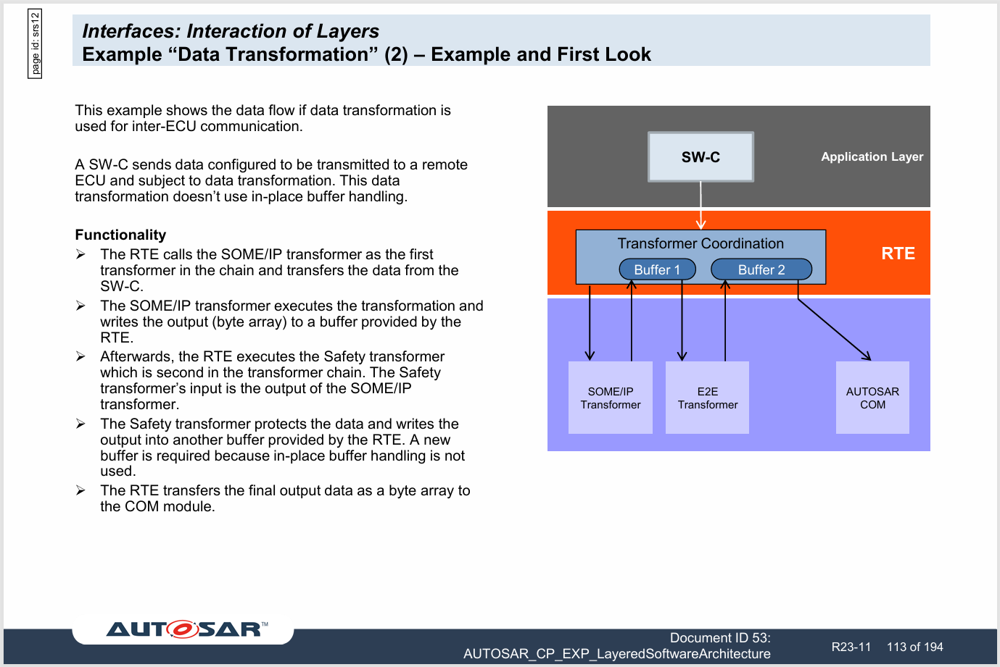

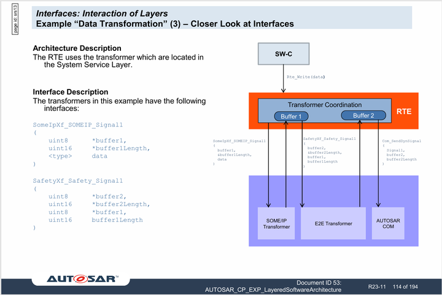

从这里来看：

## **SOMEIPXf与RTE的交互 🔄**

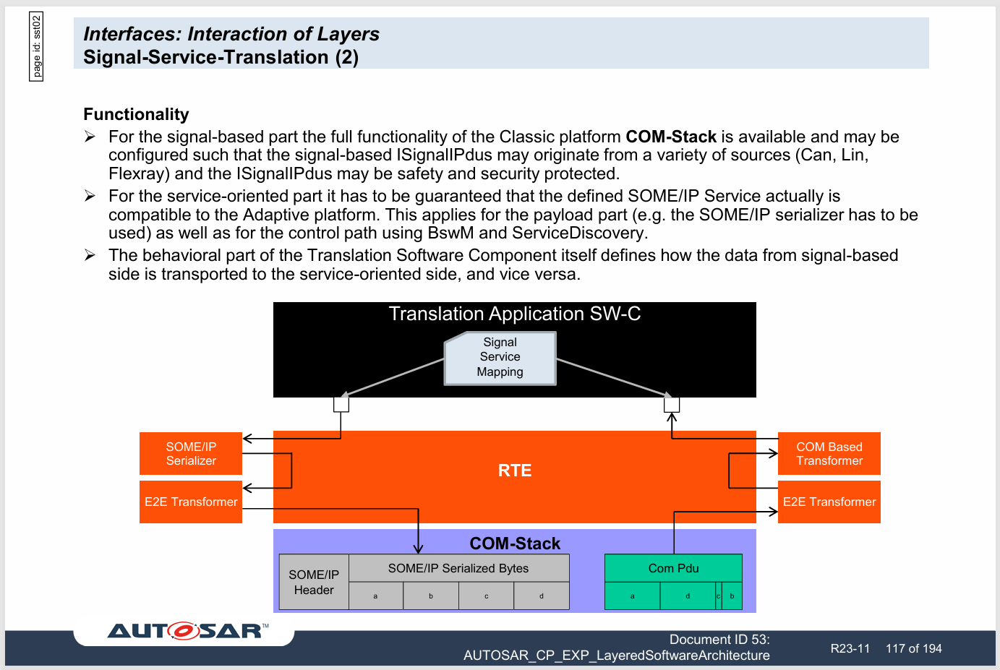

这里是整个发送流程Sender

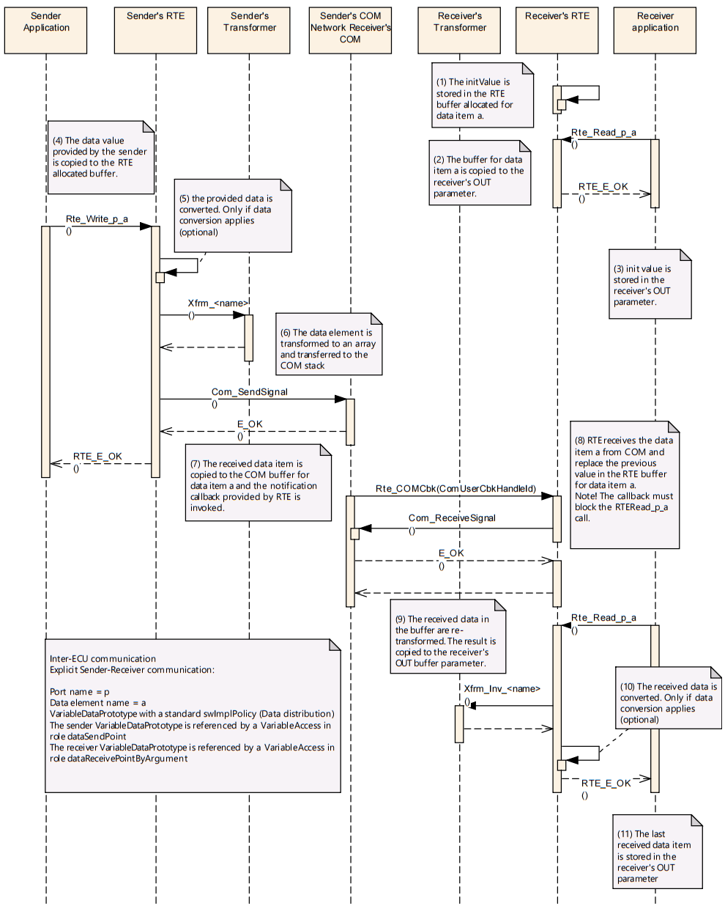

这个是LdCom的流程

这个图之后补充上

> 💡 **补充说明**：SOMEIP作为AUTOSAR中的关键通信协议，其与RTE的交互是实现分布式服务通信的核心。RTE负责将应用层的服务请求转换为SOMEIP消息，而SOMEIPXf则负责消息的序列化与反序列化，确保数据能够在网络中正确传输。

## **AUTOSAR_FO_RS_SOMEIPProtocol.pdf**

## **SOME/IP 协议核心要求 📋**

- **[RS_SOMEIP_00004]** SOME/IP protocol shall support event communication 
- SOME/IP 协议应支持事件通信，即由服务提供者单向发出的通信，支持周期性发送事件或在事件状态改变时发送。  

- *SOME/IP protocol shall support event communication which is a uni-directional communication that is produced and sent by the service provider. Supports periodic event sending or sending when the event changes state.* 
- 🔔 **实际应用**：这使得车辆传感器数据能够实时广播给多个接收方，如发动机温度变化可立即通知多个控制单元。

- **[RS_SOMEIP_00009]** SOME/IP protocol shall support field communication  
- **SOME/IP 协议应支持字段通信，包括 getter、setter 和通知事件。**

 

- *SOME/IP protocol shall support field communication with getters, setters and notification events.* 
- 🔧 **技术细节**：字段通信允许远程访问和修改服务内的数据成员，类似于面向对象编程中的属性访问。

- **[RS_SOMEIP_00012]** SOME/IP protocol shall support session handling  
- **SOME/IP 协议应支持会话管理，并能区分同一服务间多方的并行通信**。 

 

- *SOME/IP protocol shall support session handling and provide a mechanism to distinguish multiple parallel communications between the same parties.* 
- 🔄 **会话管理**：通过会话ID跟踪请求-响应对，确保消息正确匹配，即使存在多个并行通信。

- **[RS_SOMEIP_00015]** SOME/IP protocol shall support multiple instances of a service  
- **同一服务可由多个实体提供，实现故障切换，订阅者可在实例失效时切换。**  

- *The same service is provided by multiple parties in the vehicle to enable fail-over-handling which enables the subscribers to switch to another service instance if the provider of one service instance suffers a failure.* 
- 🛡️ **高可用性**：这种冗余设计确保关键服务即使在某个ECU故障时仍能继续运行。

- **[RS_SOMEIP_00016]** SOME/IP protocol shall support combining multiple RPC methods, events and fields in one service  
- **可将多个方法、事件、字段组合到一个服务中。**

- *SOME/IP protocol shall support combining multiple RPC methods, events and fields in one service.* 
- 📦 **服务封装**：类似于面向对象编程中的类，一个服务可以包含多种功能，提高模块化和重用性。

- **[RS_SOMEIP_00017]** SOME/IP protocol shall support grouping events into event group  
- **支持将事件分组，便于订阅者一次性订阅一组事件。**  

- *SOME/IP protocol shall support grouping events into event group.* 
- 🗂️ **事件分组**：例如，可以将所有与车辆动力系统相关的事件分为一组，便于动力管理模块一次订阅。

- **[RS_SOMEIP_00025]** SOME/IP protocol shall support the identification of callers of an RPC using unique identifiers  
- **支持通过唯一标识符区分同一 ECU 上多个调用者，确保响应能正确分配。**  

- *Callers need to be identified if multiple callers on the same ECU which are using the same socket connection use the same RPC method to be able to assign the response correctly to the request.* 
- 🏷️ **调用者识别**：通过Client ID和Session ID的组合，确保响应能够准确返回给正确的调用者。

## **AUTOSAR_FO_RS_SOMEIPServiceDiscoveryProtocol.pdf**

## **SOME/IP-SD 核心要求 🔍**

- **[RS_SOMEIPSD_00004]** SOME/IP Service Discovery Protocol shall support SOME/IP and non-SOME/IP services  SOME/IP Service Discovery Protocol 
- 应**支持发布和订阅属于 SOME/IP 和非 SOME/IP 服务的数据。**  

- *SOME/IP Service Discovery Protocol shall support to publish and subscribe to data which belongs to SOME/IP and non-SOME/IP services.*  
- 非SOME/IP服务也可通过SD发现和订阅，但后续通信不使用SOME/IP。  

- *Non-SOME-IP services can be discovered and subscribed using SOME/IP SD but they are used afterwards without SOME/IP.* 
- 🌉 **互操作性**：这允许SOME/IP-SD作为不同协议间的桥梁，增强系统集成能力。

- **[RS_SOMEIPSD_00024]** SOME/IP Service Discovery shall support configurable timings  
- **支持可配置的定时参数，便于状态切换。**  

- *SOME/IP Service Discovery shall support configurable timings to enable state changes after a certain time has passed.* 
- ⏱️ **时序控制**：可以根据不同服务的重要性和资源需求，调整其发现和通告的频率。

- **[RS_SOMEIPSD_00008]** SOME/IP Service Discovery Protocol shall support to find the location of service instances  
- **可与未知位置的服务进行通信。**  

- *SOME/IP Service Discovery Protocol shall support to find the location of service instances.* 
- 🔭 **服务定位**：动态发现网络中的服务位置，无需硬编码IP地址和端口。

- **[RS_SOMEIPSD_00010]** SOME/IP Service Discovery Protocol shall provide support to transport optional data  
- **提供可选数据传输能力。**  

- *SOME/IP Service Discovery Protocol shall provide support to transport optional data.* 
- 📎 **附加信息**：可以在服务发现过程中传递额外配置信息，提高灵活性。

- **[RS_SOMEIPSD_00011]** SOME/IP Service Discovery Protocol shall provide support for load balancing  
- **支持负载均衡。**  

- *SOME/IP Service Discovery Protocol shall provide support for load balancing.*
- ⚖️ **负载分配**：通过优先级和权重机制，合理分配客户端请求到多个服务实例。

- **[RS_SOMEIPSD_00012]** SOME/IP Service Discovery Protocol shall support to detect whether service instances are active  
- 支持检测服务实例是否存活。  

- *SOME/IP Service Discovery Protocol shall support to detect whether service instances are active.* 
- 💓 **心跳检测**：通过TTL机制和周期性通告，监控服务健康状态。

- **[RS_SOMEIPSD_00014]** SOME/IP Service Discovery Protocol shall support to stop offering services  
- 支持通知其他节点停止服务。  

- *SOME/IP Service Discovery Protocol shall support to stop offering services.* 
- 🛑 **优雅退出**：服务实例可以主动通知其停止提供服务，避免客户端继续尝试连接。

- **[RS_SOMEIPSD_00016]** SOME/IP Service Discovery Protocol shall support to deny subscriptions  
- 支持拒绝客户端订阅。  

- *SOME/IP Service Discovery Protocol shall support to deny subscriptions.* 
- 🚫 **访问控制**：服务提供者可以根据资源状况或安全策略拒绝特定订阅请求。

- **[RS_SOMEIPSD_00018]** SOME/IP Service Discovery Protocol shall support reboot detection of service providers  
- 支持检测服务提供者是否重启。  

- *SOME/IP Service Discovery Protocol shall support reboot detection of service providers.* 
- 🔄 **重启感知**：通过Reboot标志和Session ID机制，检测服务提供者是否经历了重启。

## **AUTOSAR_FO_PRS_SOMEIPProtocol.pdf**

## **三种通信类型 🔄**

- notifier 📢 - 单向通知机制
- getter 📥 - 获取数据
- setter 📤 - 设置数据

### **Header结构 [PRS_SOMEIP_00030] 📝**

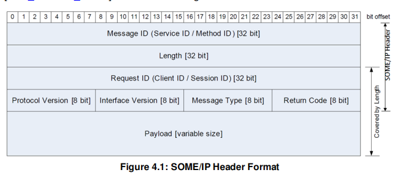

*SOMEIP消息头结构*

### **使能E2E的Header 🔒**

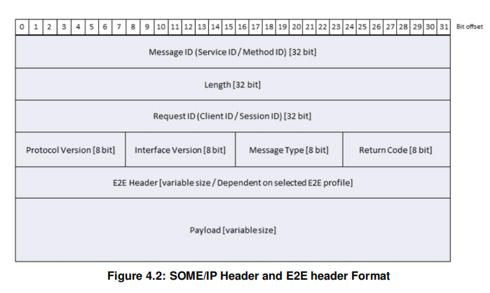

*使能E2E的SOMEIP消息头*

> 💡 **E2E保护**：端到端保护机制增强了消息传输的可靠性和安全性，通过CRC校验等方式确保数据完整性。

### **Message ID【PRS_SOMEIP_00034】 🆔**

由用户或者系统自行设定，是一个唯一的ID。

- **Service ID**（服务ID，和SD中的Service ID有区别）
- **Method ID**（通常第一位0/1，也就是0x8000来区分method和event，支持method+event）

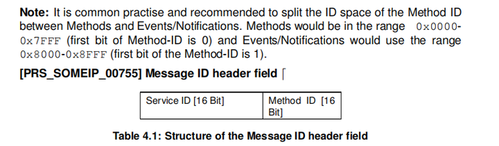

*Message ID结构示意图*

> 🧩 **补充说明**：Message ID是SOMEIP消息路由的核心，由16位Service ID和16位Method ID组成。Method ID的最高位(bit 15)用于区分方法(0)和事件(1)，这意味着一个服务最多可以有32767个方法和32767个事件。

### **Length [32 Bit] 📏**

- 从Length字段后开始到消息结尾的字节数

> 📊 **长度计算**：Length字段不包括消息头的前8个字节(Message ID和Length自身)，仅计算从Request ID开始到消息结尾的字节数。

### **Request ID [32 Bit] 🔢**

- Client ID [16 Bits]
- Client ID Prefix [8]
- Client ID [8]
- Session ID [16 Bits]

The Request ID allows a server and client to differentiate multiple parallel uses of the same method, getter or setter.

这里用来区分getter还是setter，也就是服务里的方法。

**[PRS_SOMEIP_00704]** 请求ID和请求响应应该都是唯一的一一对应的，响应中要记录请求ID（相当于握手，方便客户端同时进行多个请求）。

**[PRS_SOMEIP_00044]** Request IDs must not be reused until the response has arrived or is not expected to arrive anymore (timeout).  

**在请求没有收到回复或者超时之前，不允许重新使用。**

**[PRS_SOMEIP_00932]** In case Session Handling is not active, the Session ID shall be set to 0x00.  

**会话未激活时会话ID设置为0，激活后为1~0xFFFF。**

**[PRS_SOMEIP_00934]** 激活时会话ID要递增，然后到头之后从1开始，如果这个不匹配，客户端要忽略。对于notification的消息，如果未激活则不处理。

> 🔄 **会话管理**：Session ID的递增机制确保了请求-响应的正确匹配，同时也提供了一种简单的消息序列号机制，有助于检测丢包和重复包。

### **Protocol Version [8 Bit] 📌**

- 协议版本

> 🔄 **版本兼容性**：当前SOMEIP协议版本为0x01，未来版本可能会增加新功能或修改现有行为。

### **Interface Version [8 Bit] 📋**

- 接口版本

> 📝 **接口演进**：允许服务接口随时间演进，客户端可以根据版本号选择合适的通信方式。

### **Message Type [8 Bit] 📨**

- SOMEIP/SD模块常用0x02，在SDEntry中有SD自己的message type

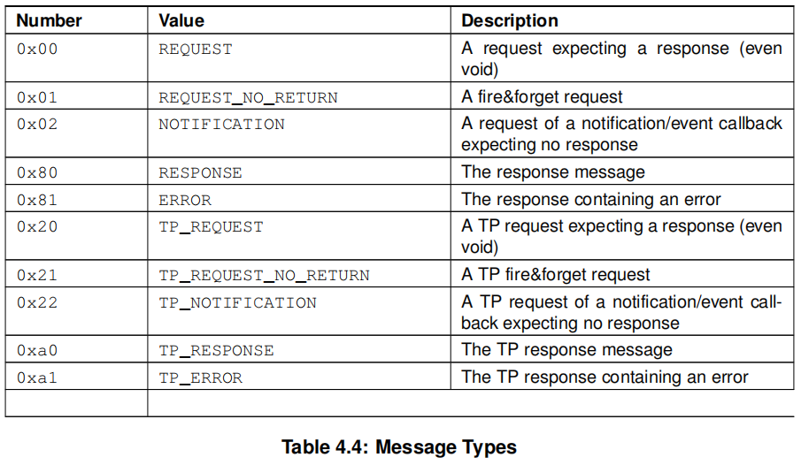

*Message Type字段示意图*

> 🔄 **消息类型**：定义了消息的基本行为模式，如请求、响应、通知等，影响消息的处理流程。

### **Return Code [8 Bit] 📊**

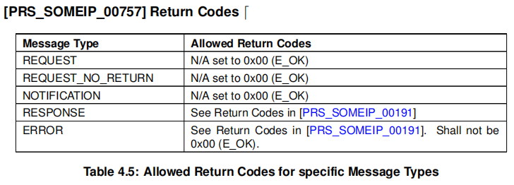

*Return Code字段示意图*

> ⚠️ **错误处理**：提供了统一的错误码机制，便于客户端识别和处理各种异常情况。

### **Payload [variable size] 📦**

- 序列化的字节对齐参考

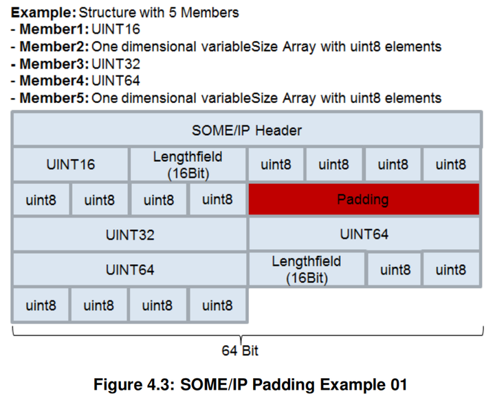

*Payload结构示意图*

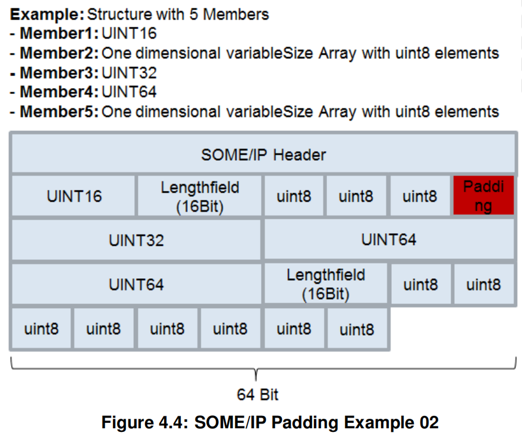

*Payload字节对齐示意图*

- 基本数据类型

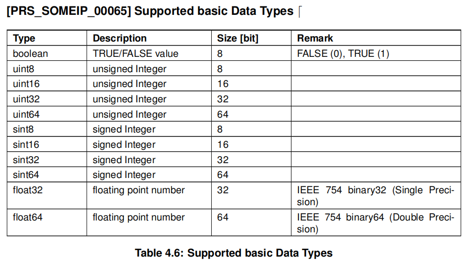

*基本数据类型示意图*

- 结构体序列化

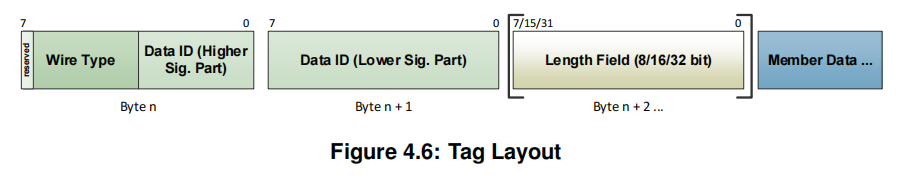

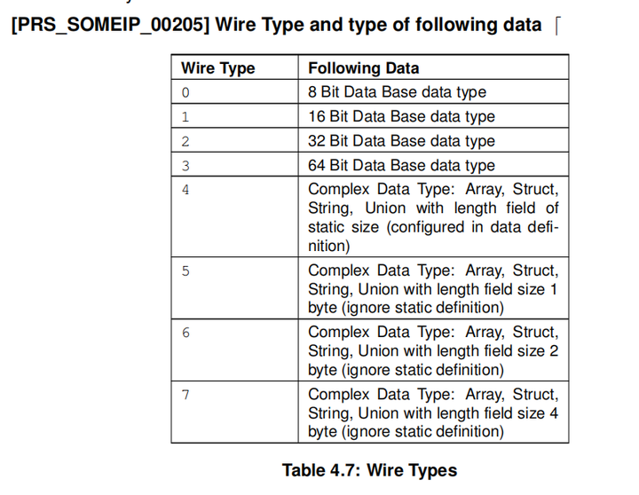

> 🧩 **序列化规则**：SOMEIP采用紧凑的二进制序列化格式，通过严格的字节对齐和排序规则，确保不同平台间的数据一致性。复杂数据结构(如结构体、数组)按照深度优先遍历的顺序序列化。

### **Strings (fixed length)**

- 固定长度字符串

> 📝 **字符串处理**：SOMEIP支持固定长度和动态长度字符串，前者预分配固定空间，后者通过长度前缀指示实际大小。

## **Specification of SOME/IP Protocol**

### **Magic Cookie机制 [PRS_SOMEIP_00154] 🍪**

**[PRS_SOMEIP_00154]** In order to allow testing tools to identify the boundaries of SOME/IP Message transported via TCP, the SOME/IP Magic Cookie Message may be inserted into the SOME/IP messages over TCP message stream at regular distances.  

**为了便于测试工具识别SOME/IP消息在TCP流中的边界，可以定期插入Magic Cookie消息。**

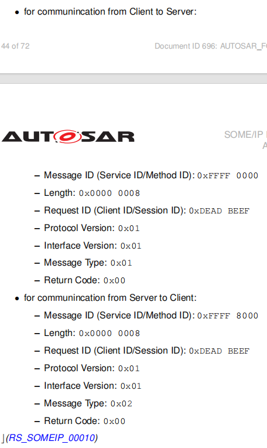

*Magic Cookie机制示意图*

- 消息帧示例

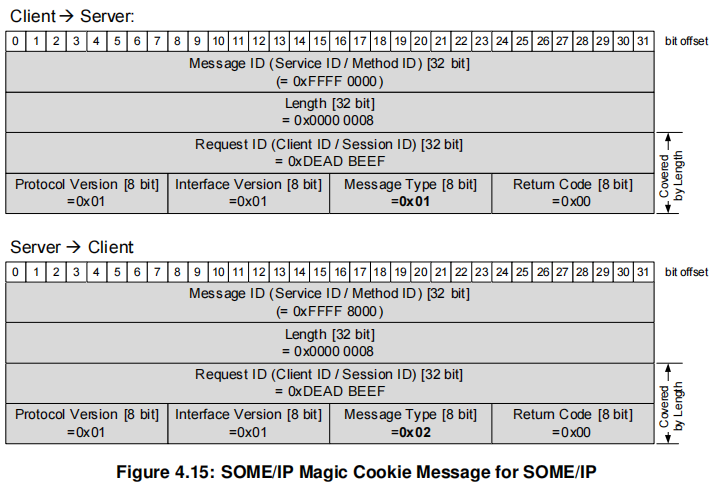

*消息帧示意图*

> 🔍 **调试辅助**：Magic Cookie (0xFFFFFFFF) 作为特殊标记，帮助测试工具在TCP流中定位SOMEIP消息边界，简化协议分析和故障排查。

### **Multiple Service-Instances [PRS_SOMEIP_00163] 🔄**

**[PRS_SOMEIP_00163]** While several Service-Instances of different Services shall be able to share the same port number of the transport layer protocol used on both the provided/server and the consumed/client side, multiple Service-Instances of the same Service on the provided/server side on one single ECU shall use different port numbers per Service-Instance. Multiple Service-Instances of the same Service on the required/client side on one single ECU may use the same port number per Service Instance.  

**同一个服务的不同实例在同一ECU上，服务端的不同实例应使用不同端口区分，不同的服务端可复用端口。**

Rationale: Normal SOME/IP (not SOME/IP-SD) messages do not carry the Service Instance ID as a dedicated field in the SOME/IP header. Thus port numbers (and perhaps the transport protocol) need to be used to distinguish different Service-Instance of the same Service of a single ECU. This way a Service-Instance can be identified through the combination of the Service ID combined with the endpoint information (i.e., IP-address, transport protocol (UDP/TCP), and port number). It is sufficient to use different port numbers for the different Service-Instances of the same Service on either the server or the client side, since only a single difference in the 4-tuple <src IP, src port, dst IP, dst port > is sufficient as a distinguishing criterion. As the server is the one actually providing the different Service-Instances, the server is also the natural place to handle the distinction.  

**也就是说，可以直接通过socket端口区分不同的服务实例。**

> 🔌 **实例区分**：由于SOMEIP消息头中没有专门的服务实例ID字段，系统通过网络端点信息(IP地址、传输协议、端口号)结合服务ID来唯一标识服务实例。这种设计简化了消息头结构，但要求服务端为同一服务的不同实例使用不同端口。

## **SOMEIP TP协议**

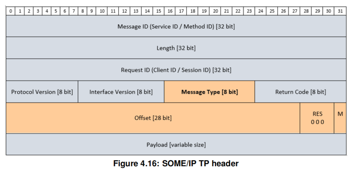

*TP结构示意图*

> 🧩 **传输协议**：SOMEIP-TP (Transport Protocol) 扩展了基本SOMEIP协议，支持大型消息的分段传输，类似于TCP的分段机制，但在应用层实现。

### **Request/Response Communication 🔄**

- 典型的请求/响应通信模式：Client发送请求，Server应答。

> 📞 **同步通信**：类似于远程过程调用(RPC)，客户端发送请求并等待服务器响应，适用于需要确认的操作。

### **Fire&Forget Communication 🚀**

- 无响应的请求称为fire&forget。

> 📤 **单向通信**：客户端发送请求后不等待响应，适用于不需要确认的操作，减少网络开销。

### **Notification Events 📢**

- 通知事件采用发布/订阅模式，通常由SOME/IP-SD实现订阅机制。
- SOME/IP仅用于传输更新值，发布/订阅机制由SOME/IP-SD实现。

### **Strategy for sending notifications**

- Cyclic update（周期更新）⏱️
- Update on change（变化时更新）🔄
- Epsilon change（超阈值变化）📊

> 📡 **事件通知**：服务器主动向订阅客户端推送数据，支持多种触发策略，适用于状态监控和实时数据分发。

### **Security Considerations for SOME/IP 🔒**

- 可以先释放一个服务来获取授权，someip返回一个随机数，客户端请求关键服务时要携带这个随机数，随机数长期不使用则失效。
- 这样的安全策略提升了通信安全性。

> 🛡️ **安全机制**：SOMEIP支持基本的挑战-响应认证机制，可与更复杂的安全框架(如SecOC)集成，提供更全面的安全保护。

## **AUTOSAR_FO_PRS_SOMEIPServiceDiscoveryProtocol.pdf**

SOME/IP Service Discovery Protocol（SOME/IP-SD，服务发现协议）的主要任务是：

- 通告车载通信中功能实体（服务）的可用性 📢
- 控制事件消息的发送行为（只向需要的接收方发送事件消息，实现发布/订阅）📨

This allows sending only event messages to receivers requiring them (Publish/Subscribe). The solution described here is also known as SOME/IP-SD (Scalable service-Oriented MiddlewarE over IP - Service Discovery)

*要实现服务发现，必须控制事件消息的发送。*

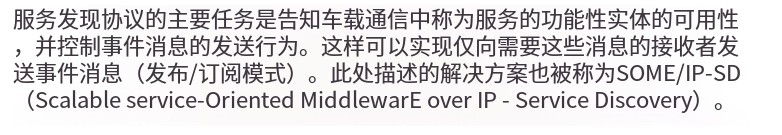

 *SOME/IP-SD的三大核心任务*

## **三大核心任务： 🎯**

- **Locate service instances.**  **定位服务实例** **🔍**
- **Detect if service instances are running**  **检测服务实例是否运行** **💓**
- **Implement the Publish/Subscribe handling.**  **实现发布/订阅机制** **📡**

> 🌐 **服务生态系统**：SOME/IP-SD创建了一个动态服务生态系统，使ECU能够自动发现和使用网络中的可用服务，减少静态配置需求。

## **SOME/IP-SD 消息格式（Message Format）📋**

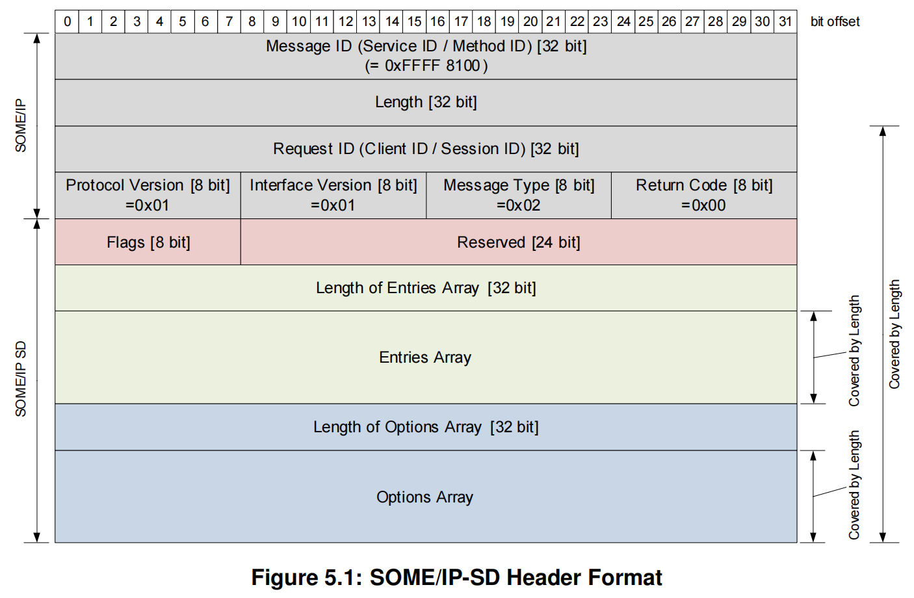

*SOME/IP-SD消息格式结构图*

**消息字段说明：**

- Message ID = 0xFFFF8100 🆔
- Length 📏
- Request ID  参考 **PRS_SOMEIP_00932** 和 **PRS_SOMEIPSD_00154**，此处 ClientID 应为 0x0000，会话ID从0x0001递增，不能为0x0000。
- Protocol Version = 0x01 📌
- Interface Version = 0x01 📋
- Message Type = 0x02 📨
- Return Code = 0x00 📊
- Flags 🚩
- Reserved ⚠️
- Length of Entries Array 📏
- Entries Array 📚
- Length of Options Array 📏
- Options Array 🛠️

> 📝 **标准化格式**：SOME/IP-SD消息遵循SOMEIP基本消息格式，但使用固定的Message ID (0xFFFF8100)和特定的负载结构，包含条目数组和选项数组。

**示例：**

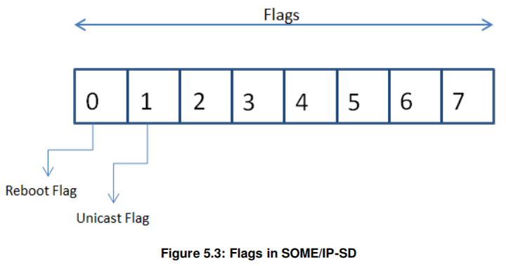

**[PRS_SOMEIPSD_00255]** The Reboot Flag of the SOME/IP-SD Header shall be set to one for all messages after reboot until the Session-ID in the SOME/IP-Header wraps around and thus starts with 1 again. After this wrap around the Reboot Flag is set to 0.

### **重启标志位机制：** 🔄

- reboot 和 session 应分别作用于单播和多播。
- 对于发送和接收：
- multicast（组播）有一个计数器
- 每个 unicast（单播）有独立计数器

### **判断 reboot 条件：**

- if old.reboot==0 and new.reboot==1
- OR if old.reboot==1 and new.reboot==1 and old.session_id>=new.session_id

此时的信息不可靠。

> 🔄 **重启检测**：通过Reboot标志和Session ID的组合，SOME/IP-SD能够检测服务提供者是否经历了重启，这对于状态同步和会话恢复至关重要。

## **Entry Format（条目格式）📝**

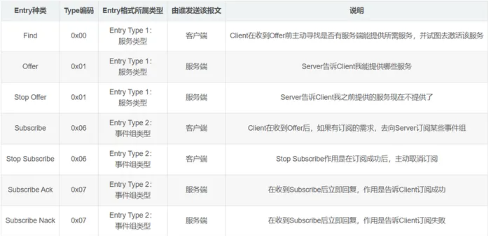

*Entry类型编码说明*

8 4 2 1 码：

- 0 0 0 0 = 0x00 发现服务（FindService）🔍
- 0 0 0 1 = 0x01 提供服务（OfferService）📢
- 0 1 1 0 = 0x06 订阅事件组（SubscribeEventgroup）📥
- 0 1 1 1 = 0x07 订阅事件组应答（SubscribeEventgroupAck）✅

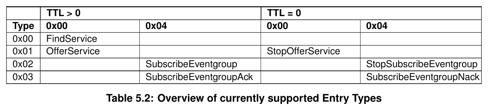

*Entry类型示意图*

> 🧩 **条目类型**：SOME/IP-SD使用不同类型的条目来表示各种服务发现操作，如查找服务、提供服务、订阅事件组等，每种类型有特定的格式和语义。

### **SOME/IP-SD Service Entry Type（服务条目类型）🔍**

*Service Entry结构*

- **Type Field [uint8]**: encodes FindService (0x00), OfferService (0x01) and StopOfferService (0x01)
- **Index First Option Run [uint8]**: Index of this run's first option in the option array. 0 表示SD包的第一段。
- **Index Second Option Run [uint8]**: Index of this run's second option in the option array. 0 表示SD包的第一段。
- **Number of Options 1 [uint4]**: Describes the number of options the first option run uses. 0 代表没有。
- **Number of Options 2 [uint4]**: Describes the number of options the second option run uses. 0 代表没有。
- **Service-ID [uint16]**: Describes the Service ID of the Service or Service-Instance this entry is concerned with.
- **Instance ID [uint16]**: Describes the Service Instance ID of the Service Instance this entry is concerned with or is set to 0xFFFF if all service instances of a service are meant.
- **Major Version [uint8]**: Encodes the major version of the service (instance).
- **TTL [uint24]**: Describes the lifetime of the entry in seconds.
- **Minor Version [uint32]**: Encodes the minor version of the service.

*或 Eventgroup Entry Type（事件组条目类型）*

> 📋 **服务条目**：用于发现和提供服务，包含服务标识、版本、生存时间等关键信息，以及指向选项数组的索引，用于附加服务配置。

### **SOME/IP-SD Eventgroup Entry Type（事件组条目类型）📡**

*Eventgroup Entry结构*

- **Counter [uint4]**: Is used to differentiate identical Subscribe Eventgroups of the same subscriber. Set to 0x0 if not used. 
- *用于区分同一订阅者的并行订阅。*
- 对于CP（Classic Platform）来说，Major Version 必须匹配。

> 📢 **事件组条目**：用于管理事件组的订阅关系，包含事件组标识、计数器等信息，支持发布/订阅模式的实现。

## **Options Format（选项格式）🛠️**

选项用于添加附加信息，如服务名称、配置等。

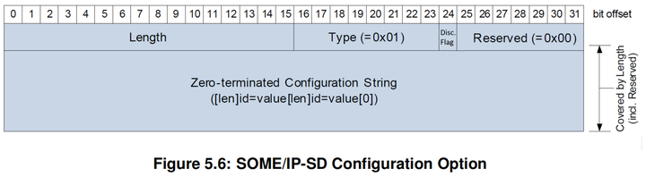

*Options结构*

- Length 字段不包括 Length 和 Type 本身。
- **[PRS_SOMEIPSD_00279]**: 应检测到下一个长度字段，持续解析。
- **[PRS_SOMEIPSD_00281]**: option 数据为键值对形式，key = value；若缺 key 或 value，则解释为空。

**示例：**

- 5abc=x7def=1230
- 5 7 0，代表长度
- 5：abc=x
- 7：def=123
- 0：代表结束

> 🧰 **扩展机制**：选项提供了一种灵活的扩展机制，允许在不修改基本协议的情况下添加新功能，如负载均衡、端点配置等。

### **Load Balancing Option（负载均衡选项）⚖️**

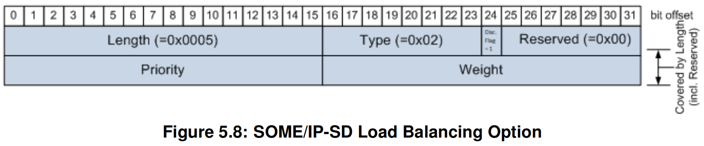

*负载均衡选项*

- 客户端应选择优先级最高且符合需求的服务。
- 若多个服务优先级相同，则按 权重/总权重 概率随机选择。
- **[PRS_SOMEIPSD_00713]**: 若 offer 服务无负载均衡选项，客户端视为最低优先级。
- 客户端主动查找服务时，权重可不适用。

> ⚖️ **智能分配**：负载均衡机制通过优先级和权重参数，实现客户端请求的合理分配，提高系统整体性能和可用性。

### **IPv4 Endpoint Option（IPv4端点选项）🌐**

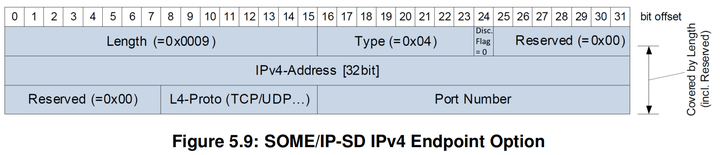

*IPv4端点选项*

- **Transport Protocol (L4-Proto) [uint8]**: 传输层协议，IANA/IETF类型（0x06: TCP，0x11: UDP）。
- **[PRS_SOMEIPSD_00310]**: 使用IPv4 option时，最多一个UDP和一个TCP。

> 🔌 **网络端点**：定义服务实例的网络位置(IP地址和端口)，是服务发现和通信的基础。

**[PRS_SOMEIPSD_00835]**

- 同一ECU上，同一服务的不同实例需用不同端点（socket）区分。
- 不同服务可复用终点。

**[PRS_SOMEIPSD_00807]**

- 客户端在订阅事件组时，需用IPv4 Endpoint Option指明接收事件的IP和port。

### **IPv6 Endpoint Option（IPv6端点选项）🌐**

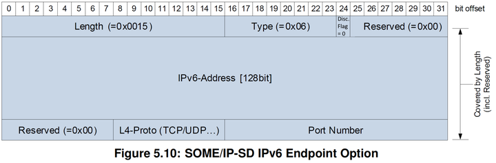

*IPv6端点选项*

> 🔄 **IPv6支持**：SOME/IP-SD同时支持IPv4和IPv6，适应未来网络环境的演进。

### **IPv4 Multicast Option（IPv4多播选项）📡**

### **[PRS_SOMEIPSD_00848]**

- **服务端**：可向指定多播地址发送事件，若已提供事件服务，ack字段需设置为对应值。
- **客户端**：可声明希望在该多播地址接收消息，订阅/停止订阅时需设置响应多播地址。
- 三种情况：
- SubscribeEventgroup entry（订阅事件组）
- StopSubscribeEventgroup entry（停止订阅事件组）
- SubscribeEventgroupAck entry（订阅事件组应答）

> 📡 **多播优化**：通过多播机制，一条消息可同时发送给多个订阅者，大幅减少网络流量，特别适合事件通知场景。

### **IPv6 Multicast Option（IPv6多播选项）📡**

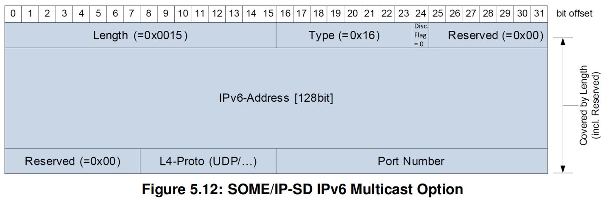

*IPv6多播选项*

### **IPv4 SD Endpoint Option（IPv4 SD端点选项）🔄**

- 用于转发：如ECU2代理转发ECU1的服务，ECU2本身不提供服务。

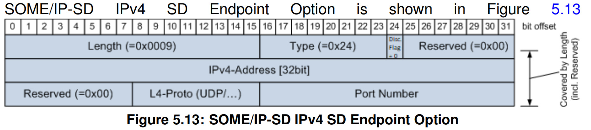

- 最多存在一个，且需为option中的第一个。
- 不能被SD Entry引用，若有此option，客户端应用其替代SD消息中的IP和端口。

> 🔄 **代理转发**：支持服务代理模式，允许一个ECU代表另一个ECU提供服务，增强系统灵活性。

### **IPv6 SD Endpoint Option（IPv6 SD端点选项）🔄**

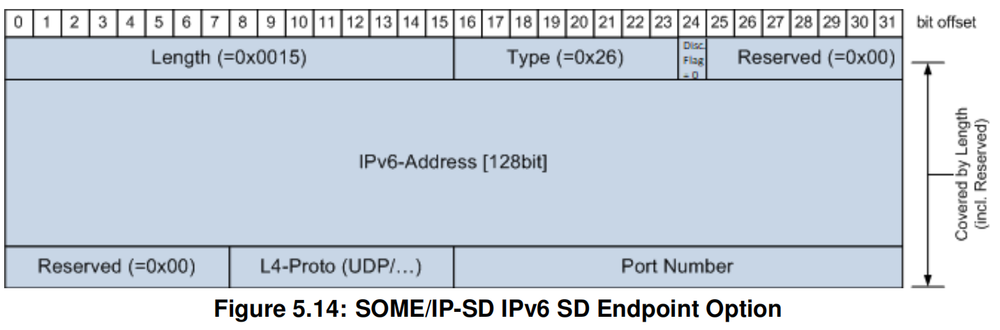

## **Service Entries（服务条目）🔍**

### **Find Service Entry（发现服务条目）🔎**

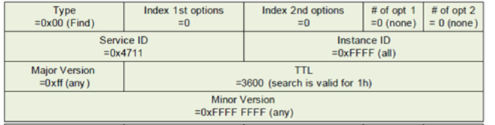

*发现服务条目*

- **Type**: 0x00 (FindService)
- **Service ID**: 要查找的服务ID。
- **Instance ID**: 0xFFFF 表示返回所有服务实例，指定值表示返回特定实例。
- **Major Version**: 0xFF 表示返回所有版本，指定值表示返回特定主版本。
- **Minor Version**: 0xFFFFFFFF 表示返回所有版本，指定值表示返回特定次版本。
- **TTL**: 不用于FindService，可设为任意值，仅为兼容性，接收方应忽略。
- 发现服务时，除Endpoint外，其他option均可用。

> 🔍 **服务查询**：客户端通过FindService条目查询网络中的可用服务，可以指定精确条件或使用通配符查找所有匹配服务。

### **Offer Service Entry（提供服务条目）📢**

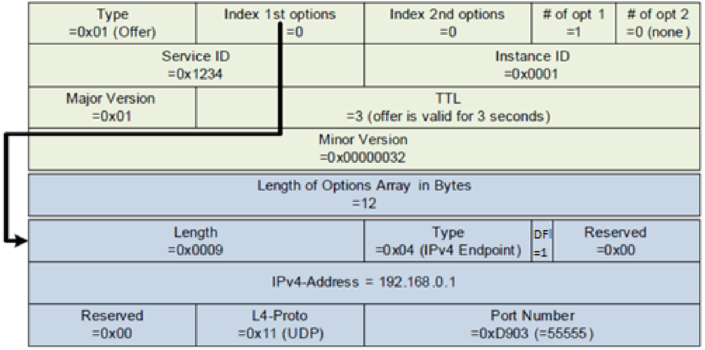

*提供服务条目*

- 若TTL为0xFFFFFF，Offer Service entry在下次重启前一直有效。

> 📢 **服务通告**：服务提供者通过OfferService条目向网络通告其服务可用性，包含服务位置、版本和生存时间等信息。

### **Stop Offer Service Entry（停止提供服务条目）🛑**

- TTL设为0x000000。
- **[PRS_SOMEIPSD_00840]**: StopOfferService (type 0x01) 应携带与被停止条目相同的option。

> 🛑 **服务撤销**：当服务不再可用时，通过StopOfferService条目通知网络，避免客户端继续尝试连接。

### **Usage of Options in Entries（条目中option的使用总览）🧰**

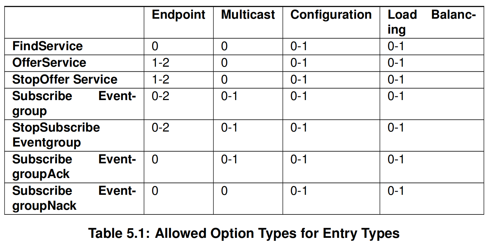

> 📋 **选项应用**：不同类型的条目可以使用不同的选项组合，上表总结了各种条目类型与选项的兼容关系。

## **Endpoint Handling for Services and Events（服务与事件的端点处理）🔌**

**[PRS_SOMEIPSD_00802]**: 消息使用的底层传输协议由配置决定，服务可同时支持UDP和TCP，但每个元素需配置使用哪种协议。

- 服务可支持TCP/UDP，客户端需根据自身情况选择其一，不能同时订阅。

> 🔌 **传输选择**：SOME/IP支持TCP和UDP两种传输协议，前者提供可靠传输，后者提供低延迟，应根据服务需求选择合适的协议。

### **Service Endpoints（服务端点）🔌**

> 🔗 **服务连接点**：定义服务实例的网络位置和通信参数，是客户端连接服务的入口点。

### **Eventgroup Endpoints（事件组端点）📡**

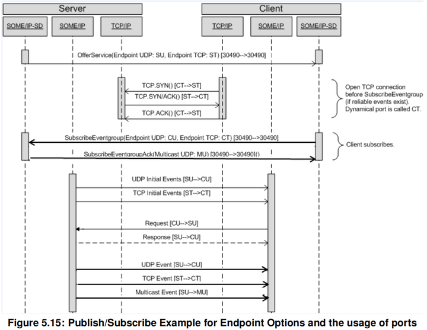

*事件组端点*

> 📡 **事件分发点**：定义事件组的网络位置和通信参数，支持事件的单播和多播分发。

## **Service Discovery Messages（服务发现消息）📨**

- 遵循上述消息格式，所有消息默认走SD端口，除非SD Endpoint指定了不同端口。

> 🌐 **发现机制**：服务发现消息通过标准UDP端口(30490)传输，确保所有参与者能够接收和处理服务发现信息。

### **Eventgroup Entry（事件组条目）📡**

### **Subscribe Eventgroup Entry（订阅事件组条目）📥**

- **Type**: 0x06 (SubscribeEventgroup)
- **Counter**: 区分同一服务同一事件组的并行订阅（仅端点不同），未用时设为0。
- **[PRS_SOMEIPSD_00846]**: 客户端可选择单播或多播通道接收事件，订阅时在option中携带。

> 📥 **事件订阅**：客户端通过SubscribeEventgroup条目向服务提供者表达接收特定事件组的意愿，并指定接收方式(单播/多播)。

### **Stop Subscribe Eventgroup Entry（停止订阅事件组条目）🛑**

- TTL设为0即可。

> 🛑 **取消订阅**：客户端不再需要接收事件时，通过StopSubscribeEventgroup条目通知服务提供者停止发送。

### **Subscribe Eventgroup Acknowledgement (Subscribe Eventgroup Ack) Entry（订阅事件组应答条目）✅**

- entry type 0x07
- Service ID、Instance ID、Major Version、Eventgroup ID、TTL、Reserved、Counter需与被应答的订阅一致。

> ✅ **订阅确认**：服务提供者通过SubscribeEventgroupAck条目确认接受客户端的订阅请求，并开始发送事件。

### **Subscribe Eventgroup Negative Acknowledgement (Subscribe Event group Nack) Entry（订阅事件组拒绝应答条目）❌**

- 与上面一致，TTL设为0。
- 拒绝原因包括但不限于：
- Service ID、Instance ID、Eventgroup ID、Major Version组合未知
- 客户端未建立所需TCP连接
- option引用有问题
- 服务器资源问题
- 安全关联未建立

> ❌ **订阅拒绝**：服务提供者因各种原因无法满足订阅请求时，通过SubscribeEventgroupNack条目通知客户端，并可能提供拒绝原因。

**[PRS_SOMEIPSD_00527]**: 客户端收到Nack且需TCP连接时，应检查并重启TCP连接。

- 服务端可能丢失TCP连接，客户端未感知。
- 检查socket是否有其他消息
- 发送magic cookie等待应答
- 重新建立TCP连接

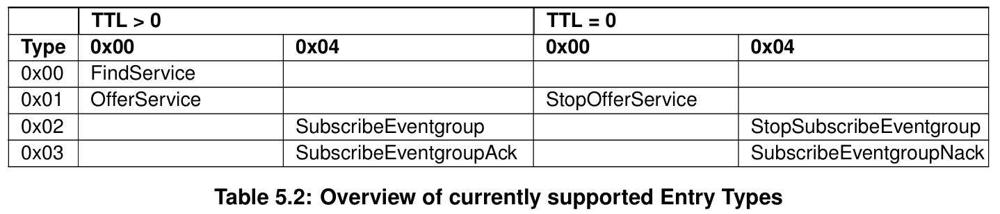

*订阅事件组Nack处理流程*

> 🔄 **错误恢复**：当订阅被拒绝时，客户端可以根据拒绝原因采取相应措施，如重新建立TCP连接或调整订阅参数。

## **Service Discovery Communication Behavior（服务发现通信行为）🔄**

- SD应尽量减少报文发送次数，尽量合并报文。

> 🌐 **通信优化**：SOME/IP-SD设计了多种机制减少网络流量，如消息合并、延迟响应和状态机控制等。

### **Startup Behavior（启动行为）🚀**

- 三阶段：
- Initial Wait Phase（初始等待阶段）：服务端和客户端初始化时各自获取随机数延时。
- Repetition Phase（重复阶段）：每次消息发送延时加倍（**[PRS_SOMEIPSD_00406]**）。
- Main Phase（主阶段）：根据CYCLIC_OFFER_DELAY定时发送，此阶段不允许发现服务。

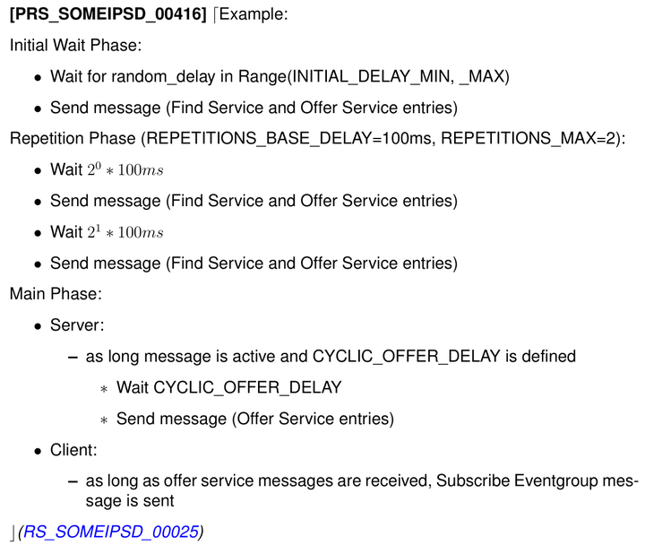

*SD启动三阶段*

> 🚀 **启动策略**：三阶段启动机制避免了网络风暴，通过随机延迟和指数退避算法分散网络流量，确保系统平稳启动。

### **Server Answer Behavior（服务端应答行为）📤**

- **[PRS_SOMEIPSD_00417]**: 发现服务后可能还有其他报文，收到后需延时REQUEST_RESPONSE_DELAY再响应，延时为最小值和最大值间随机。
- 若收到单播发现服务，需判断上次REQUEST_RESPONSE_DELAY时间，若在0~1/2区间则发单播，1/2~1则发组播。

> 📤 **智能响应**：服务端通过延迟响应和响应方式选择(单播/组播)，优化网络资源使用，避免响应风暴。

### **Shutdown Behavior（关闭行为）🛑**

- **[PRS_SOMEIPSD_00752]**: 客户端服务实例在Initial Wait、Repetition或Main Phase时链路断开，SD进入Down Phase，链路恢复且服务可用时重新进入Initial Wait Phase。
- **[PRS_SOMEIPSD_00430]**: 客户端收到停止服务时，不再发送发现服务，等待提供服务。
- 关闭时需通知服务端停止订阅。

> 🛑 **优雅退出**：关闭行为确保服务实例能够干净地退出系统，通知相关方并释放资源，避免悬挂引用。

## **State Machines（状态机）⚙️**

## **Service（服务端状态机）🔄**

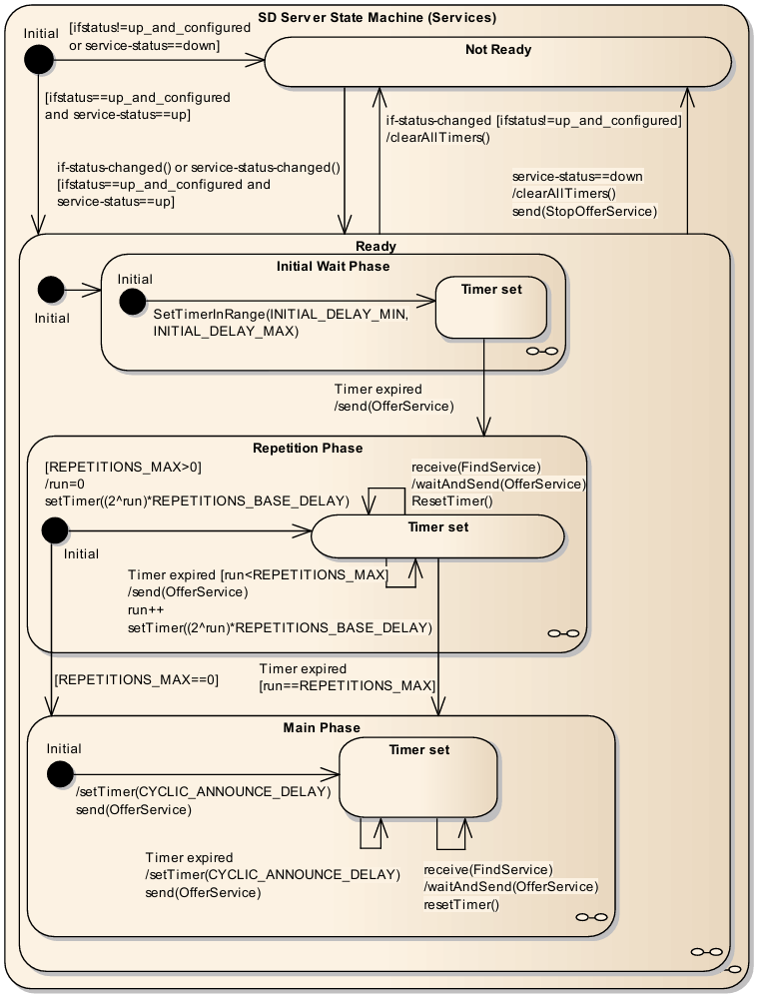

*服务端状态机*

> ⚙️ **服务生命周期**：服务端状态机控制服务实例的生命周期，从初始等待到主循环，再到关闭，确保服务行为的一致性和可预测性。

## **Client（客户端状态机）🔄**

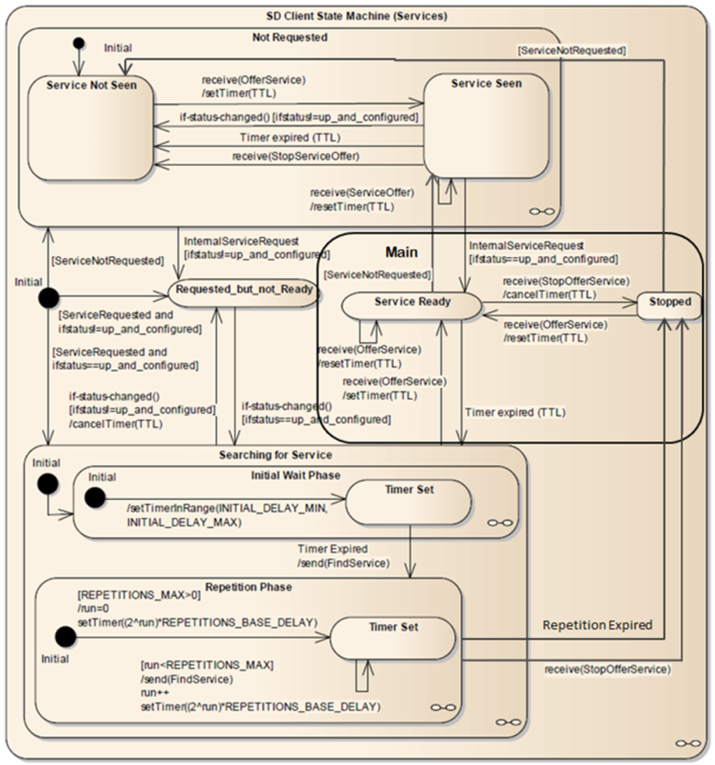

*客户端状态机*

> ⚙️ **客户端生命周期**：客户端状态机控制服务消费者的行为，包括服务发现、连接建立和维护，以及异常处理。

### **SOME/IP-SD Mechanisms and Errors（机制与错误）⚠️**

> 🛠️ **错误处理**：SOME/IP-SD定义了一系列错误处理机制，确保在网络异常、服务不可用等情况下系统能够优雅降级和恢复。

## **Non-SOME/IP protocols with SOME/IP-SD（非SOMEIP协议与SOME/IP-SD结合）🔄**

- **[PRS_SOMEIPSD_00437]**: 非SOMEIP服务可通过SD发布，但后续通信不走SOMEIP。
- Service-ID 设为0xFFFE（保留）
- Instance-ID 按SOMEIP服务和事件组描述
- Configuration Option需包含key为"otherserv"且值非空的项，由系统部门确定

*此option仅非SOMEIP服务可用，需在发现、提供、请求服务时携带。*

> 🌉 **协议桥接**：SOME/IP-SD的灵活设计允许它与非SOMEIP协议集成，作为服务发现层，而实际数据传输可使用其他协议，增强了系统的互操作性。

## **Publish/Subscribe with SOME/IP and SOME/IP-SD（SOME/IP与SOME/IP-SD的发布/订阅）📡**

Note: In contrast to the SOME/IP request/response mechanism there may be cases in which a client requires a set of parameters from a server, but does not want to request that information each time it is required. These are called notifications and concern events and fields.

*注意：与SOME/IP请求/响应机制不同，客户端有时需要从服务器获取一组参数，但不希望每次都请求，这称为通知，涉及事件和字段。*

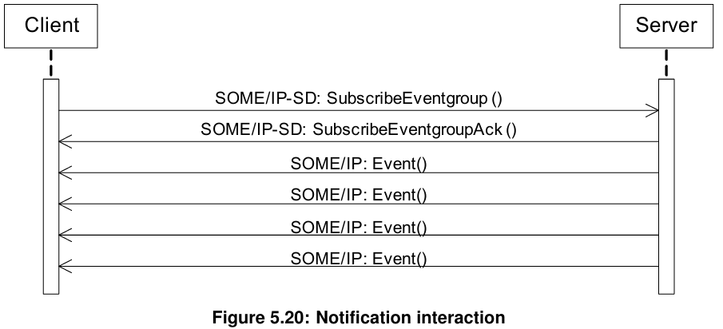

*发布/订阅机制示意*

- **[PRS_SOMEIPSD_00446]**: 通过SOME/IP-SD的Offer Service条目，服务器可向客户端推送通知，作为订阅的触发器。
- **[PRS_SOMEIPSD_00704]**: 客户端重复订阅的处理。
- **[PRS_SOMEIPSD_00450]**: 发布/订阅丢失的处理。

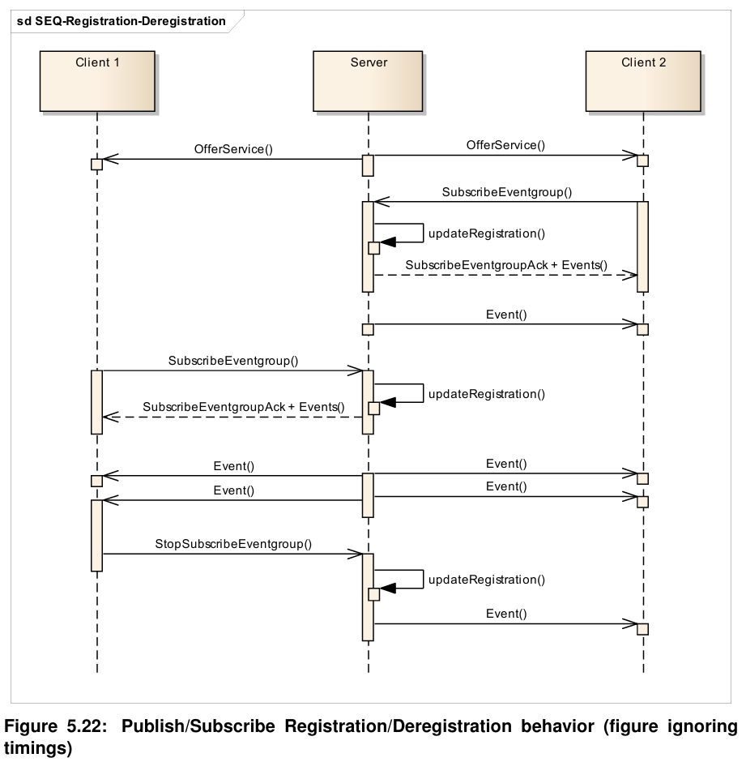

*发布/订阅丢失处理*

> 📡 **事件分发**：发布/订阅模式允许服务提供者主动向订阅者推送数据，减少轮询开销，提高实时性，特别适合状态监控和事件通知场景。

- **[PRS_SOMEIPSD_00454]**: 出现错误时，服务端需删除客户端订阅。
- **[PRS_SOMEIPSD_00461]**: 客户端订阅TCP服务前需先建立socket。
- **[PRS_SOMEIPSD_00463]**: 客户端未收到订阅应答时，先发送停止订阅再重新订阅。
- **[PRS_SOMEIPSD_00577]**: 客户端先收到单播offer再订阅，未收到ack又收到组播offer时，不会重复发送停止订阅+订阅。

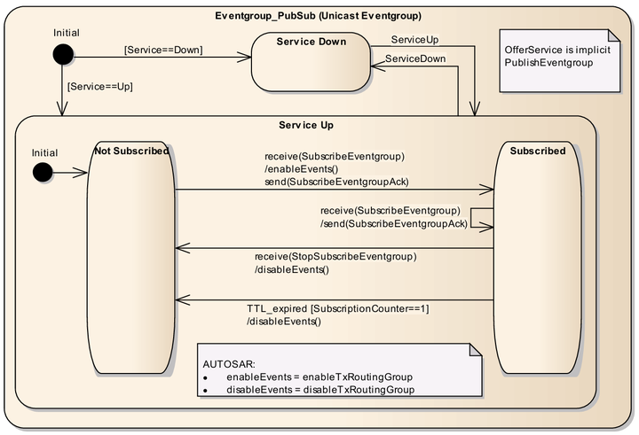

*订阅应答合并处理*

- **[PRS_SOMEIPSD_00571 PRS_SOMEIPSD_00572]**: 客户端通过两条消息订阅，服务端需分别回复；若为一条，服务端可合并回复。
- **[PRS_SOMEIPSD_00134]**: SOMEIP可配置单播数量达阈值时自动切换组播。
- **[PRS_SOMEIPSD_00470]**: 可静态配置部分服务的订阅。

> 🔄 **订阅管理**：SOME/IP-SD提供了完整的订阅生命周期管理，包括建立、维护、恢复和终止，确保发布/订阅关系的稳定性。

## **Reserved and special identifiers for SOME/IP and SOME/IP-SD（保留及特殊标识符）🔒**

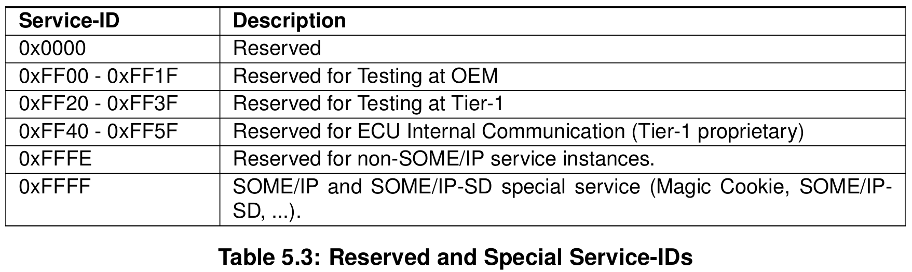

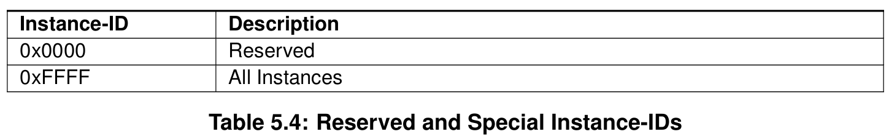

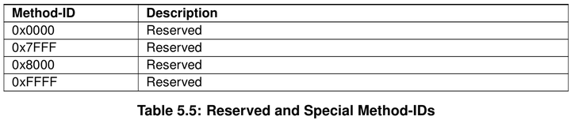

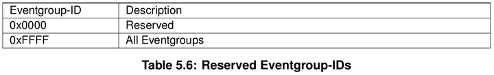

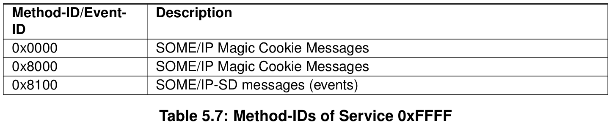

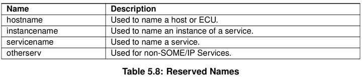

> 🔒 **标识符管理**：SOME/IP和SOME/IP-SD定义了一系列保留标识符，用于特殊功能或未来扩展，开发者应避免使用这些值以防冲突。

## **SOME/IP与SOME/IP-SD的理解与补充 🧠**

SOME/IP（Scalable service-Oriented MiddlewarE over IP）是AUTOSAR中面向服务的通信协议，支持服务发现、远程过程调用、事件通知等功能。SOME/IP-SD作为其服务发现子协议，负责服务的动态注册、发现、发布/订阅管理，是实现车载分布式系统高效通信的基础。

- SOME/IP-SD通过标准化的消息格式和状态机，确保服务的高可用性和灵活性。
- 支持多种通信模式（单播/组播、TCP/UDP），适应不同场景需求。
- 通过option机制灵活扩展服务能力，如负载均衡、端点配置等。
- 严格的规范条目编号便于开发者查阅标准文档，提升开发效率。

> 🚗 **车载应用**：SOME/IP已成为现代汽车电子架构中的关键组件，支持从信息娱乐到高级驾驶辅助系统(ADAS)的各种应用场景，推动汽车向软件定义方向发展。

## **AUTOSAR_CP_SWS_SOMEIPTransformer.pdf**

## **序列化流程图 🔄**

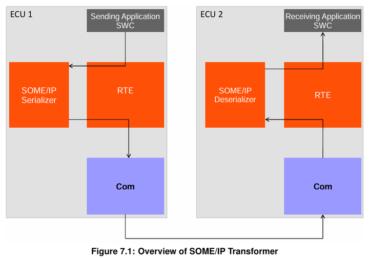

*SOMEIP Transformer序列化流程*

> 🔄 **数据转换**：SOMEIPXf负责应用数据与网络字节流之间的双向转换，确保不同平台间的数据一致性。

## **Specification of the SOME/IP on-wire format**

### **Message Length Limitations 📏**

- 消息长度不超过4096字节

> 📏 **大小限制**：限制消息大小有助于内存管理和网络效率，超大消息可通过SOMEIP-TP分段传输。

### **Endianess 🔄**

- 字节序要求（大端/小端，具体见AUTOSAR规范）

> 🔄 **字节序**：SOMEIP默认使用大端字节序(网络字节序)，确保不同处理器架构间的数据一致性。

### **Message format 📋**

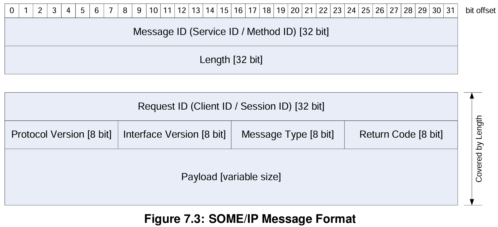

*SOMEIP消息格式结构*

**[SWS_SomeIpXf_00015]** The SOME/IP transformer shall implement all fields of the header except Message ID and Length.  SOMEIPxf需要实现header，除了Message ID和Length。

### **Request ID [32 bit] 🔢**

The Request ID shall be the unique identifier for the calling client inside the ECU. Its values are chosen by the RTE and handed over to the SOME/IP transformer.  由RTE传递给SOMEIP。

### **Protocol Version [8 bit] 📌**

### **Interface Version [8 bit] 📋**

### **Message Type [8 bit] 📨**

- 普通client request（0x00）由server response（0x80）应答，无错误时如此。
- 错误时发送error message（0x81）。
- 通知（notification）使用0x02。
- 也可发送无response的request（0x01），用于Sender/Receiver通信。

> 📨 **消息类型**：不同的消息类型对应不同的通信模式和处理流程，如请求-响应、单向通知等。

### **Return Code [8 bit] 📊**

### **Payload [variable size] 📦**

## **Serialization of Parameters and Data Structures 🔄**

### **Basic Datatypes 🧱**

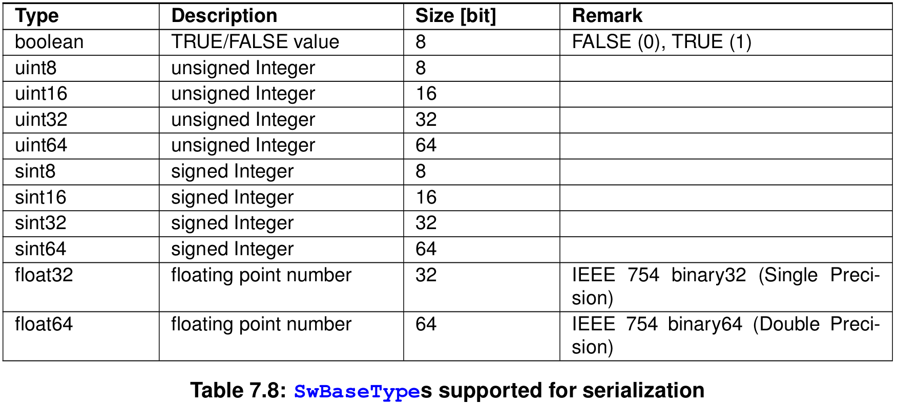

*基本数据类型序列化*

> 🧱 **基础类型**：SOMEIP定义了基本数据类型的序列化规则，确保跨平台一致性，包括整数、浮点数、布尔值等。

### **Structured Datatypes (structs) 🏗️**

**[SWS_SomeIpXf_00042]** A struct shall be serialized in order of depth-first traversal.  结构体序列化采用深度优先遍历。

- 需递归序列化所有子元素后再序列化下一个同级元素。
- 如需对齐，可通过配置添加padding。
- 未对齐时，工具链可给出警告。

**[SWS_SomeIpXf_00216]** 如果SOMEIP TransformationISignalProps的属性sizeOfStructLengthFields设置为大于0的值，则在每个序列化结构前面应插入一个长度字段。

- 序列化和反序列化都根据这个长度来做。
- 例如 uint8 的长度为1 ，uint16 为2，uint32为4。

**[SWS_SomeIpXf_00219]** 反序列化只解释预期合理的数据，对于异常数据跳过。

> 🏗️ **复杂结构**：结构体序列化遵循深度优先原则，可选配置长度前缀，增强数据完整性检查和错误恢复能力。

### **Structured Datatypes and Arguments with Identifier and optional Members【draft】🏷️**

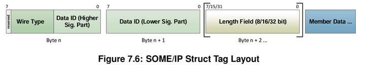

*结构体带标识符序列化*

- 可添加字段标识数据类型

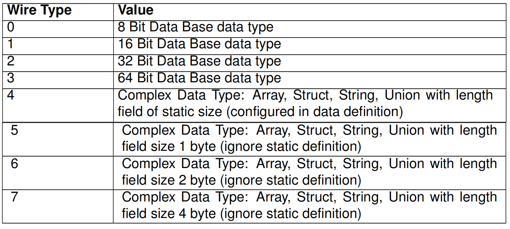

> 🏷️ **标识符结构**：带标识符的结构体支持可选成员和版本兼容性，允许结构体随时间演进而不破坏向后兼容性。

### **Strings 📝**

- 字符串以0结尾，支持uint8/uint16对齐方式

> 📝 **字符串处理**：SOMEIP支持多种字符串格式，包括固定长度和动态长度，以及不同的对齐方式。

### **Strings (fixed length) 📏**

> 📏 **固定长度**：预分配固定空间，适合长度已知且稳定的字符串，如标识符、常量等。

### **Strings (dynamic length) 📏**

> 📏 **动态长度**：使用长度前缀指示实际大小，适合长度可变的字符串，如用户输入、描述文本等。

### **Arrays (fixed length) 📚**

### **One-dimensional 📊**

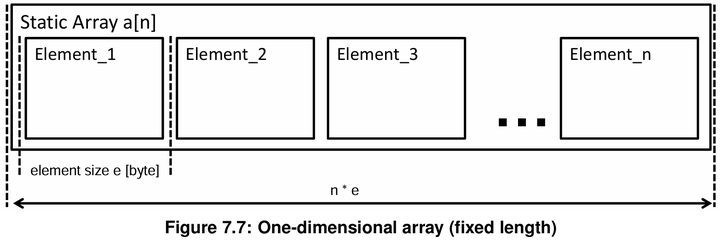

*一维数组序列化*

> 📊 **一维数组**：按元素顺序连续序列化，无需额外长度信息，因为长度在编译时已知。

### **Multidimensional 📊**

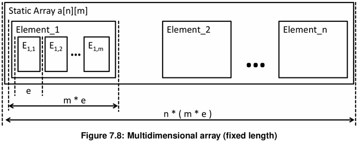

*多维数组序列化*

> 📊 **多维数组**：按行优先顺序展平为一维序列，保持元素间的逻辑关系。

### **Optional Parameters / Optional Elements 🔄**

> 🔄 **可选元素**：通过特殊标记或长度指示元素是否存在，增强协议的灵活性和扩展性。

### **Dynamic Length Arrays / Variable Size Arrays 📊**

- 动态数组前加长度字段

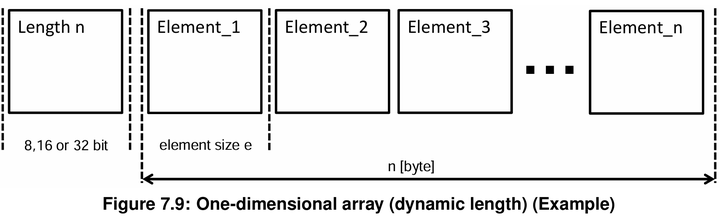

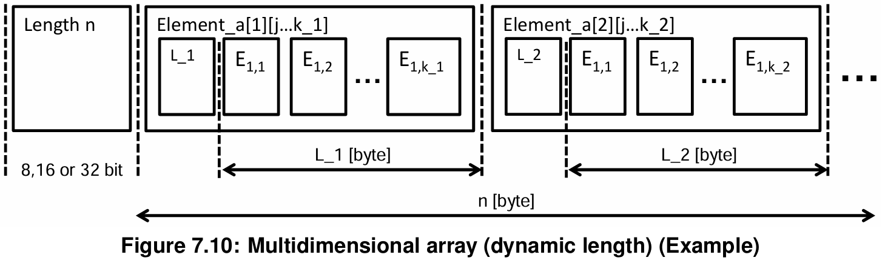

> 📊 **动态数组**：使用长度前缀指示实际元素数量，适合大小可变的集合，如列表、队列等。

### **Bitfield 🔢**

> 🔢 **位域**：紧凑表示多个布尔值或小整数，节省空间，适合状态标志、配置选项等。

### **Union / Variant 🔄**

> 🔄 **联合体**：允许同一内存位置存储不同类型的数据，通常与类型标识符配合使用，实现多态数据结构。

## **Protocol specification（通信类型）🔄**

## **Client/Server Communication 🔄**

### **request | response**

**[SWS_SomeIpXf_00106]** 对于SOMEIP的request消息，SOMEIPXf要填充这些并实现header。

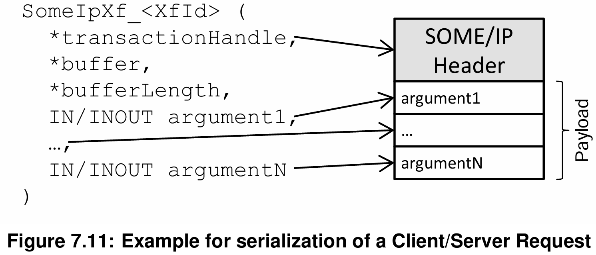

*Client/Server通信流程*

> 🔄 **请求-响应**：经典的远程过程调用模式，客户端发送请求并等待服务器响应，适用于需要确认的操作。

## **Sender/Receiver Communication 📡**

**[SWS_SomeIpXf_00107]** 对于SOMEIP的notification消息，SOMEIPXf要填充这些并实现header。

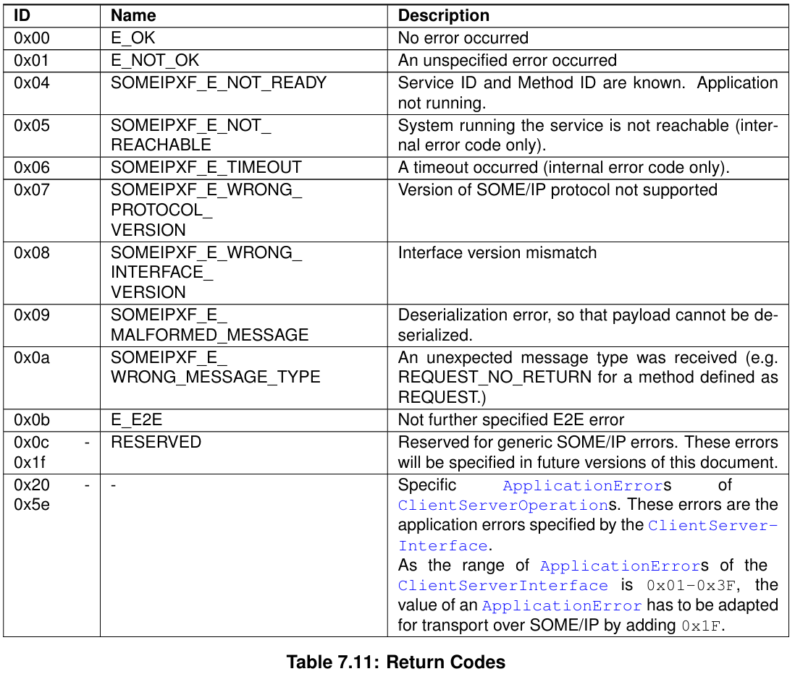

*Sender/Receiver通信流程*

> 📡 **发布-订阅**：单向通信模式，发送方主动推送数据给订阅方，无需等待响应，适用于状态更新和事件通知。

## **AUTOSAR_CP_SWS_ServiceDiscovery.pdf**

## **Functional specification**

> The main tasks of the Service Discovery Module are managing the availability of func tional entities called services in the in-vehicle communication as well as controlling the send behavior of event messages. 

SD负责管理整个车辆的功能或者说服务的可用入口

> With Service Discovery different ECUs can offer Service Instances and find available Service Instances within the vehicle network. An ECU can stop offering a Service Instance it was offering before. Later finds to such a service instance will remain unan swered. Service Instances are single implementations of a service that is defined by its service interface. In the AUTOSAR context, a find is an operation to identify available Service Instances and their locations.

借助这个SD呢，其他ECU可以提供服务，或者可以知道一个服务的地址

> Service Discovery can be used to manage Publish/Subscribe relationships as well. In the Service Discovery based Publish/Subscribe use-case one ECU (Publish/Subscribe Client with ConsumedEventgroup) is interested in receiving some data from (subscrib ing to) another ECU (Publish/Subscribe Server with EventHandler).

SD呢也可以管理订阅的一些关系

虽然SD服务发布服务，但是具体的服务可用或者不可用是由服务本身决定的

## **Requirements**

也就是说不同的角色，调用SD之后会由不同的状态

Server SWCs via Sd_ServerServiceSetState() or, Sd_ServiceGroupStart() and Sd_ ServiceGroupStop(), respectively:

- SD_SERVER_SERVICE_DOWN 
- SD_SERVER_SERVICE_AVAILABLE 

Client SWCs via Sd_ClientServiceSetState() or, Sd_ServiceGroupStart() and Sd_Ser viceGroupStop(), respectively: 

- SD_CLIENT_SERVICE_RELEASED 
- SD_CLIENT_SERVICE_REQUESTED 

Client SWCs via Sd_ConsumedEventGroupSetState() 

- SD_CONSUMED_EVENTGROUP_RELEASED
- SD_CONSUMED_EVENTGROUP_REQUESTED

还有俩状态

SD_EVENT_HANDLER_RELEASED

SD_EVENT_HANDLER_REQUESTED

### **Ethernet Communication**

反正就是至少有一个socket来进行通信

然后soad要先初始化

### **State Handling**

【SWS_Sd_00020】这里好像所有的模块的套路都是一样的，他可以自动打开，也可以手动打开

### **Interaction with Socket Adaptor【这里触发了event发送】**

【SWS_Sd_00024】可以去控制路由组

 [**SWS_Sd_00699**] The Service Discovery module shall be able to trigger the sending of initial Events using the API SoAd_IfSpecificRoutingGroupTransmit().

调用SoAd_IfSpecificRoutingGroupTransmit这个接口去发送event

### **空闲socket回收**

> [**SWS_Sd_00481**] Every wildcard socket connection shall be reset to wildcard using SoAd_ReleaseRemoteAddr() if all of the following conditions apply:  The remote address of a socket connection has been set by SD.  The socket connection is not used by a ClientService anymore. I.e. no Offer was received, a Stop Offer was received or the TTL has expired.  The socket connection is not used by an Eventhandler anymore. I.e. the client has unsubscribed all Eventgroups using this socket connection. The socket con nection shall not be reset if the routings get disabled because the SdEventHan dlerMulticastThreshold was reached

这里作为一个普通的SD来说，除了用来去发现服务的那个socket,其他的socket如果不再收到offer/find/ttl超时的时候，如果这个remote地址是sd设置的，那这个时候要清理回收socket，设置remote为通配符

### **Subscribe Eventgroup retry handling**

一种重新订阅机制

【**SWS_Sd_00737**】就是会进行重新初始化去重启订阅事件组，超出了重试次数就会报错SD_E_COUNT_OF_RETRY_SUBSCRIPTION_EXCEEDED

总之就是有几个参数来进行重试，然后收到了ACK或者超出最大重试次数或者这个eventgroup为release时的时候就停止重试

> If the procedures, described in the previous to paragraphs cannot be implemented by the application, the retry-mechanism should be out-sourced to the BswM in a rule that initiates re-sending of Initial Events via triggering a StopSubscribeEventgroup/ SubscribeEventgroup SD message upon detecting that a security association is estab lished, to increase at least the robustness for a security association based communa tion.

如果这个流程不能被应用实现的话，可以给BSWM来做

【**SWS_Sd_00759**】 If a SubscribeEventgroup entry is received, for which a security association is required, and the security association not yet established, this entry shall be answered with a SubscribeEventgroupNack entry (see [SWS_Sd_00760]).

如果还没有建立安全关联，应该回复NACK

## **Message format**

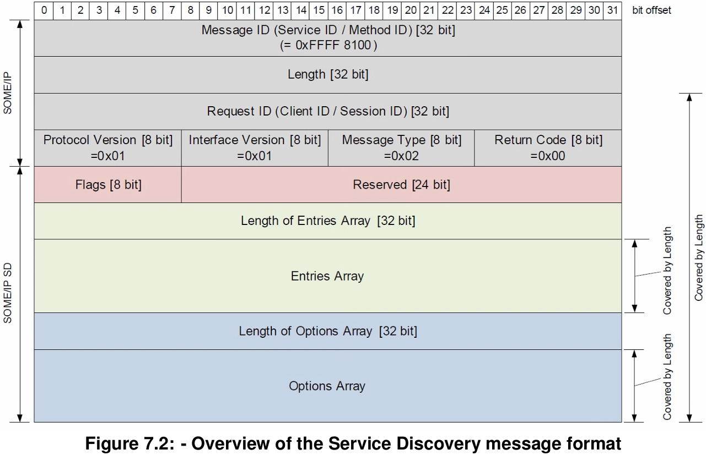

这里的字节定义可以参考这里

### **两种Entry**

**SOME/IP-SD Service Entry Type**

**SOME/IP-SD Eventgroup Entry Type**

### **Options**

**Options Format**

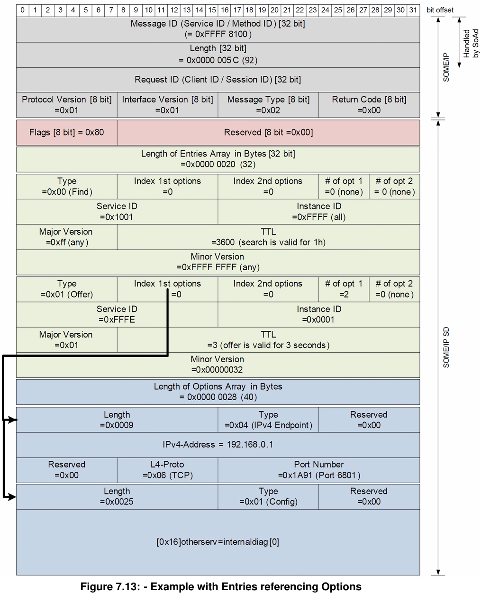

## **Service Discovery Entry Types**

### **Entries for Services (common requirements)**

 [SWS_Sd_00299] OfferService entries shall carry the TTL as configured in SdServer TimerTTL.

### **FindService entry**

### **OfferService entry**

### **Building OfferService entries**

【**SWS_Sd_00478**】一个例子去构建offer报文，这里参考之前的规范，一个服务可以既提供TCP服务又提供UDP服务，然后供客户端选择哪个去连接

### **StopOfferService entry**

### **Eventgroup Entries (Common requirements)**

### **SubscribeEventgroup entry**

### **StopSubscribeEventgroup entry**

### **SubscribeEventgroupAck entry**

### **SubscribeEventgroupNack entry**

### **Building SubscribeEventgroup entries**

## **Sending and Receiving of Messages**

 [SWS_Sd_00040] The Service Discovery module receives Service Discovery mes sages via the API Sd_SoAdIfRxIndication() and the configuration items SdInstance UnicastRxPdu and SdInstanceMulticastRxPdu. The received remote address must be saved in the call context of the Sd_RxIndication.

也需要检查基本的错误

### **Sequence for message transmission**

 [SWS_Sd_00480] This chapter describes the interaction with the Socket Adaptor module to send Service Discovery messages

发送消息的流程

SoAd_SetRemoteAddr

SoAd_IfTransmit

【**SWS_Sd_00651**】尽可能的合并消息到一条报文中

### **Sequence for message reception**

【**SWS_Sd_00482**】接收流程

- When the SocketAdaptor receives a Service Discovery message, the API Sd_Rx Indication() is called. 
- Using the indicated RxPduId, the associated SoConId for this SD Instance has to be determined. 
- Call API SoAd_GetRemoteAddr() with this SoConId. 
- Store address and message for further processing. 
- Reset the SoCon back to Wildcard using SoAd_ReleaseRemoteAddr() 
- The entries shall be processed exactly in the order they arrived.

【**SWS_Sd_00696**】如果关闭和打开socket冲突时不要直接关闭socket

### **Receiving Entries**

 [**SWS_Sd_07016**] If a service match candidate is detected for a ClientService where SdVersionDrivenFindBehavior is set to MINIMUM_MINOR_VERSION and the ClientService has already triggered a subsription to another ServerService, the Service Discovery module shall silently discard this service match candidate.

如果接收到一个提供服务，但是client已经订阅了其他服务，那client要忽略这个

 [**SWS_Sd_00716**] If either the received Type 1 SD entry references a configuration option or a service match candidate has capability records configured (i.e., SdServer CapabilityRecord in case of a received FindService entry or SdClientCapabilityRecord in case of a OfferService or a StopOfferService entry), the configured SdCapability RecordMatchCallout shall be invoked by the SD implementation.

这里也是有一套最佳匹配机制的，用来去限制一些特定的服务

发现AUTOSAR的设计理念好多类似的，包括init行为mainfunction，if/tp的发送，rxindication，一些事件的回调，一些超时的机制，一些最佳匹配的机制，这些东西所有模块都是一样的逻辑，

### **Answering behaviour, if receiving Service Discovery Entries via Multicast address**

Whenreceiving Service Discovery messages using multicast, these messages may be received by multiple ECUs at once and multiple ECUs may answer to such a message in parallel. This could lead to overload situations of the ECU which sent the Service Discovery messge via multicast, if all receiving ECUs answer in a similar point in time. In order to avoid a high workload on ECU which sent the Service Discovery message via multicast, the answers of the receiving ECUs could delay answer as described in this section.

为了避免server发送了多播之后，多个client同时去订阅，造成拥挤，应该加一些随机延时

## **Timings and repetitions for Server Service and Event Handlers**

这里每个地方该干什么都是写好的

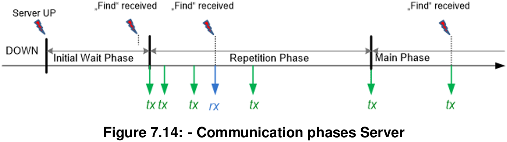

## **Initial Wait Phase for Server Services**

【**SWS_Sd_00317**】这里有一些细节

【**SWS_Sd_00321**】这里的消息发送都会是一个最小值到最大值之间的随机时间

初始化需要等soad的mode切换到SOAD_SOCON_RECONNECT or SOAD_SOCON_ONLINE

Sd_LocalIpAddrAssignmentChg（）这个也要准备好

## **Repetition Phase for Server Services**

## **Main Phase for Server Services**

【**SWS_Sd_00342**】条件

【**SWS_Sd_00344**】接收订阅

【**SWS_Sd_00345**】接收停止订阅

【**SWS_Sd_00347**】localip改变

【**SWS_Sd_00733**】服务丢失之后的处理

【**SWS_Sd_00348**】停止提供服务

## **Fan out control**

【**SWS_Sd_00453**】收到订阅事件的处理

### **Sharing of SdServerTimer**

 [SWS_Sd_00743] If several ServerServices refer to the same SdServerTimer, they shall share a common timer (and therefore a common random offset), if they either refer to the same SdServiceGroup and do not refer to any other (additional) SdService Group or, if SdServerServiceAutoAvailable of all ServerServices are set to TRUE.

## **Timings and repetitions for Client Service and Consumed Eventgroups**

这里每个阶段要做的事情都是定义好的，具体的实现到时候再看细节

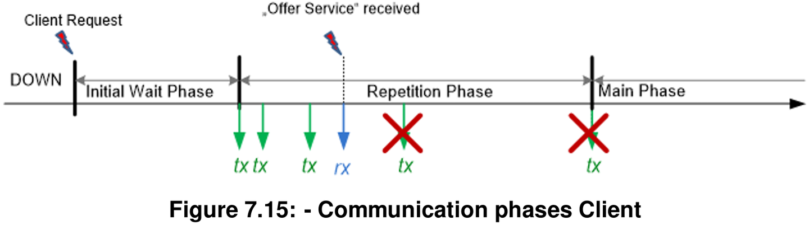

### **Down Phase for Client Services**

### **Initial Wait Phase for Client Services**

### **Repetition Phase for Client Services**

### **Main Phase for Client Services**

### **Fan in control**

### **Sharing of SdClientTimer**

### **Handling of SdServiceGroupS**

## **SOME/IP-ACL**

The ACL "Access Control List" introduces the possibility of limiting service access to listed authenticated communication partners. It is an effective way to minimize the damage if one of the communication partners is hacked because this communication partner cannot go beyond the services he could provide or consume in his healthy state.

## **AUTOSAR_CP_SWS_SOMEIPTransportProtocol.pdf**

**这里就是通过PduR的路由关系来控制走到哪个模块。**

**这里对我真的是很有感触**

> **我们正常写一个代码，硬编码了函数调用，这里巧妙地哦通过一个中间通信模块，来控制数据路由给谁！**

> **直接实现了软件解耦，这个架构值得学习借鉴。**

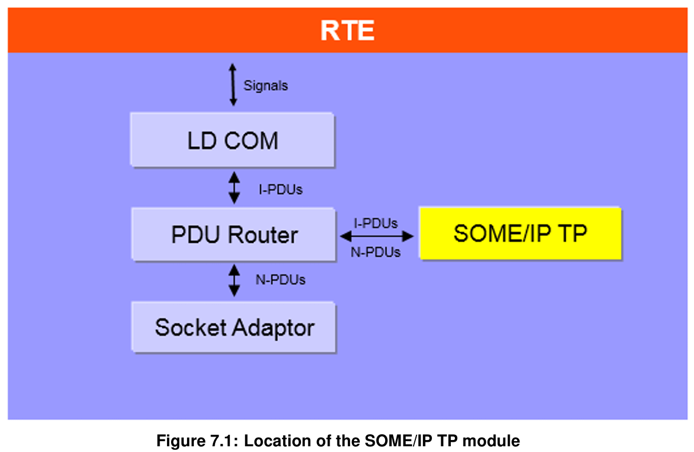

### **Message Type Field**

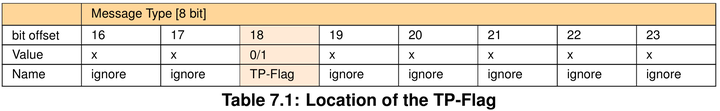

就是有一个多帧标志位

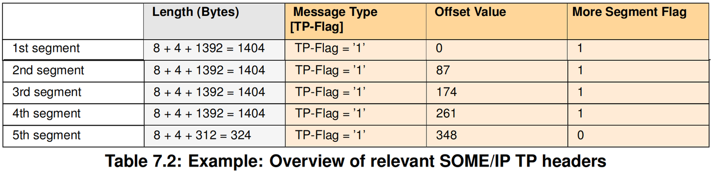

## **Segmentation of SOME/IP messages (TX Path)**

## **Assembly of received SOME/IP messages (RX path)**

## **SOME/IP-TP（传输协议）🚚**

SOME/IP-TP是SOME/IP的扩展，用于处理大型消息的分段传输。

### **分段机制 🧩**

- 将大型消息分割成多个片段（segments）
- 每个片段都有自己的SOME/IP头部
- 通过特殊标志位和序列号标识片段顺序和完整性

> 🚚 **大数据传输**：SOME/IP-TP允许传输超过标准SOMEIP大小限制(4096字节)的消息，如固件更新、大型配置文件等。

## **SOME/IP与AUTOSAR架构集成 🏗️**

SOME/IP作为AUTOSAR中的通信协议，与整体架构紧密集成：

- 与RTE（运行时环境）交互，处理服务请求和响应
- 通过COM模块与底层网络栈连接
- 支持AUTOSAR自适应平台(AP)和经典平台(CP)间的通信

> 🏗️ **架构集成**：SOMEIP作为AUTOSAR通信栈的一部分，与其他模块如RTE、COM、PDU Router等协同工作，提供端到端的通信服务。

## **SOME/IP安全考虑 🔒**

SOME/IP本身不提供完整的安全机制，但可与AUTOSAR安全框架集成：

- 可与SecOC（安全通信）模块集成，提供认证和加密
- 支持基本的挑战-响应认证机制
- 可配置访问控制，限制服务访问权限

> 🔒 **安全防护**：在实际应用中，SOMEIP通常与TLS/DTLS、IPsec或SecOC等安全机制结合使用，确保通信安全。

## **SOME/IP性能优化 ⚡**

为提高SOME/IP通信效率，可采用以下优化措施：

- 合理使用单播/多播通信模式
- 优化事件触发策略（周期性/变化时）
- 合理配置服务发现参数，减少网络开销
- 使用负载均衡机制分散服务负载

> ⚡ **性能调优**：通过合理配置和使用SOMEIP的各种特性，可以显著提高通信效率和系统响应性。

## **SOME/IP调试与诊断 🔍**

SOME/IP提供多种调试和诊断功能：

- Magic Cookie机制便于在TCP流中定位消息边界
- 详细的错误码系统帮助识别问题
- 可与诊断工具集成，监控服务状态和通信流量

> 🔍 **问题排查**：SOMEIP的设计考虑了可调试性，提供多种机制帮助开发者识别和解决通信问题。

## **SOME/IP未来发展 🚀**

作为车载通信的关键技术，SOME/IP持续演进：

- 增强对高级驾驶辅助系统(ADAS)和自动驾驶功能的支持
- 提升安全性和可靠性，适应关键安全应用
- 优化性能，支持更高带宽和更低延迟需求
- 增强与其他通信协议的互操作性

> 🚀 **技术演进**：随着汽车电子架构向集中式和域控制器方向发展，SOMEIP将继续扮演关键角色，连接不同域和功能。

## **总结 📝**

SOME/IP和SOME/IP-SD作为AUTOSAR中的核心通信协议，提供了灵活、高效的服务导向通信机制，支持现代汽车电子架构的分布式特性。通过标准化的消息格式、服务发现机制和多种通信模式，SOMEIP满足了从信息娱乐到安全关键系统的各种应用需求。

随着汽车向软件定义方向发展，SOMEIP的重要性将进一步提升，成为连接车内各功能域和外部世界的关键桥梁。深入理解SOMEIP协议及其工作机制，对于开发高质量的车载软件系统至关重要。

> 🌟 **核心价值**：SOMEIP通过标准化的服务导向通信，简化了分布式系统开发，提高了软件重用性和互操作性，加速了汽车软件创新。
