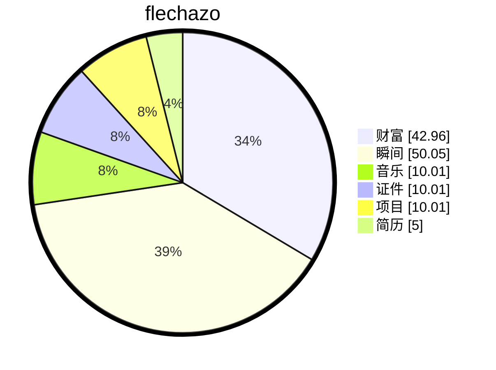

# 缘起

<details open>
    <summary>梦🫧开始的地方</summary>
<p>一切从这里开始</p>
<p>想要把人生梳理的井井有条💮</p>
</details>

# 🛠️ 独立开发者个人工作站搭建保姆级教程 Tailscale + 自建 DERP 实现即插即用内网环境

> **🎯 核心目标**：实现无痛的 `Windows远程桌面` 💻 + `VS Code开发` 🛠️ + `文件共享` 📁 + `个人服务全家桶` 🌐（博客/代码/云盘/AI/数据库等）

本文将手把手带你完成整个搭建过程。核心方案是使用 **Tailscale** 🔗 搭配 **自建 DERP 中继** 🚀，结合 Windows 专业版的原生远程桌面，实现设备间的无缝互联、跨网络穿透和高质量的远程办公体验。

如果你之前用过 FRP 等反向代理工具，那么这套方案可以看作是它的“终极进化版”——它把所有连接的复杂性都封装起来，让你只需专注于开发与使用，真正做到“登录即连通” ✅。

## ❓ 为什么选择 Tailscale + DERP

相比传统的 FRP、NPS 或 DDNS 方案，Tailscale 的优势显而易见：

| 特性           | 传统方案             | Tailscale + DERP        |
| -------------- | -------------------- | ----------------------- |
| **安全性**     | 🔐 需要自行配置加密   | 🛡️ 端到端 WireGuard 加密 |
| **配置复杂度** | ⚙️ 手动端口转发、DDNS | 🧩 自动组网，零配置      |
| **稳定性**     | 📡 依赖网络环境       | 🔁 智能 P2P + 中继备份   |
| **管理性**     | 🗂️ 分散管理           | 📊 统一 Web 控制台       |

**💡 一句话总结**：把"如何建立连接"的难题交给 Tailscale，你只需要关心"如何使用这个网络" 🤝

---

## 🧰 准备工作

在开始前，请确保你已准备好以下几项：

1.  **🌐 一个域名**：用于为你的 DERP 服务器申请 SSL 证书，例如 `derp.yourdomain.com`。
2.  **☁️ 一台云服务器**：需要有独立的公网 IP 地址（VPS），作为 DERP 中继节点运行。
3.  **🔐 开放服务器防火墙**：在云服务商的安全组或服务器防火墙中放行以下端口：
    *   `443/TCP`：用于 DERP 节点的 HTTPS 加密通信。
    *   `3478/UDP`：用于 STUN 协议，帮助设备进行 NAT 穿透，提高 P2P 直连成功率。
4.  **📥 安装 Tailscale 客户端**：在你的所有设备（Windows、macOS、Linux、手机等）上下载并安装 Tailscale 客户端。

## 🚀 第一步：初识 Tailscale，感受内网的“爽”

在正式搭建前，先体验一下 Tailscale 的便捷。

1.  访问 [https://tailscale.com/download](https://tailscale.com/download) 下载并安装客户端。
2.  打开客户端并登录（支持 Google、GitHub、Microsoft 等账号）。
3.  在其他设备上重复此操作。

你会发现，只要登录同一个账号，所有设备就会出现在 Tailscale 的设备列表中。你可以直接通过它们的 Tailscale IP（如 `100.x.y.z`）进行：

- `ping` 测试 ✅
- SSH 连接 ✅  
- Windows 远程桌面 ✅

### 🖥️ 场景一：高质量远程桌面与开发

这是最直接的应用。

- **💻 Windows 远程桌面 (RDP)**：
  - 在家里的 Windows 笔记本上，打开 `mstsc`。
  - 计算机栏输入你办公室那台高性能主机的 Tailscale IP（如 `100.**.**.99`）。
  - 输入账号密码，即可享受低延迟、高画质的编码和 AI 开发体验，仿佛坐在电脑前。

- **🛠️ VS Code Remote-SSH**：
  - 在 VS Code 中安装 `Remote - SSH` 插件。
  - 添加一个新连接：`ssh username@100.x.y.z`。
  - 直接在你的 Linux 服务器或 Ubuntu 虚拟机上进行开发，所有文件、环境、调试器都在远程，但编辑器在本地运行。

### 📁 场景二：安全高效的文件共享与同步

告别微信传大文件或不安全的 FTP。

- **📁 Windows 文件资源管理器访问**：
  - 在任意设备上，按 `Win + R`，输入 `\\100.x.y.z` 回车。
  - 即可访问另一台 Windows 电脑上共享的文件夹，进行复制、移动等操作，就像在局域网内一样。

#### 📊 文件传输方案对比

| 方案               | 安全性 | 便捷性 | 速度 |
| ------------------ | ------ | ------ | ---- |
| 微信/QQ 传文件     | ❌      | ✅      | 🟡    |
| 公共网盘           | ❌      | ✅      | ❌    |
| Tailscale 内网共享 | ✅      | ✅      | ✅    |

### 🌐 场景三：内部 Web 服务全家桶

你在个人工作站上搭建的所有网站服务，都可以通过 Tailscale 内网 IP 安全访问。

| 服务类型   | 访问方式                 | 默认端口 |
| ---------- | ------------------------ | -------- |
| 个人博客   | `http://100.x.y.z:8080`  | 8080     |
| Git 服务   | `https://100.x.y.z:3000` | 3000     |
| NAS 网盘   | `http://100.x.y.z:5244`  | 5244     |
| AI 应用    | `http://100.x.y.z:7860`  | 7860     |
| 数据库管理 | `http://100.x.y.z:8081`  | 8081     |

- **✍️ 个人博客/知识库**：
  - 你在主机上用 Hexo、Hugo 或 WordPress 搭建的博客，绑定端口 `8080`。
  - 在手机或平板上打开浏览器，输入 `http://100.x.y.z:8080`，即可预览和管理你的博客。

- **👨‍💻 自建 Git 代码仓库**：
  - 使用 Gitea 或 GitLab CE 搭建自己的代码托管平台。
  - 所有团队成员或未来的自己，都可以通过 `https://100.x.y.z:3000` 安全地克隆、推送代码，无需暴露到公网。

- **💾 NAS 网盘系统**：
  - 部署 AList、Nextcloud 或 Seafile，将你的电影、音乐、文档集中管理。
  - 在外出时，通过手机 App 或浏览器访问 `http://100.x.y.z:5244`，随时随地获取文件。

- **🤖 AI 模型与应用界面**：
  - 如果你用 Gradio、Streamlit 或 Ollama 部署了 AI 应用，它们通常运行在 `localhost:7860` 等端口。
  - 只需确保服务监听 `0.0.0.0`，即可从任何联网设备通过 `http://100.x.y.z:7860` 访问你的专属 AI 工具。

- **🗄️ 数据库与管理面板**：
  - MySQL, PostgreSQL 的管理工具（如 phpMyAdmin, Adminer）可以部署在内网。
  - Redis、MongoDB 的可视化工具也可以通过内网访问，避免数据库端口暴露风险。

### 🔧 场景四：高级网络与开发测试

Tailscale 提供了更多企业级能力。

- **🏠 子网路由 (Subnet Routes)**：
  - 将你的家庭路由器或整个局域网通过一台设备接入 Tailscale。
  - 这样，你就可以从公司或咖啡厅，直接访问家里所有的智能设备（摄像头、NAS、打印机），而它们本身不需要安装 Tailscale。

- **✈️ 出口节点 (Exit Node)**：
  - 将你的工作站设置为出口节点。
  - 当你在公共 Wi-Fi 下时，可以将手机或笔记本的流量通过 Tailscale 隧道转发到你的工作站，再由它上网，实现“回家般”的网络环境和隐私保护。

- **🔑 ACL 精细权限控制**：
  - 通过 `tailnet lock` 和 ACL 策略，可以精确控制谁可以访问哪个服务。
  - 例如，只有 `admin@yourdomain.com` 可以 SSH 登录服务器，其他用户只能访问博客和网盘。

### ✅ 最终

通过 Tailscale，你的个人工作站不再是一个孤立的设备，而是变成了一个**安全、可靠、随时可访问的中心枢纽** 🌟。

- **💼 工作流**：在家用轻薄本，无缝连接办公室的高性能主机进行编译和训练。
- **🔄 数据流**：所有文件、代码、媒体都存放在中心，通过加密隧道安全同步和访问。
- **⚙️ 服务流**：所有自建服务都运行在内网，免去了复杂的反向代理和证书配置。

这套方案完美契合你作为程序员和开发者的需求，既保证了安全性，又极大提升了工作效率和灵活性 ⚡。

这已经是一个可用的内网环境了！但为了获得更低的延迟和更高的稳定性，我们继续搭建自己的 DERP 节点 🏗️。

## 🏗️ 第二步：搭建高性能自建 DERP 中继

> **💡 为什么要自建 DERP？** 降低延迟！提升稳定性！跨国访问优化！

### 📊 DERP 网络拓扑

```
你的设备 ←→ 自建 DERP 节点 ←→ 目标设备
    ↓              ↓              ↓
   低延迟         高速转发        低延迟
```

### 1. 🌐 域名解析配置

首先，将你的域名指向云服务器的公网 IP。

根据不同云服务商，设置域名解析的方式不同。
这里以腾讯云的域名解析为例：

等待 DNS 解析生效（通常几分钟到几小时）⏳。

### 2. ☁️ 在服务器上安装 Go 环境

`derper` 是用 Go 编写的，所以需要先安装 Go。

1.  **🔗 访问 Go 官方下载页面**： 打开 [https://go.dev/dl/](https://go.dev/dl/?spm=a2ty_o01.29997173.0.0.7920c921gNtplo) 查看所有可用版本。

2.  **⬇️ 选择并下载最新版本**： 选择适用于 Linux 的 `amd64` 架构的压缩包。

```bash
# 1. 下载最新版 Go (以 go1.25.4 为例)
wget https://go.dev/dl/go1.25.4.linux-amd64.tar.gz

# 2. 移除旧版本 (如果存在)
sudo rm -rf /usr/local/go

# 3. 解压到 /usr/local
sudo tar -C /usr/local -xzf go1.25.4.linux-amd64.tar.gz

# 4. 将 Go 添加到 PATH 环境变量
echo 'export PATH=$PATH:/usr/local/go/bin' >> ~/.bashrc
source ~/.bashrc

# 5. 验证安装
go version
# 输出应为: go version go1.25.4 linux/amd64
```

**✅ 预期输出**: `go version go1.25.4 linux/amd64`

### 3. ⚙️ 安装并运行 derper

使用 Go 的包管理工具一键安装 `derper`。

```bash
# 使用 go install 安装 derper
go install tailscale.com/cmd/derper@latest

# 默认情况下，可执行文件会安装在 $HOME/go/bin/
# 为了方便，将其复制到系统路径
sudo cp $HOME/go/bin/derper /usr/local/bin/
```

#### 🚀 测试运行

现在，启动 `derper` 服务：

```bash
sudo derper --hostname=derp.yourdomain.com
```

**关键说明**：

*   `--hostname` 参数必须是你之前解析的域名。`derper` 会利用该域名自动向 Let's Encrypt 申请免费的 SSL 证书。
*   **🚫 不能使用 IP 地址**：Let's Encrypt 不会为纯 IP 地址签发公开信任的证书，因此无法使用 IP 作为 `--hostname`。

成功启动后，你应该看到类似日志：

```
derper: serving on :443 with TLS
STUN server listening on [::]:3478
```

### 4. 🔄 创建 systemd 服务（推荐）

为了让 `derper` 开机自启并后台运行，创建一个 systemd 服务。

```bash
sudo nano /etc/systemd/system/derp.service
```

写入以下内容：

```ini
[Unit]
Description=Derper - Tailscale DERP Server
After=network.target
Wants=network.target

[Service]
Type=simple
ExecStart=/usr/local/bin/derper --hostname=derp.flechazo.mba --certdir /var/lib/derper/certs
Restart=always
RestartSec=5
StandardOutput=journal
StandardError=journal

[Install]
WantedBy=multi-user.target
```

保存后，启用并启动服务：

```bash
sudo systemctl daemon-reload
sudo systemctl enable derp
sudo systemctl start derp

# 查看状态
systemctl status derp
```

**✅ 成功标志**: 显示 `active (running)`

## 🛠️ 第三步：在 Tailscale 控制台添加自建 DERP 节点

### 📍 操作路径

1. 登录 [Tailscale Admin Console](https://login.tailscale.com/admin/acls/file)
2. 进入 **Access controls > JSON**
3. 在 `derpMap` 部分添加配置

### ⚙️ DERP 配置模板

在 JSON 配置框中，填入你的 DERP 节点信息：

### 🎯 配置说明表

| 字段       | 值        | 说明                        |
| ---------- | --------- | --------------------------- |
| RegionID   | 900+      | 唯一区域 ID，避免与官方冲突 |
| RegionCode | 自定义    | 区域代码标识                |
| HostName   | 你的域名  | 必须与 derper 启动参数一致  |
| IPv4       | 服务器 IP | DNS 故障时的备用连接        |

```json
"derpMap": {
    "Regions": {
        "900": {
            "RegionID": 900,
            "RegionCode": "jaya",
            "RegionName": "jaya",
            "Nodes": [
                {
                    "Name": "flechazo",
                    "RegionID": 900,
                    "HostName": "derp.yourdomain.mba",
                    // IPv4 and IPv6 are optional, but recommended, to reduce
                    // potential DERP connectivity issues if DNS is unavailable
                    // or having issues. Addresses must be publicly routable
                    // and not in private IP ranges.
                    "IPv4": "106.12.**.***",
                },
            ],
        },
    },
},
```

> **⚠️ 注意**：
>
> *   `RegionID` 必须是唯一的数字（建议从 99 开始）。
> *   `HostName` 必须与 `--hostname` 参数完全一致。
> *   保存后，所有客户端会在几分钟内自动同步新的 DERP 地图。

## ✅ 第四步：验证与使用

一切就绪，现在来验证效果！

### 1. 🔍 验证连接状态

在任意一台客户端设备上运行：

```cmd
tailscale netcheck
```

你应该能看到类似输出：

```
Nearest DERP: jaya
DERP latency:
    - jaya: 10ms
```

这表明你的流量正在通过自己搭建的低延迟 DERP 节点 🎉。

### 2. 🚀 享受高质量远程桌面

现在，使用 Windows 专业版自带的远程桌面连接 (`mstsc`) 来连接你的工作站。

*   **🖥️ 计算机**：输入目标设备的 Tailscale IP 地址（如 `100.x.y.z`）。
*   **👤 用户名**：输入目标电脑的登录用户名（本地账户或 Microsoft 账户）。
*   **🔑 密码**：输入对应的密码。

由于网络质量得到了极大提升（得益于自建 DERP 和可能的 P2P 直连），你的远程桌面体验将非常流畅，无论是编码、浏览网页还是轻度图形处理，都能获得接近本地操作的感受 💯。

### 3. 🌐 访问内部服务

你在工作站上搭建的所有服务，如博客、Git 仓库、NAS 网盘等，都可以通过其 Tailscale IP 地址直接访问。

例如，在浏览器中输入 `http://100.x.y.z:8000`，即可访问你部署在该机器上的网站服务。

## 📝 总结

至此，你的个人工作站网络环境已搭建完成。整个流程如下：

- [x] **🌐 拥有一个域名**。
- [x] **☁️ 拥有一台带独立 IP 的云服务器**。
- [x] **⚙️ 在服务器上安装 Go 并运行 `derper`**。
- [x] **🛠️ 在 Tailscale 后台添加自建 DERP 节点**。
- [x] **📥 在所有设备上安装 Tailscale 客户端**。

最后，别忘了享受一次丝滑的远程桌面连接！这套方案不仅解决了“如何访问”的问题，更为你的开发、学习和工作提供了一个安全、高效、可靠的网络基石 🏁。

# 缘落


