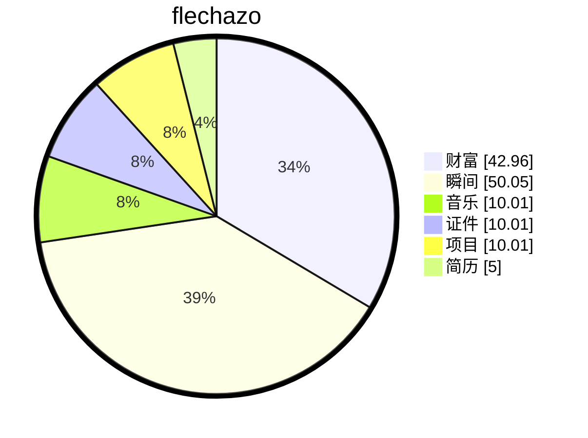

# 缘起

    
梦🫧开始的地方

一切从这里开始

想要把人生梳理的井井有条💮

# 厨艺

## 蔬菜焯水

1、水开加入盐和少量油，彩椒、芦笋、西兰花、胡萝卜切丝、菠菜焯水。

2、过冷水后控干水分。

## 胡萝卜、菠菜凉拌

1、加入生抽、醋、盐、橄榄油和白芝麻拌匀。

# 缘落

```mermaid
%%{init: {"pie": {"textPosition": 0.5}, "themeVariables": {"pieOuterStrokeWidth": "5px"}} }%%
pie showData
    title flechazo
    "财富" : 42.96
    "瞬间" : 50.05
    "音乐" : 10.01
    "证件" : 10.01
    "项目" : 10.01
    "简历" :  5
```
