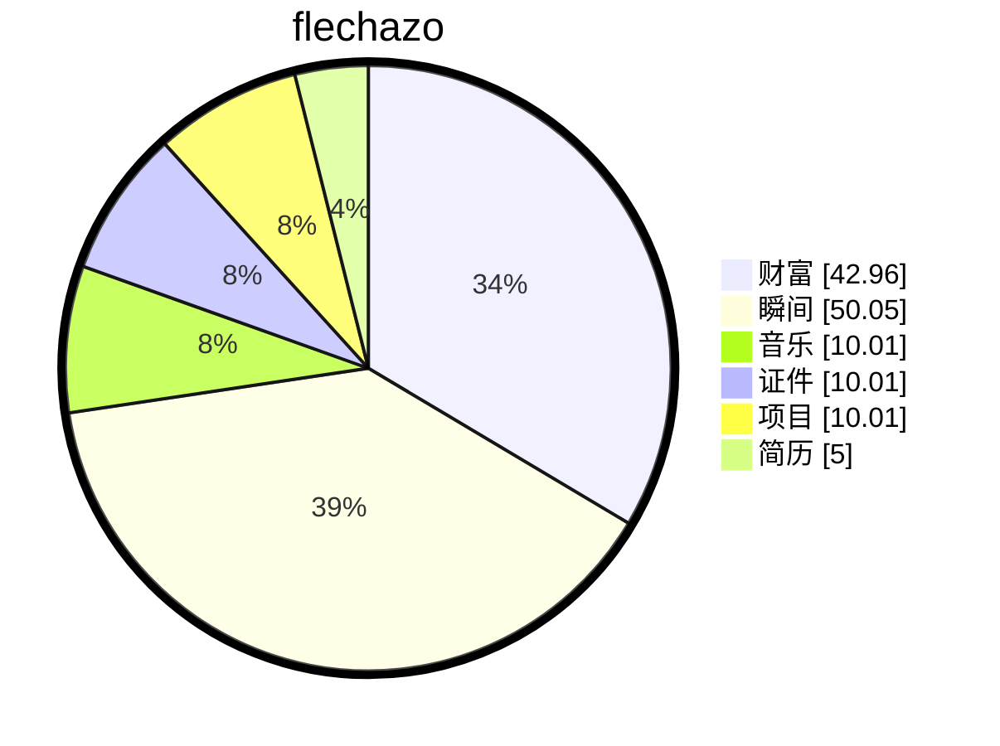

# 缘起

    
梦🫧开始的地方

一切从这里开始

想要把人生梳理的井井有条💮

# 厨艺

## 【牛腱子】

1、泡水去腥，泡3小时，中途多次换水。

2、加入料酒及清水（没过牛肉三指），水开后撇去浮沫。

3、加入花椒、八角、桂皮、草果、香叶、陈皮、山楂、干辣椒、生抽、老抽、甜面酱、黄豆酱、盐。

4、炖煮1小时至1个半小时，关火焖3小时后捞出冷藏，冷藏一夜后切片。

# 缘落

