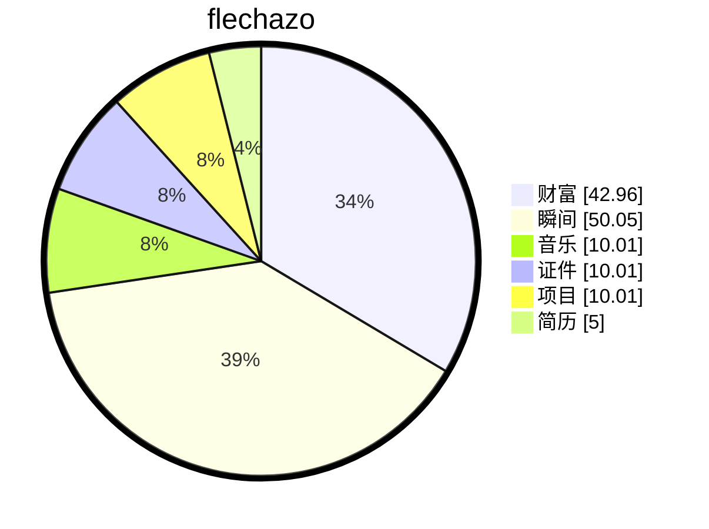

# 缘起

    
梦🫧开始的地方

一切从这里开始

想要把人生梳理的井井有条💮

# 厨艺

## 食材

| 食材   | 数量 | 价格 | 备注 |
| ------ | ---- | ---- | ---- |
| 鲫鱼   | 1条  | 20元 |      |
| 老豆腐 | 1块  | 3元  |      |
| 姜     | 1个  | 3元  |      |
| 葱     | 1根  | 3元  |      |
| 料酒   | 两勺 |      |      |
| 盐     | 三勺 |      |      |
| 大米饭 | 两碗 |      |      |
|        |      |      |      |

## 步骤

### 蒸米饭（55分钟）

两碗大米，一半米一半水

### 准备鲫鱼（5分钟）

让卖家处理好鳞片和内脏

切掉鱼头和鱼尾

清洗干净

### 煎至金黄（3分钟）

清洗完鲫鱼控水

加油

煎一会

### 加水炖汤（1小时）

加入开水炖

### 撒盐和葱花开盖（3分钟）

不需要其他调料

加盐、葱花即可出锅

## 展示

【2025年08月18日】

【图片】

# 缘落

