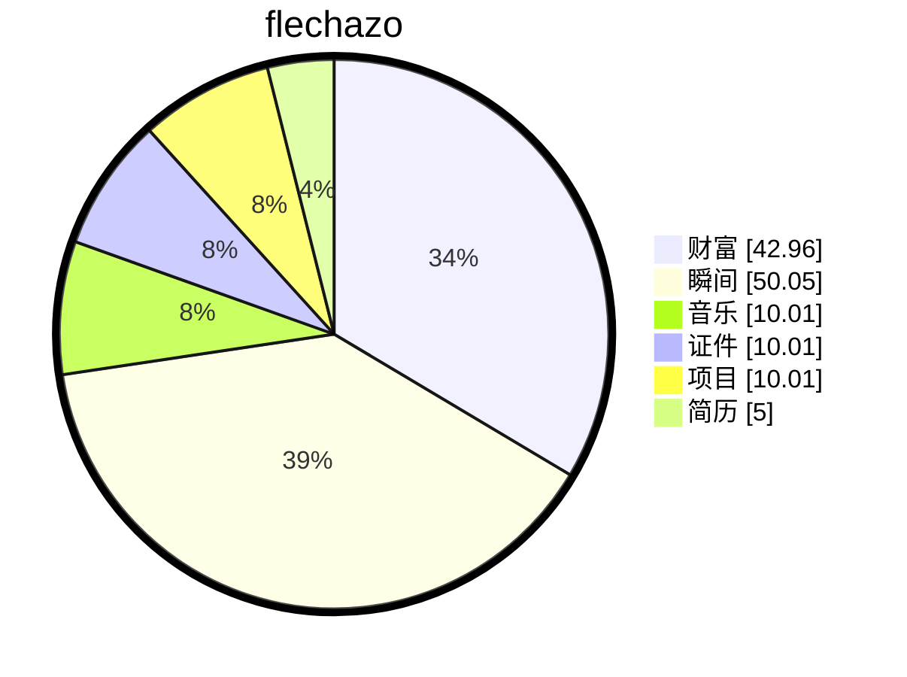

# 缘起

    
梦🫧开始的地方

一切从这里开始

想要把人生梳理的井井有条💮

# 过往

## 消毒设备中控网关

**项目名称：** 基于 GD32+FreeRTOS 的智能消毒设备物联网网关系统

**项目角色：** 核心开发工程师（嵌入式 + 上位机）

**技术栈：** GD32 (Cortex-M4), FreeRTOS, LoRa, TCP/IP, 4G, Qt5/6, AES, SQLite, Bootloader

**项目描述：** 

设计并实现一套工业级消毒设备中控网关，负责连接云端、PC 配置工具与末端消毒设备。系统支持多指令集并发处理，实现设备自动发现、远程运维及安全升级，应用于医疗/公共消毒场景。

## 1、**通信协议设计**

- 设计 **LoRa 射频跳频算法**，基于多频段动态分配机制，实现网关与设备间的自动发现与双向绑定
- 设计消息 **负载均衡策略**，由网关主动为设备分配频段信道，均衡分配可选频段资源
- 开发 **消息优先级队列**，支持多指令并发处理，确保高安全级别事件优先响应
- 实现**函数指针架构抽象**，保证代码在嵌入式设备和QT工具以及网站通信间复用
- 实现 **TCP/4G 网络通信**，支持网站编排设备、分配任务给网关，由网关协调各类消毒设备工作
- 实现 **网络穿透通道**，网关为每个设备分配独立内网地址，支持网站通过网关穿透至具体设备进行点对点独立通信

## 2、**存储与升级架构**

- 设计 **页表索引算法**，采用动态地址存储算法及双页轮流擦除机制，有效延长 FLASH 使用寿命
- 统一**管理存储空间**，涵盖设备信息、设备任务、网关信息等关键数据
- 实现 **Bootloader**，支持断点续传、双区备份、异常恢复、AES 签名验证及最终数据完整性验证
- 支持 **透传Bootloader**，给消毒设备和网站间创建以太网转Lora的隧道，实现对消毒设备的Bootloader管理
- 开发 **环形队列缓冲**，处理 Socket 分包粘包问题，增强网关处理并发消息的能力

## 3、**QT配置工具开发**

- 实现 **多协议通信支持** (串口/网口/Socket)
- 支持基于 Qt 对网关进行 **Boot 升级** 及全参数配置，涵盖：任务、设备、功能使能、遥控器参数、LoRa、以太网、中继、透传转换（以太网互转串口/以太网互转 LoRa）、控制器心跳、权限模式切换（管理员/用户）
- 集成 **FRP 内网穿透**，支持远程设备管理，打开软件即可让网关打开TCP连接
- 开发 **AES 加密通信** 模块及 **数据库存储** 功能存储用户历史配置
- 支持 **工厂配置模式**，适用于流水线配置工具，支持 AES 加密保护
- 支持 **指令解析功能**，支持任意粘贴指令，工具自动返回指令描述
- 支持 **远程数据读取**，自动搜索设备，读取设备信息、房间信息及任务信息

# 缘落

