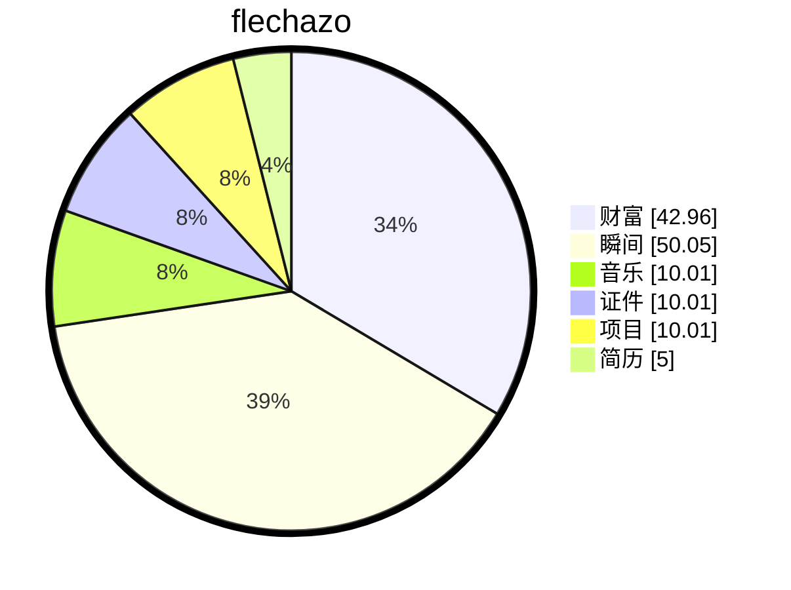

# 缘起

    
梦🫧开始的地方

一切从这里开始

想要把人生梳理的井井有条💮

# 过往

## 基于瑞昱 RTL9071CP 的车载以太网Switch开发

**项目名称：** 基于瑞昱 RTL9071CP 的AUTOSAR MCAL开发
**项目角色：** 嵌入式以太网工程师
**技术栈：** RTL9071CP, C, L2/L3 Switch, PTP,TSN,QoS, IGMP, VLAN,, AVB

**项目描述：**
基于 **瑞昱 Switch RTL9071CP** 芯片开发高性能车载以太网交换机，支持外挂SPI的flash读取配置，或在flashless mode通过SPI配置，或者通过port9进行配置

## 1、**交换核心与转发架构**

- 基于 **瑞昱 RTL9071CP** 芯片驱动开发，实现 **Port 端口管理** 及状态监控，芯片集成 **Real-M500 ARM 处理器**（最高 500MHz，768KB SRAM）
- 配置 **VLAN 划分** 功能，支持 **4096-entry VLAN 表**，支持 802.1ad/Q-in-Q **双标签**及 **VLAN 转换**
- 维护 **L2 转发表**，采用 **4K 8-way hash 查找引擎 + 256-entry CAM**，支持 MAC 地址**自学习**、老化（最长 1757497s）及**源/目的 MAC 阻塞**
- 实现 **IP Routing 三层路由** 功能，支持 **64-entry L3 接口表**、**256-entry 网络路由表**、**12K IPv4/2K IPv6 单播主机路由表**及**4K/2K 组播路由表**
- 开发 **报文过滤 (ACL/TCAM)** 机制，支持 **512-entry ACL**，支持 MAC、LLC、ARP、TCP、UDP、ICMP、IGMP 等多维度过滤

## 2、**TSN/AVB 时间敏感网络**

- 实现 **IEEE 802.1AS-2020 gPTP** 精确时间协议，支持 **3个独立 PTP 实例**，支持 1-step/2-step 同步，时间同步精度 < 1μs
- 实现 **IEEE 802.1Qav** 信用整形器（Credit-Based Shaper），为音视频流提供有界延迟保障
- 实现 **IEEE 802.1Qbv** 时间感知整形器，支持基于时间门的队列调度，实现确定性延迟传输
- 实现 **IEEE 802.1Qat SRP** 流预留协议，支持最多 **25条流**的带宽预留及 VLAN 注册
- 实现 **IEEE 802.1Qcc** SRP 增强功能，支持流排名、端站接口、流量规格等 TLV 扩展
- 实现 **IEEE 802.1Qci** 每流过滤与监管（PSFP），支持流识别、流过滤、流门控及流量计量
- 实现 **IEEE 802.1CB** 帧复制与消除，支持 **96-entry 被动流识别表**、**序列恢复**及**流拆分**功能，提升传输可靠性

## 3、**流量管理与 QoS**

- 实现 **QoS 服务质量机制**，支持 **8个优先级队列**，支持端口/内标签/外标签/混合/DSCP 优先级提取
- 设计 **优先级调度** 算法，支持 **Strict Priority (SP)**、**Weighted Round Robin (WRR)**、**Weighted Fair Queuing (WFQ)** 及 **Credit-Based Shaper (CBS)**
- 实现 **带宽控制** 功能，支持入口带宽控制（8Kbps-1Gbps，步长 8Kbps）及出口队列/端口速率限制
- 配置 **FlowControl 流控** 机制，支持 IEEE 802.3x pause 帧，防止缓冲区溢出
- 实现 **Storm 风暴抑制**，支持广播/组播/未知单播/未知组播风暴检测与阈值限制

## 4、**车载以太网物理层**

- 集成 **4个 10BASE-T1S/100BASE-T1** 组合收发器（支持单对双绞线，符合 IEEE 802.3bw）
- 集成 **2个 100/1000BASE-T1** 收发器（符合 IEEE 802.1bp），支持主/从角色自动协商
- 支持 **Realtek Cable Test Diagnostics (RTCT)** 线缆诊断，可检测开路/短路及线缆长度（精度 ±1m）
- 实现 **TC10 部分网络**功能，支持端口级睡眠/唤醒及唤醒转发，降低整车功耗

## 5、**组播与高级特性**

- 配置 **IGMP/MLD Snooping**，支持 **IGMP v1/v2/v3**（包含/排除模式）及 **MLD v1**，**128-entry 组播组表**，支持快速离开及跨 VLAN
- 实现 **端口镜像** 功能，支持入口/出口镜像、流基础镜像、原始/修改包镜像及 RSPAN 跨交换机镜像
- 开发 **链路聚合 (Link Aggregation)** 功能，支持 **2组聚合组**（每组 2/3端口），支持 **Hash 模式**及**Balance 模式**负载均衡
- 实现 **端口隔离** 功能，支持同一 VLAN 内端口间流量隔离
- 配置 **单环路检测机制**，防止网络环路
- 实现 **STP/RSTP/MSTP 生成树协议**，支持 **15个生成树实例**，RSTP 由内部 ARM CPU 硬件卸载

## 6、**PCIe 与高速接口**

- 实现 **PCIe 3.0 x1** 接口（8 GT/s），支持 **SR-IOV**（1个物理功能 + **7个虚拟功能**）
- 支持 **协议卸载**：TX/RX 校验和卸载、VLAN 插入/提取、TCP 分段卸载（TSO）
- 支持 **PTM（Precision Time Measurement）** 精确时间测量
- 支持 **RGMII/RMII/MII** 接口（3组），支持 **SGMII/HSGMII/USXGMII/5G-BASE-KR** SerDes 接口
- 支持 **SPI MACPHY** 接口（符合 OPEN Alliance TC6），用于连接外部 10BASE-T1S PHY

## 7、**系统管理与维护**

- 开发 **MIB Counter 统计计数器**，支持 RFC1213/2863/3635/2819/4188/4363 等标准 MIB
- 实现 **中断管理** 机制，支持 GPIO、交换功能、OPFSM、PTP、PHY、MACsec、PCIe、ACL 等 **14类中断**
- 支持 **堆叠 (Stacking)** 功能，支持最多 **4台交换机堆叠**，支持动态堆叠构建及堆叠启动（仅需 1个 Flash）
- 支持 **Flashless 启动模式**，提升启动速度
- 实现 **LED 指示**功能，支持 6个 LED 引脚，支持链路/活动/速率/双工状态指示及自定义指示
- 支持 **I2C/SPI/MDIO** 寄存器访问接口，支持间接访问及页切换

## 8、**电源与功耗管理**

- 支持 **Deep Sleep** 及 **Lite Sleep** 两种睡眠模式
- 支持 **INH 引脚** 控制外部稳压器，实现超低功耗睡眠
- 支持 **WAKE 引脚** 本地唤醒及 **MDI 远程唤醒**（WUP/WUR）
- 支持 **唤醒转发** 功能，可配置唤醒端口掩码
- 电源域：3.3V、0.9V、V33（独立供电），支持上电/断电时序控制

# 缘落

