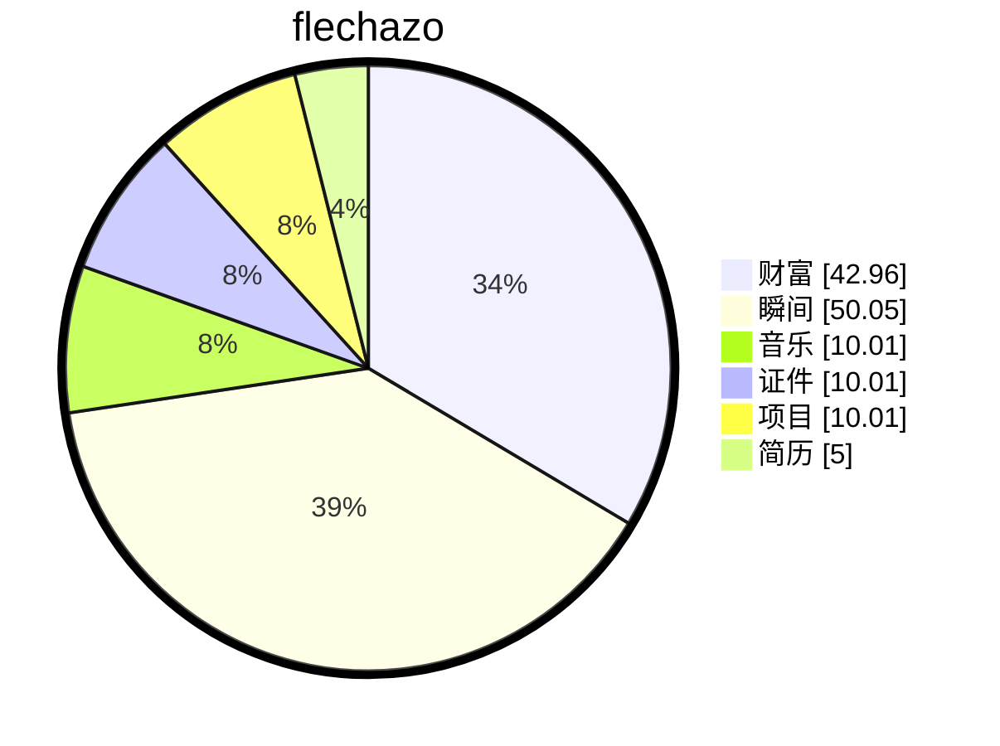

# 缘起

    
梦🫧开始的地方

一切从这里开始

想要把人生梳理的井井有条💮

# 过往

## 基于 RH850 的双 Bank 安全 Bootloader 开发

**项目名称：** 伯特利Bootloader开发

**项目角色：** 嵌入式软件工程师 负责Bootloader

**技术栈：** RH850, ISO14229 (UDS), Dual Bank, Secure Boot, Flash Driver

**项目描述：** 设计并实现基于 RH850 车规芯片的高可靠 Bootloader 系统，支持 ISO14229 标准刷写流程与 AB 面交替升级。设计 PBL/FBL/SBL 三级启动架构

**核心职责：**

- **三级启动架构设计：** 构建 **PBL(一级)/FBL(二级)/SBL(RAM)** 分层启动体系。PBL 固化于受保护区域负责完整性校验；FBL 驻留 Flash 处理 UDS 协议与 Flash 操作；SBL 动态加载至 SRAM 执行关键擦写任务，实现 Flash 无感升级。
  - **PBL (Primary Bootloader):**
    - **位置：** 位于 Flash 受保护区域（通常由硬件保护或 Option Byte 锁定）。
    - **功能：** 上电最先运行，负责初始化最小系统，校验 FBL 的签名/Checksum。如果 FBL 损坏，可进入紧急模式。
    - **特点：** 极少更新，保证系统总能启动。
  - FBL (Flash Bootloader):
    - **位置：** 位于 Flash 的 A/B 面公共区域或独立区域。
    - **功能：** 核心刷写逻辑，处理 UDS 通信，解析刷写指令，控制 Flash 擦写。
    - **特点：** 支持通过 UDS 升级自身（需配合 SBL）。
  - SBL (SRAM Bootloader):
    - **位置：** 运行时由 FBL 加载到 SRAM 中执行。
    - **功能：** 当需要升级 FBL 自身所在的 Flash 区域时，将关键擦写代码搬运到 RAM 运行，避免“边跑边擦”导致的系统崩溃。
    - **特点：** 临时性，断电丢失，保证 FBL 升级的原子性。
- **AB 面冗余与切换机制：** 设计 **Dual Bank 双分区存储方案**，通过改写 **Option Byte 配置位** 实现硬件层面的 A/B 面启动切换。支持升级失败自动回滚至旧版本，确保车辆永不变砖。
- **ISO14229 协议栈实现：** 完整实现 UDS 核心服务，包括 **会话控制 (0x10)**、**安全访问 (0x27 Seed/Key)**、**数据传输 (0x34/0x36/0x37)**、**例程控制 (0x31)** 及 **DTC 管理 (0x14/0x19)**，支持诊断会话保持 (0x3E) 与数据读写 (0x22/0x2E)。
- **安全启动与验证：** 实现基于非对称加密的应用签名验证机制，在 PBL 阶段校验 FBL 签名，FBL 阶段校验 App 签名，防止恶意固件刷写。
- **底层驱动与内存映射：** 深入配置 RH850 **内存映射 (Memory Map)** 与 **中断向量表重映射**，编写高性能 Flash 驱动，优化擦写算法以延长 Flash 寿命。

# 缘落

