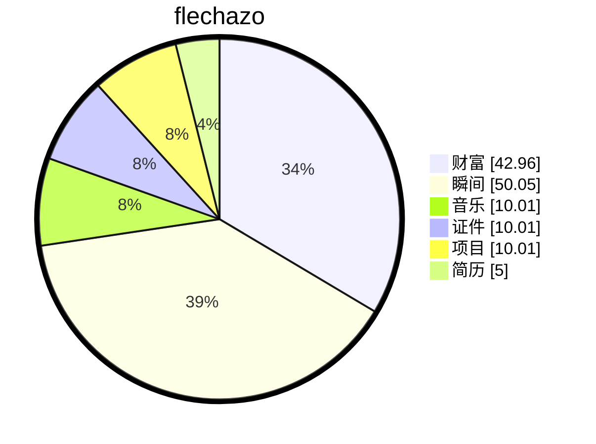

# 缘起

    
梦🫧开始的地方

一切从这里开始

想要把人生梳理的井井有条💮

# 过往

## Socket 通信与管理架构设计

**模块名称：** 车载以太网 Socket 通信与管理协议栈 

**技术栈：** AUTOSAR (EthIf/SoAd/TcpIp), lwIP, TCP/IP, Socket API, 多线程并发，零拷贝技术

**核心职责：**

- 设计 EthIf 驱动抽象层 (Hardware Abstraction)：
  - **异构硬件屏蔽**：设计统一以太网接口驱动抽象层，屏蔽 **RTL9071CP Switch** 与 **T1 PHY** 等底层硬件差异，统一封装 **RGMII/SGMII/100BASE-T1** 多接口驱动，实现链路状态实时监控、MDIO 配置管理及中断事件处理。
  - **时间同步抽象**：集成硬件时间戳引擎，抽象 **IEEE 802.1AS/gPTP** 时间同步接口，支持 **Tx/Rx 双向硬件打戳** 与 Time Application Interface (TAI) 对接，降低协议栈 CPU 负载并提升同步精度。
  - **功耗模式管理**：基于 **OPEN Alliance TC10** 标准实现功耗管理模块，封装休眠/唤醒流程 (Sleep/Wake Flow)，控制 **INH/WAKE 引脚** 及工作模式切换 (Normal/Sleep/Standby)，支持局部网络 (Partial Networking) 功耗优化。
- 开发 SoAd Socket 适配层 (Socket Adaptation Layer)：
  - 基于 AUTOSAR 标准架构开发 SoAd 模块，管理 **TCP/UDP 连接的全生命周期**（建立、保持、断线重连、断开），实现状态机闭环管理。
  - 支持 **IF (Immediate Frame) 与 TP (Transport Protocol) 两种发送模式**，适配不同实时性需求的数据流，实现 PDU 路由分配与动态映射。
  - 解决 **TCP 粘包/分包** 难题，设计基于 **长度字段/帧头特征** 的解析状态机，确保应用层数据完整性。
  - 支持最佳匹配算法，来匹配ip和port，支持UDP自动创建连接，TCP支持匹配连接
- 设计 Socket 路由组控制机制 (Routing & Multiplexing)：
  - 实现 **多路复用 (Multiplexing)** 管理，支持单 Socket 多业务流复用，通过 **消息回调 (Callback)** 机制将数据分发至不同业务模块。
  - 设计 **连接状态通知中心**，支持异步事件通知（如 Link Down、IP Change），确保上层业务快速响应网络变化。
- 适配与优化 lwIP/TcpIp 协议栈：
  - 针对嵌入式资源受限环境优化 **lwIP 内存池 (Memory Pool)** 管理，实现 **零拷贝 (Zero-Copy)** 数据转发，提升吞吐量。
  - 增强协议栈稳定性，增加 **看门狗守护** 与 **异常恢复机制**，确保在网络风暴或高负载下通信不中断。

# 缘落

