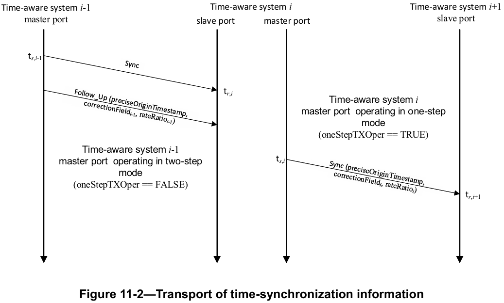
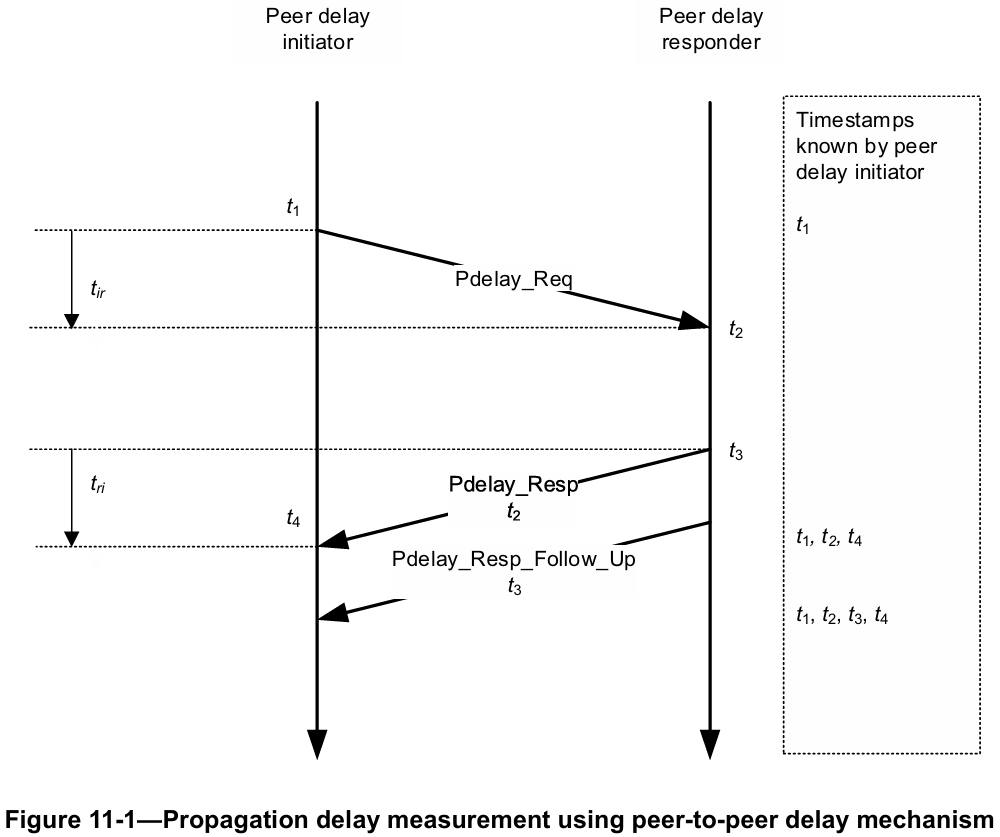
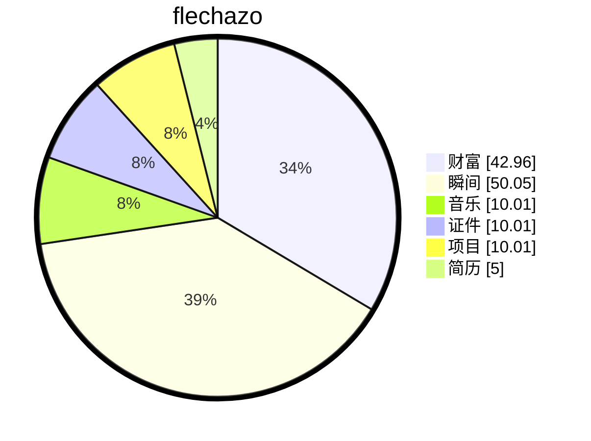

# 缘起

    
梦🫧开始的地方

一切从这里开始

想要把人生梳理的井井有条💮

# 过往

## 项目名称：车载以太网时间同步系统 (EthTSyn & CanTSyn)

**项目角色：** 嵌入式基础软件工程师 / 时间同步协议专家 

**技术栈：** IEEE 802.1AS-2020, AUTOSAR CP (EthTSyn, StbM, EthIf), gPTP, TSN, Linux gptp

**项目描述：** 基于 AUTOSAR Classic Platform 架构，设计并实现符合 IEEE 802.1AS-2020 标准的时间同步模块 (EthTSyn)，为车内多域控制器提供微秒级全局时间基。同时开发 CAN 总线时间同步模块 (CanTSyn)，实现异构网络时间统一。

**核心职责：**

- **EthTSyn 模块开发：** 遵循 **AUTOSAR SWS TimeSyncOverEthernet** 规范，实现 gPTP 协议栈。完整支持 **Sync, Follow_Up, Pdelay_Req/Resp** 消息的处理与发送，实现 **Follow_Up Information TLV** 及 AUTOSAR 自定义 **Sub-TLV** 的解析与组装。
- **高精度时间戳架构：** 设计灵活的时间戳采集机制，支持通过配置 (`EthTSynHardwareTimestampSupport`) 在 **MAC 硬件时间戳** 与 **StbM 软件时间戳** 之间切换。实现了不同时间源 (Virtual Local Time) 之间的线性转换与补偿，消除软件栈延迟对同步精度的影响。
- **同步算法实现：** 精通 **IEEE 802.1AS 同步算法**，独立实现全局时间计算、主从时钟偏移 (Offset) 校正及网络传输延迟 (Path Delay) 测量。实现了 **neighborRateRatio** 计算以补偿时钟频率漂移，确保长时间同步稳定性。
- **网络特性支持：** 集成 **VLAN 优先级 tagging** 功能，确保同步报文在网络拥塞时的低延迟传输。支持 **Time Master/Slave/Gateway** 多种角色动态切换，适应复杂的整车网络拓扑。
- **异构网络同步：** 开发 **CanTSyn 模块**，实现 CAN 网络主从节点时间同步，支持 **CAN FD 扩展帧** 携带时间信息，并通过 StbM 实现以太网与 CAN 域的时间域统一，CAN报文是Sync,Follow Up,OFS,OFNS,EXOFS。
- **协议一致性验证：** 搭建 **Linux gptp** 测试环境，作为 Grandmaster 或 Transparent Clock 与目标板进行互操作性测试。分析 Wireshark 报文时序，优化 Pdelay 测量周期与抖动处理，确保同步精度达到 **微秒级 (≤1μs)**。

#### 专业技能 (Skills)

- **协议标准：** 精通 **IEEE 802.1AS-2020 (gPTP)**, IEEE 1588 PTP, IEEE 802.1Qbv/Qav, AUTOSAR CP R23-11 EthTSyn SWS.
- **中间件开发：** 熟练掌握 AUTOSAR BSW 模块开发 (EthTSyn, StbM, EthIf, CanIf, Csm)，熟悉 RTE 配置与集成。
- **时间同步算法：** 深入理解时钟伺服模型、频率补偿、路径延迟测量 (Pdelay) 及最佳主时钟算法 (BMCA)。
- **调试与测试：** 熟练使用 Wireshark, Vector CANoe, Linux gptp 进行协议分析与一致性验证。

## Sync

## PDelay

# 缘落

