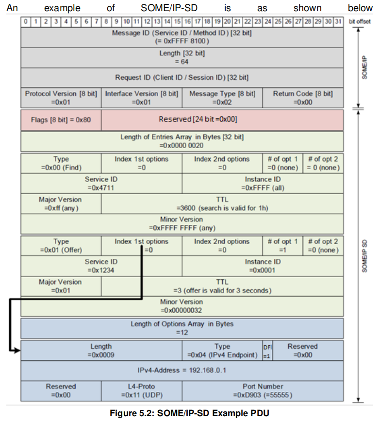
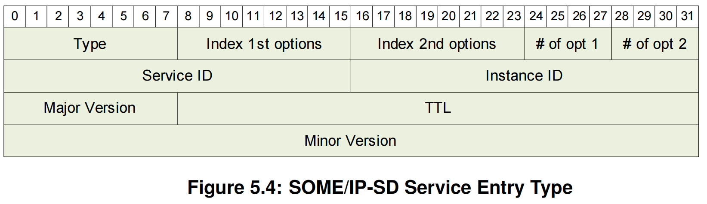
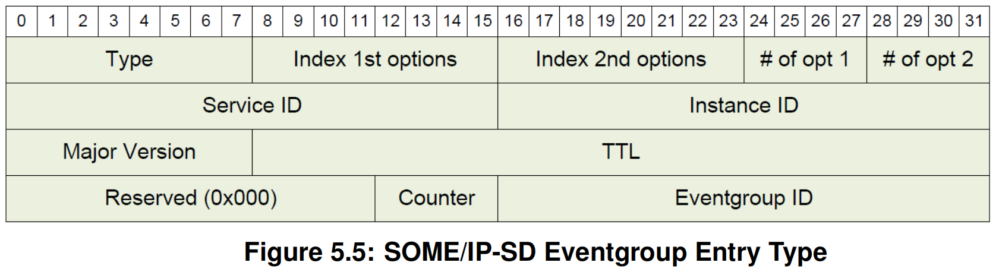
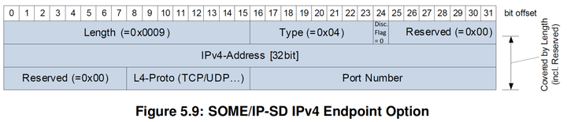
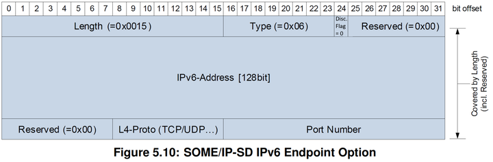
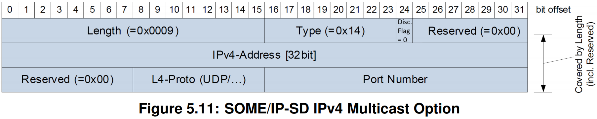
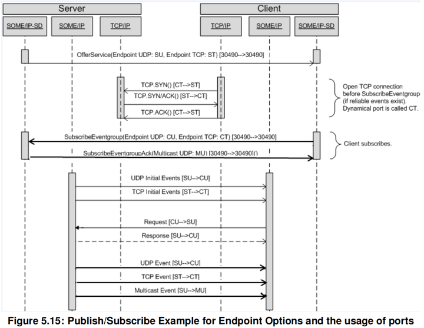
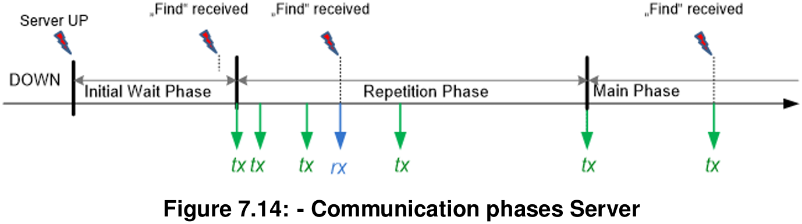
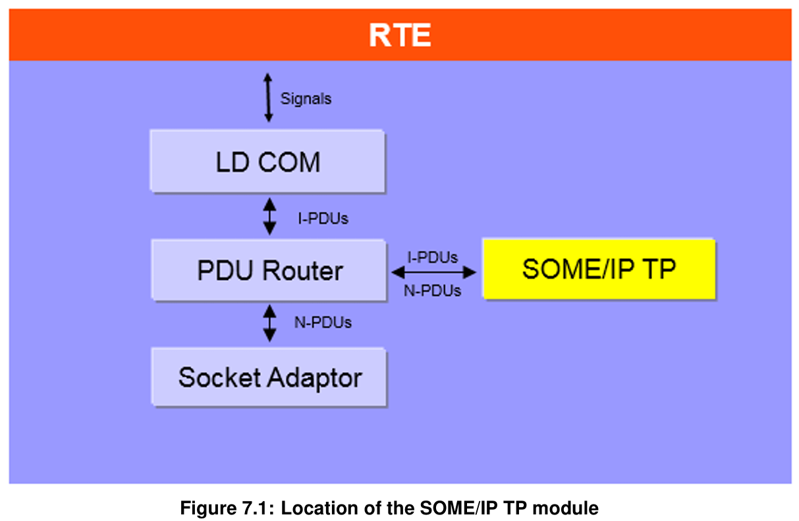
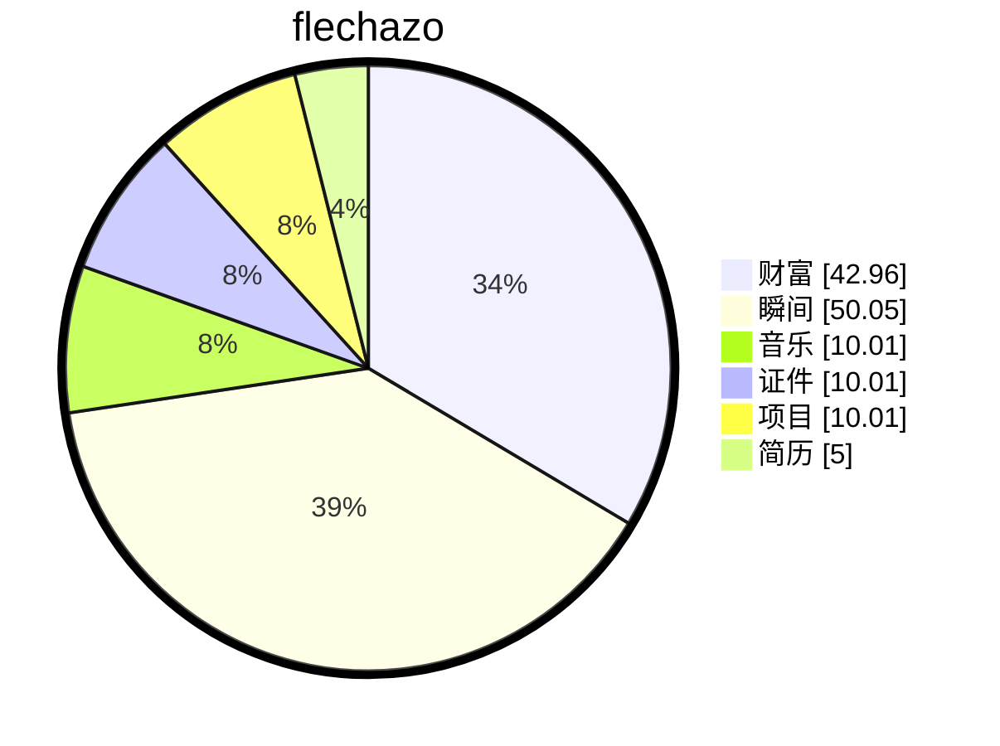

# 缘起

    
梦🫧开始的地方

一切从这里开始

想要把人生梳理的井井有条💮

# 过往

## 项目概述

基于AUTOSAR CP标准，设计并实现面向服务的**车载以太网通信中间件SOMEIP**，支持**服务发现**、**大数据传输**、**序列化**等核心功能，满足**TC8 测试**规范。

- 基于 AUTOSAR CP 标准，独立开发 SOME/IP-SD 服务发现模块，实现服务（method/event）发布/订阅、负载均衡、多播通信等核心功能，支持协议状态机动态切换
- 设计 SomeIpTp 传输层，支持超大报文分段传输与重组，对接 PduR 实现多协议路由，数据传输可靠性达 99.99%+
- 实现 SomeIpXf 序列化引擎，支持复杂数据结构编解码，优化内存策略使性能提升
- 搭建 Linux+vsomeip 自动化测试框架，完成部分 TC8 一致性测试用例
- 技术栈：C++14/Python/AUTOSAR/vsomeip/CMake/Wireshark

## 核心技术模块

### 🔹 服务发现模块 (Sd) 开发

- 实现 SOME/IP-SD 状态机（Initial → Repeat → Main），支持服务发布/订阅机制的动态切换
- 设计负载均衡策略，通过优先级和权重机制，合理分配客户端请求到多个服务实例。同一服务可由多个实体提供，实现故障切换，订阅者可在实例失效时切换。
- 支持**服务版本**协商、单播/组播/广播多模式通信，兼容异构网络环境
- 基于 Linux + vsomeip 搭建协议一致性测试环境，完成部分 TC8 测试用例验证
- 事件类型
  - Request/Response Communication 🔄
  - Fire&Forget Communication 🚀
  - Notification Events 📢
    - Cyclic update（周期更新）⏱️
    - Update on change（变化时更新）🔄
    - Epsilon change（超阈值变化）📊

### 🔹 SOME/IP 传输层 (SomeIpTp) 实现

- 开发分段传输协议，支持超大报文（>1472 字节）的分包/重组，确保数据完整性与顺序性
- 实现流控机制与重传策略，适应车载网络抖动场景
- 对接 AUTOSAR PduR 模块，通过标准化接口实现多协议路由转发

### 🔹 序列化引擎 (SomeIpXf) 开发

- 实现复杂数据结构（嵌套结构体、变长数组、字符串）的序列化/反序列化
- 支持字节序转换、对齐填充、长度字段编码等 SOME/IP 协议细节
- 优化内存拷贝策略

### 🔹 大数据通信接口 (LdCom) 设计

- 设计分层接口架构：LdCom → SomeIpTp → PduR → EthIf，实现模块解耦
- 支持零拷贝数据传输，降低大数据场景下的内存开销与延迟
- 提供异步回调机制，支持应用层非阻塞式数据收发

### 🔹 自动化测试框架

- 使用 Python + pybind11 封装 C++ 核心模块，构建跨语言测试接口
- 开发协议一致性测试套件，支持服务发现、传输、序列化等模块的自动化验证

## 消息格式

### 两种Entry (方法/事件)

### 多种Option

**Load Balancing Option（负载均衡选项）⚖️**

**IPv4 Endpoint Option（IPv4端点选项）🌐**

**IPv6 Endpoint Option（IPv6端点选项）🌐**

**IPv4 Multicast Option（IPv4多播选项）📡**

**IPv6 Multicast Option（IPv6多播选项）📡**

**IPv4 SD Endpoint Option（IPv4 SD端点选项）🔄**

**IPv6 SD Endpoint Option（IPv6 SD端点选项）🔄**

## 订阅服务通信示例

### 多客户端订阅事件

## 状态机

这里的消息发送都会是一个最小值到最大值之间的随机时间

## SOMEIPTP的传输方式

# 缘落

