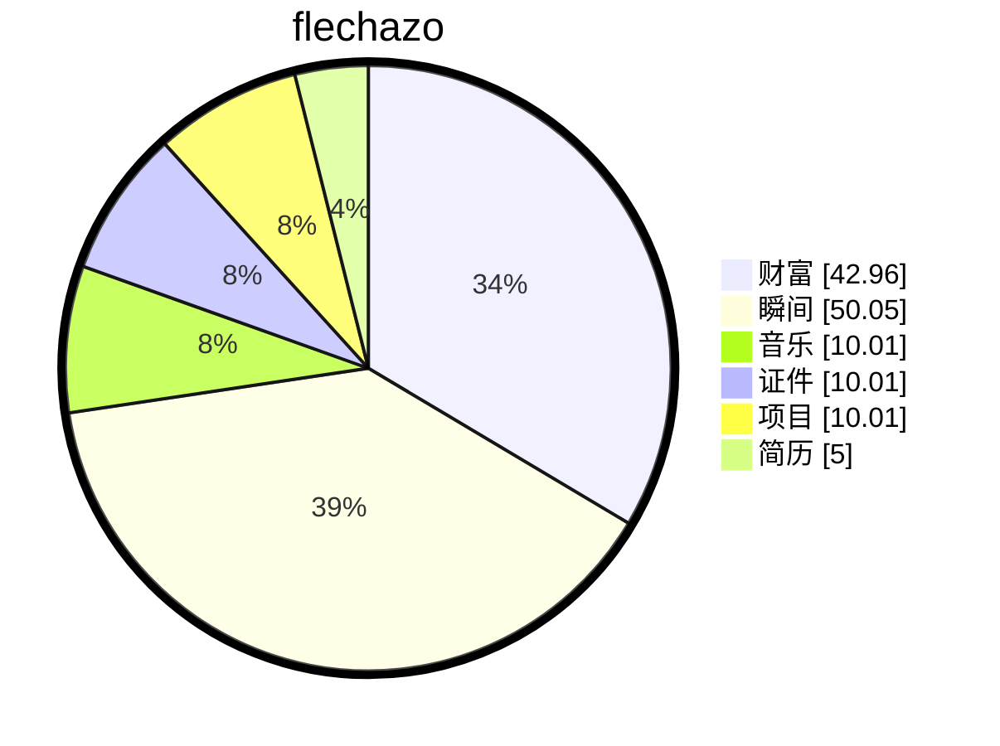

# 缘起

    
梦🫧开始的地方

一切从这里开始

想要把人生梳理的井井有条💮

# 过往

### 项目名称：车载以太网网关网络管理模块开发 (UdpNm)

**项目角色：** 基础软件工程师 / 网络管理模块负责人

**技术栈：** AUTOSAR CP, UdpNm, UDP/IP, 状态机，电源管理，CBV 解析

### 简历项目知识点描述 (建议选用 3-4 条)

- **AUTOSAR UdpNm 状态机设计与实现：** 严格遵循 AUTOSAR CP SWS 规范，设计并实现了 UdpNm 核心状态机。完整覆盖了三种操作模式（**Network Mode, Prepare Bus-Sleep Mode, Bus-Sleep Mode**），并在 Network Mode 下细化实现了三种子状态（**Repeat Message State, Normal Operation State, Ready Sleep State**）的平滑切换逻辑，确保网络启动稳定性与休眠协调性。
- **基于 CBV 的网络休眠唤醒策略：** 开发基于 **Control Bit Vector (CBV)** 的报文解析机制，通过解析 NM PDU 中的控制位（如 PNC Request, Sleep Info 等）协同全网节点状态。实现了基于超时机制（NM-Timeout Timer）与报文触发的双重休眠判断逻辑，有效降低了网关及末端节点的静态功耗。
- **网络管理报文处理与鲁棒性优化：** 实现了 UDP 网络管理报文的收发处理流程，包括报文去抖（Debounce）、重复消息处理及异常状态恢复。通过配置 **Repeat Message State** 确保节点上线时网络可见性，利用 **Ready Sleep State** 协调全网进入 Prepare Bus-Sleep，避免了单节点异常导致的网络无法休眠问题。
- **电源管理与功耗优化：** 基于 UdpNm 状态机联动 EcuM 及 BswM 模块，实现了精准的总线睡眠控制。在 Bus-Sleep Mode 下关闭非必要通信接口，结合 Prepare Bus-Sleep 阶段的报文静默处理，显著降低了系统待机电流，满足车规级功耗要求。

### 面试技术准备 (基于 AUTOSAR 规范)

为了应对面试官的深入提问，建议您准备好以下技术细节的回答（基于 UdpNm 规范）：

#### 1. 状态机切换细节

- Q: Network Mode 下的三个状态有什么区别？
  - **Repeat Message State:** 节点刚唤醒或请求网络时进入。强制发送 NM 报文，确保网络中其他节点知道本节点已活跃（防止被误认为离线）。持续时间为 `UdpNmRepeatMessageTime`。
  - **Normal Operation State:** 正常运行状态。只要有网络请求（Network Request）就持续发送 NM 报文，保持网络唤醒。
  - **Ready Sleep State:** 当本节点释放网络（Network Release）但收到其他节点的 NM 报文时进入。本节点停止发送报文，但监听网络。如果全网都进入此状态（超时无报文），则转入 Prepare Bus-Sleep。
- Q: 什么时候进入 Prepare Bus-Sleep Mode？
  - 当处于 Ready Sleep State 且 **NM-Timeout Timer** 超时（即 `UdpNmTimeoutTime` 内未收到任何 NM 报文），说明全网都准备休眠，此时进入 Prepare Bus-Sleep，进行最后的报文静默（Bus Calm Down），然后进入 Bus-Sleep。

#### 2. CBV 与休眠唤醒

- Q: 如何通过 CBV 实现休眠协调？
  - NM PDU 中包含 Control Bit Vector。我会解析其中的 **PNC (Partial Network Control)** 位或 **Sleep Info** 位。
  - 如果收到带有 Sleep 指示的 CBV，且本节点无活跃请求，则加速进入 Ready Sleep State。
  - 如果收到带有 Wakeup 指示的 CBV，则立即触发 Network Request，从 Bus-Sleep 或 Ready Sleep 跳回 Normal Operation State。
- Q: 如果网关报文丢失怎么办？
  - 依赖 **NM-Timeout Timer**。即使收不到网关的协调报文，只要超时时间到，且本节点无请求，也会进入休眠逻辑，保证系统不会因单点故障而无法休眠。

#### 3. 配置参数理解

- Q: 你配置过哪些关键参数？
  - `UdpNmTimeoutTime`: 决定从 Ready Sleep 进入 Prepare Sleep 的等待时间。
  - `UdpNmRepeatMessageTime`: 决定启动时发送重复报文的时间，确保网络发现。
  - `UdpNmMainFunctionPeriod`: 主函数调用周期，影响状态机响应速度和定时器精度。
  - `UdpNmImmediateNmTransmissions`: 立即发送报文的次数，用于快速唤醒。

# 缘落

