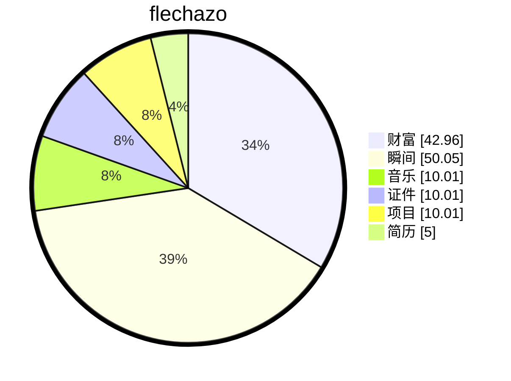

# 缘起

    
梦🫧开始的地方

一切从这里开始

想要把人生梳理的井井有条💮

# 过往

## 车载以太网协议栈移植与嵌入式操作系统验证

**项目角色：** 底层软件工程师 

**技术栈：** C, ARM Cortex-M4/M7, AUTOSAR CP, lwIP, RT-Thread, POSIX, MDIO, RMII

**项目描述：** 负责车载网络通信协议栈在异构硬件平台上的移植与验证。基于 NXP S32K344 与 芯驰 KF32A158 平台，完成从 PHY 驱动、LwIP 适配到 AUTOSAR CP 网络栈（SomeIp, DoIp, EthTSyn 等）的全链路移植，并实现 AUTOSAR 服务发现协议向 POSIX 环境的跨平台迁移。

**核心职责：**

- **底层以太网驱动开发：** 基于 **S32K344** 芯片开发 **TJA1101B** PHY 驱动，通过 **MDIO** 接口配置 PHY 寄存器，实现 **100M 全双工 RMII** 模式稳定通信；编写硬件抽象层（HAL）适配 **EthIf** 与 **EthSM** 模块。
- **AUTOSAR 网络栈移植：** 完成 **lwIP** 协议栈与 AUTOSAR CP 网络模块的集成，包括 **TcpIp, SoAd, SomeIp/SomeIpTp/SomeIpXf, Sd, UdpNm, LdCom** 等模块的配置与适配；实现 **DoIp** 诊断通信及 **EthTSyn/CanTSyn/StbM** 时间同步功能。
- **RTOS 内核深度验证：** 基于 **KF32A158** 平台对 **RT-Thread** 内核进行压力测试，覆盖线程调度、定时器、IPC（ mailbox, semaphore, mutex, event, messagequeue）及内存管理（memheap, sharedmem）等核心机制，确保内核稳定性。
- **跨平台协议移植：** 基于现有 AUTOSAR SomeIp 协议栈，将其服务发现（Service Discovery）模块移植至 **POSIX** 环境，实现车载协议在通用操作系统上的兼容运行。

### 💡 面试准备：针对“底层移植”的常见问题

既然您强调了底层移植，面试官一定会问到底层细节。以下是针对您项目经历的预测问题及回答思路：

#### 1. 关于以太网驱动 (S32K344 + TJA1101B)

- Q: TJA1101B 是如何配置的？RMII 模式下需要注意什么？
  - **A:** 通过 MDIO 接口读写 PHY 寄存器。RMII 模式下需要注意时钟源（是 PHY 提供 50MHz 还是 MCU 提供），以及 RXD 信号在时钟沿的采样对齐问题。在驱动初始化中，我配置了 S32K344 的 ENET 模块寄存器，设置了 RMII 模式、全双工、100M 速率，并处理了 MDIO 的时序时序。
- Q: EthIf 驱动中，数据包收发是如何管理的？
  - **A:** 使用 DMA 描述符环（Descriptor Ring）。发送时，上层传入 Pdu，驱动填充 Tx Descriptor，触发 DMA 发送，完成后通过 Tx Interrupt 回调通知上层释放 Buffer。接收时，DMA 将数据写入 Rx Buffer，触发 Rx Interrupt，驱动在中断中分配新的 Buffer 给 DMA，并将数据包上交 PduR。
- Q: lwIP 与 AUTOSAR EthIf 如何对接？
  - **A:** 主要是内存管理的对接。AUTOSAR 使用 PduR 提供的 Buffer，而 lwIP 有自己的 Pbuf。我在 EthIf 的 Tx/Rx 回调中做了内存拷贝或零拷贝（Zero-Copy）适配，确保数据能正确流入 lwIP 栈或从栈中流出。

#### 2. 关于 AUTOSAR 协议栈

- Q: SomeIp-SD 的服务发现流程是怎样的？
  - **A:** 主要涉及 Offer Service 和 Find Service。服务端周期性发送 Offer，客户端发送 Find。移植时重点实现了 UDP 多播 sockets 的创建与加入组播组，以及定时器管理（TTL, T2 定时器）。
- Q: EthTSyn 时间同步是如何实现的？
  - **A:** 基于 IEEE 802.1AS。EthTSyn 模块负责抓取硬件时间戳（Tx/Rx Timestamp），通过 Pdelay 机制计算链路延迟，结合 Sync/Follow_Up 消息计算时钟偏移，最终调用 StbM 接口更新全局时间。
- Q: 移植过程中遇到的最大难点是什么？
  - **A:** （建议准备一个具体案例）例如：某些 AUTOSAR 模块强依赖特定 OS 接口（如 Alarm 机制），在移植到 lwIP 或 POSIX 时，需要重新实现定时器抽象层；或者 PHY 链路不稳定，通过调整 MDIO 时序和寄存器配置解决。

#### 3. 关于 RT-Thread 内核测试

- Q: 你是如何测试内存堆（memheap）的？
  - **A:** 设计了压力测试用例，频繁申请释放不同大小的内存块，检查是否有碎片化过高或内存泄漏。同时测试多线程竞争申请同一块内存时的锁机制是否正常。
- Q: 邮件箱和消息队列的区别是什么？测试中发现了什么问题？
  - **A:** 邮件箱传递的是指针（高效但需注意生命周期），消息队列拷贝数据（安全但有开销）。测试中发现如果发送者释放了内存而接收者还未读取，会导致野指针，因此制定了内存管理规范。

# 缘落

