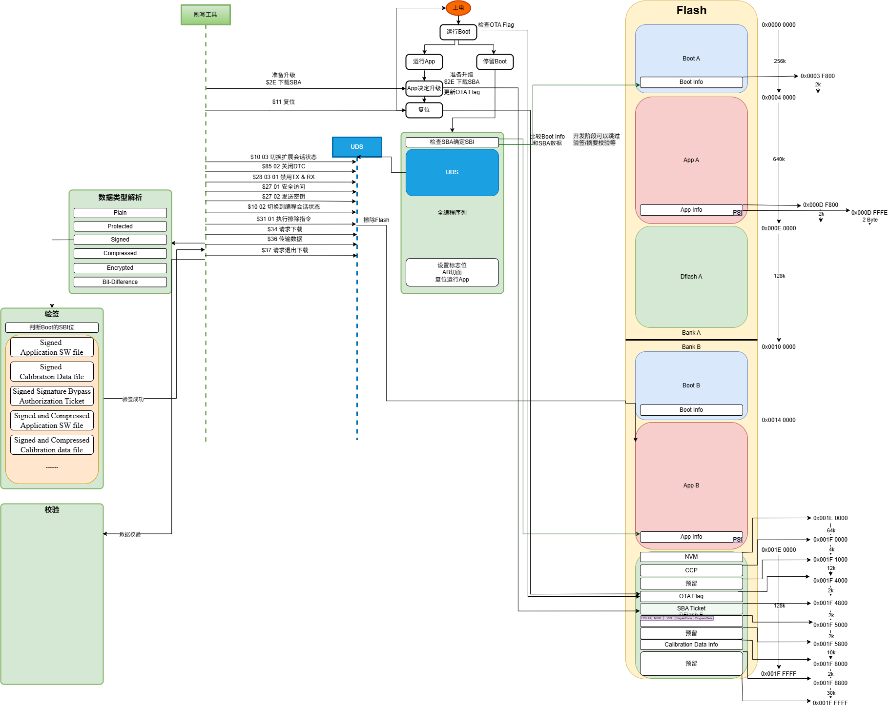
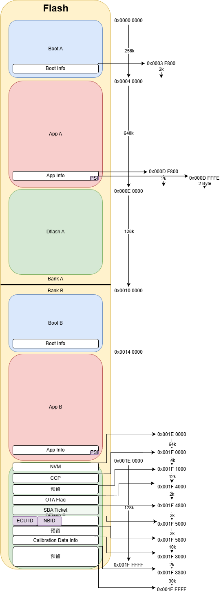
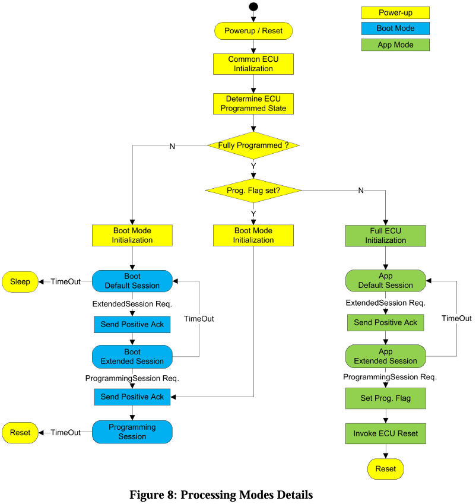
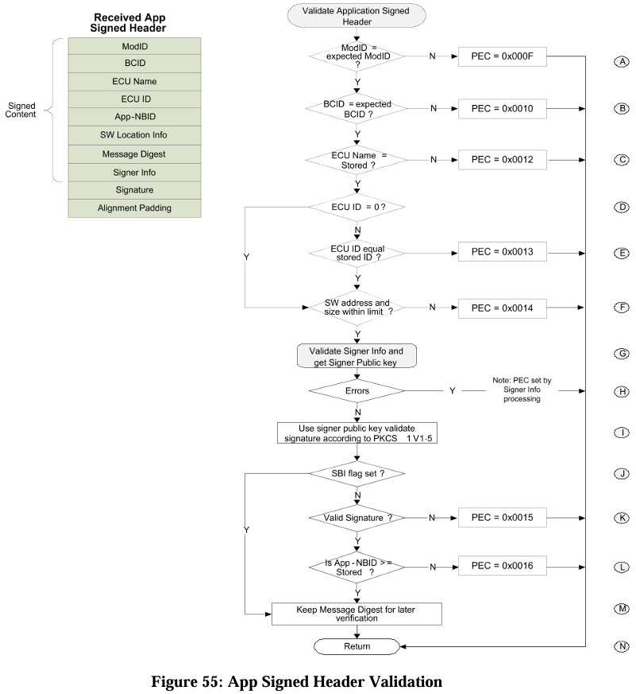
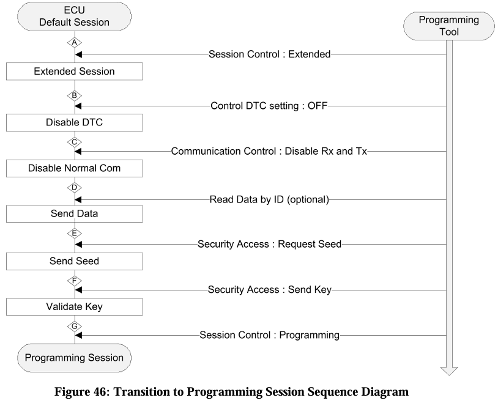
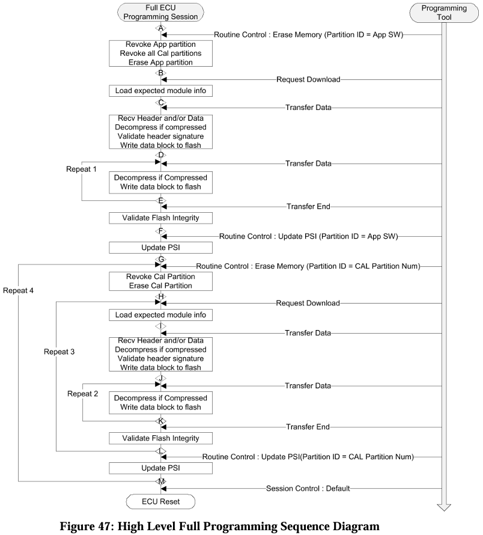
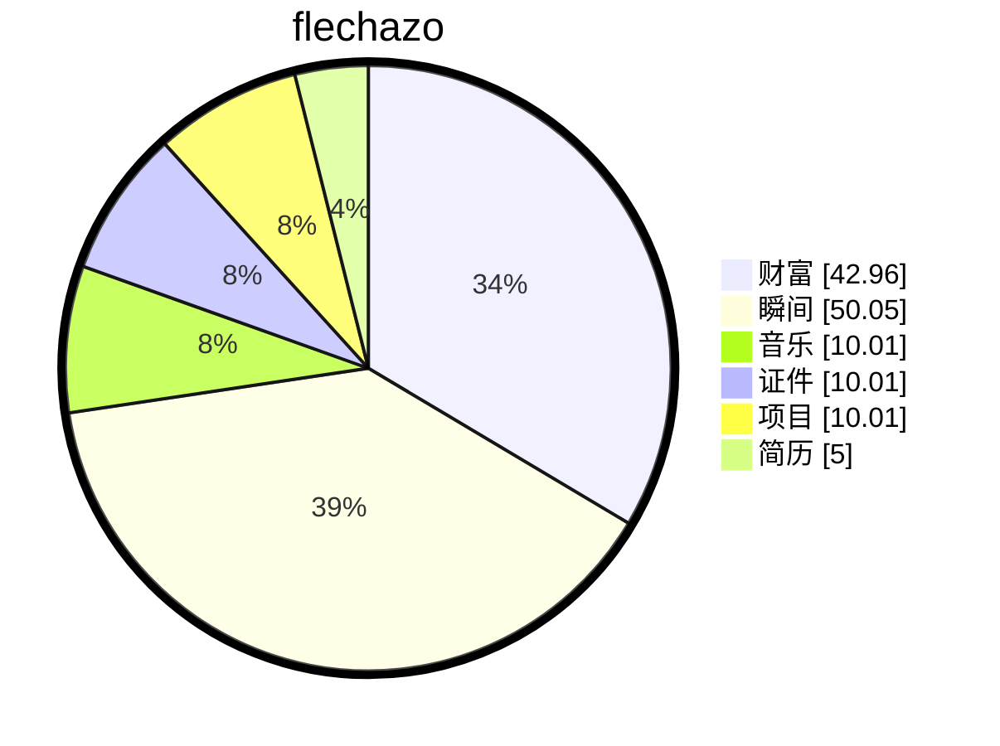

# 缘起

<details open>
    <summary>梦🫧开始的地方</summary>
<p>一切从这里开始</p>
<p>想要把人生梳理的井井有条💮</p>
</details>


# 过往


# 项目经历：基于 KF32A158 的车规级 Bootloader 设计与实现（符合 GB6002/AUTOSAR UDS）

## 项目概述
基于 **芯驰 KF32A158** 车规级 MCU，设计并实现符合 **GB6002 Bootloader 规范** 与 **AUTOSAR CP Dcm 标准** 的安全启动与刷写系统。支持 **AB 面冗余升级**、**RSA/SHA 签名验签**、**OTA 无感升级**，兼容 **周立功/ZCANPRO** 及 **J2534 DPS** 诊断工具，满足车规级功能安全与网络安全要求。

---

## 核心技术架构

### 🔹 系统架构设计

draw.io



### 🔹 内存分区规划（符合 GB6002 Section 7.2）



---

## 核心功能模块

### 1️⃣ UDS 诊断通信栈（符合 AUTOSAR Dcm SWS）

#### 诊断服务实现
| 服务 ID       | 服务名称                   | 实现细节                                                     |
| ------------- | -------------------------- | ------------------------------------------------------------ |
| **0x10**      | DiagnosticSessionControl   | 支持 Default/Extended/Programming 三会话切换，S3Server 超时管理 |
| **0x27**      | SecurityAccess             | Seed/Key 算法，支持 Level 1-6 安全等级，集成SSC              |
| **0x34**      | RequestDownload            | 内存地址校验，支持 App/Cal 分区选择，数据长度验证            |
| **0x36**      | TransferData               | 块序号校验，支持解析签名头，支持SBAT票据，支持HASH算法验证   |
| **0x37**      | RequestTransferExit        | 触发签名验证，更新 PSI 状态                                  |
| **0x31**      | RoutineControl             | 支持 0x01 启动/0x03 读取结果，实现 EraseMemory/UpdatePSI 例程 |
| **0x22/0x2E** | Read/WriteDataByIdentifier | 支持 VIN/软件版本/标定参数等 DID 读写                        |
| **0x19**      | ReadDTCInformation         | 支持 DTC 读取与清除，符合 ISO 14229-1                        |

#### 会话状态机（符合 GB6002 Section 8.3）


### 2️⃣ AB 面冗余升级机制（符合 GB6002 Section 5.3 Robustness）

#### 双 Bank 切换流程
#### 升级流程
1. **检测当前 Bank**：读取 Boot Info Block 中 `active_bank` 字段
2. **选择目标 Bank**：自动切换到非活跃 Bank 进行刷写
3. **刷写新固件**：通过 UDS 0x34/0x36/0x37 流程写入数据
4. **签名验证**：使用 RSA-2048 + SHA-256 验证 App Signed Header
5. **更新 PSI**：验证通过后更新目标 Bank 的 PSI 状态为 `PSI_VALIDATED`
6. **切换启动 Bank**：修改 `active_bank` 字段，触发复位后从新 Bank 启动
7. **回滚机制**：新 Bank 启动失败（看门狗复位/校验失败）自动切回旧 Bank

### 3️⃣ 安全签名验签（符合 GB6002 Section 10）

#### 签名算法配置
| 算法类型 | 参数配置          | 用途            |
| -------- | ----------------- | --------------- |
| **RSA**  | 2048-bit, e=65537 | 非对称签名/验签 |
| **SHA**  | SHA-256           | 消息摘要计算    |
| **PKCS** | PKCS#1 v2.1       | 签名格式标准    |
| **CRC**  | CRC-8H2F          | 头部完整性校验  |

#### App Signed Header 结构（符合 GB6002 Table 7/8）
```c
typedef struct {
    uint32_t magic_number;          // 0xAPP00001
    uint32_t module_id;             // 模块 ID（ModID）
    uint32_t bcid;                  // Bootloader 兼容性 ID
    uint32_t app_version;           // 应用版本号
    uint32_t flash_start_addr;      // Flash 起始地址
    uint32_t flash_size;            // Flash 大小
    uint32_t cal_partition_addr;    // 标定分区地址
    uint8_t  signature_type;        // 签名类型（0=RSA2048+SHA256）
    uint8_t  compression_type;      // 压缩类型（0=无，1=LZMA）
    uint8_t  alignment_padding[2];  // 对齐填充（不计入签名）
    uint8_t  message_digest[32];    // SHA-256 摘要
    uint8_t  rsa_signature[256];    // RSA-2048 签名
    uint8_t  signer_info[128];      // 签名者信息（含公钥）
    uint8_t  crc8;                  // 头部 CRC 校验
} AppSignedHeader_t;
```

#### 验签流程（符合 GB6002 Figure 55）


### 4️⃣ OTA 无感升级（符合 GB6002 Section 5.4 Concurrent Processing）

#### 并行处理机制
```c
// 多任务并发处理（符合 GB6002 BL-30022_10009）
void Bootloader_MainLoop(void) {
    while (1) {
        // 1. 刷新看门狗
        Watchdog_Refresh();
        
        // 2. 处理诊断通信
        UDS_ProcessMessage();
        
        // 3. Flash 写入（后台任务）
        if (Flash_Write_Pending()) {
            Flash_Write_Background();
        }
        
        // 4. 安全计算（签名验签）
        if (Crypto_Verify_Pending()) {
            Crypto_Verify_Background();
        }
        
        // 5. 响应 NRC 0x78（请求挂起）
        if (Processing_Time_Exceeded()) {
            UDS_Send_NRC_0x78();
        }
    }
}
```

#### 无感升级流程
1. **后台下载**：车辆运行期间通过 4G/以太网网关转CAN通信下载升级包
2. **预验证**：在后台完成签名验签，确保升级包有效性
3. **休眠切换**：车辆下电休眠时，Bootloader 自动切换 Bank
4. **快速启动**：下次上电从新 Bank 启动，用户无感知
5. **失败回滚**：新 Bank 启动失败自动切回旧 Bank，保证车辆可用

### 5️⃣ 诊断工具兼容性

#### 周立功/ZCANPRO 支持
- 兼容 **ZCANPRO 4.0+** 刷写界面
- 支持 **.bin/.hex/.s19** 格式文件自动转换
- 自动识别 **GB6002 签名文件头**
- 支持 **批量刷写** 与 **产线配置**

#### J2534 DPS 支持（符合 GB6002 Section 13.3 Ethernet）
| 接口类型     | 协议支持          | 配置参数             |
| ------------ | ----------------- | -------------------- |
| **OBD-II**   | ISO 15765-2 (CAN) | 500kbps, 11/29bit ID |
| **Ethernet** | DoIP (ISO 13400)  | 100BASE-T1, TCP 6801 |
| **J2534**    | PassThru API      | DLL 动态链接库调用   |

#### DPS 诊断刷新流程






### 6️⃣ 标定文件支持（符合 GB6002 Section 7.1.2）

#### Cal Signed Header 结构（符合 GB6002 Table 9）
```c
typedef struct {
    uint32_t magic_number;          // 0xCAL00001
    uint32_t module_id;             // 关联的 App ModID
    uint32_t cal_version;           // 标定版本号
    uint32_t cal_partition_addr;    // 标定分区地址
    uint32_t cal_size;              // 标定数据大小
    uint8_t  protection_flag;       // 保护标志（0=非保护，1=保护分区）
    uint8_t  signature_type;        // 签名类型
    uint8_t  alignment_padding[2];  // 对齐填充
    uint8_t  message_digest[32];    // SHA-256 摘要
    uint8_t  rsa_signature[256];    // RSA-2048 签名
    uint8_t  crc8;                  // 头部 CRC 校验
} CalSignedHeader_t;
```

#### 标定兼容性验证（符合 GB6002 Figure 71）
- 标定文件必须与 App 软件的 **ModID 匹配**
- 保护分区标定需进行 **额外签名验证**
- 标定更新后需更新 **Cal PSI 状态**

---

## 项目成果

✅ 完成 **GB6002 v1.8.2** 规范符合性验证，通过主机厂台架与整车测试
✅ 支持 **RSA-2048 + SHA-256** 签名验签，满足网络安全要求 
✅ **AB 面升级** 总升级时长为120s
✅ 兼容 **周立功/ZCANPRO** 及 **J2534 DPS** 主流诊断工具 
✅ **OTA 无感升级** 已在量产车型中部署，用户零感知 
✅ 支持 **App + 标定** 独立/联合升级，满足产线配置需求 

---

## 面试可展开的技术亮点

### 1. GB6002 规范理解
- **Q: GB6002 与 AUTOSAR Bootloader 的区别？**
  - A: GB6002 是通用汽车的企业规范，定义了更详细的签名格式、PSI 管理、AB 面切换流程；AUTOSAR 是行业标准，侧重接口标准化。本项目以 GB6002 为主，兼容 AUTOSAR Dcm 接口。

### 2. 签名验签实现
- **Q: RSA 签名验签的具体流程？**
  - A: 使用 SHA-256 计算 Flash 内容摘要 → 将摘要与 App Signed Header 中的 message_digest 对比 → 使用公钥验证 RSA 签名 → 验证 Signer Info 证书链 → 全部通过则更新 PSI 为 PSI_VALIDATED。

### 3. AB 面切换机制
- **Q: 如何保证 AB 面切换的原子性？**
  - A: Boot Info Block 采用双页存储 + CRC 校验，修改 active_bank 前先写入新页，校验通过后再更新指针。切换过程中断电可从旧页恢复，保证不会变砖。

### 4. OTA 无感升级
- **Q: 如何实现用户无感知的升级？**
  - A: 升级包后台下载到外部 Flash → 车辆休眠时 Bootloader 自动切换 Bank → 下次上电从新 Bank 启动。整个过程用户无需操作，升级失败自动回滚。

### 5. 诊断工具兼容
- **Q: 如何适配不同诊断工具？**
  - A: 统一 UDS 接口层，抽象会话管理、安全访问、数据传输等核心功能。针对不同工具的时序差异（如 S3Server 超时、NRC 0x78 次数），通过配置参数灵活调整。


# 缘落


