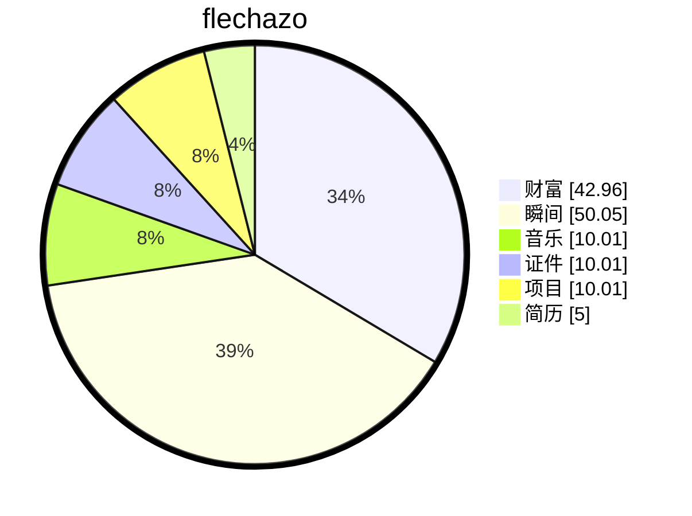

# 缘起

<details open>
    <summary>梦🫧开始的地方</summary>
<p>一切从这里开始</p>
<p>想要把人生梳理的井井有条💮</p>
</details>

# 过往


```article
{
	"tags": "文章",
    "title": "我的日程规划",
    "author": "flechazo",
    "description": " ",
    "url": "http://localhost:3000/blog/wonderful_calendar",
    "timeline": [
        {"time":"2026-03-17", "status":"remember"},
    ],
},
{
	"tags": "文章",
    "title": "足迹",
    "author": "flechazo",
    "description": " ",
    "url": "http://localhost:3000/blog/Wonderful_map",
    "timeline": [
        {"time":"2026-03-17", "status":"remember"},
    ],
},
{
	"tags": "文章",
    "title": "MOS管做开关教程",
    "author": "flechazo",
    "description": " ",
    "url": "https://blog.csdn.net/Mark_md/article/details/118391425?spm=1001.2014.3001.5501",
    "timeline": [
        {"time":"2026-04-17", "status":"remember"},
    ],
},
```


# 缘落


