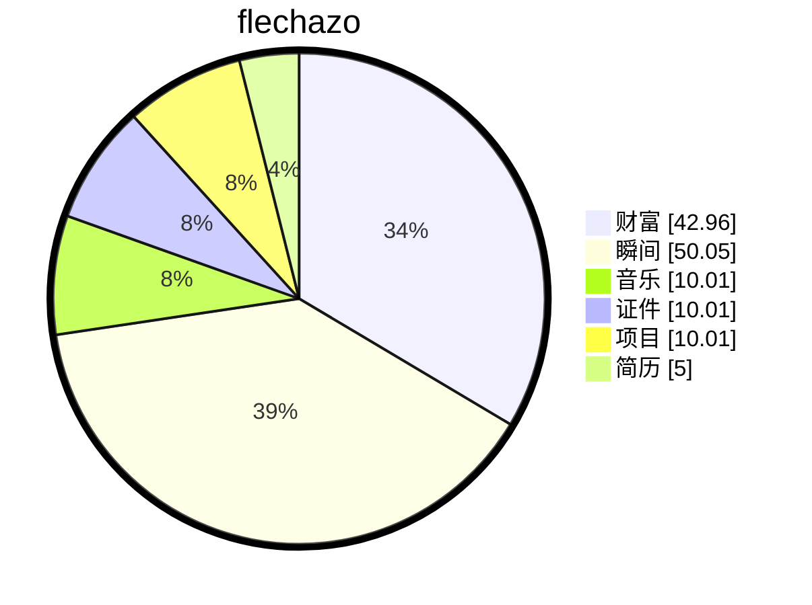

# 缘起

<details open>
    <summary>梦🫧开始的地方</summary>
<p>一切从这里开始</p>
<p>想要把人生梳理的井井有条💮</p>
</details>

# 过往


```video

{
	"tags": "视频",
    "title": "原来陪玩也有讲究，新手爸妈如何有效陪玩？",
    "author": "flechazo",
    "description": " ",
    "url": "https://www.xiaohongshu.com/explore/69ae9c5300000000150220fe?app_platform=android&ignoreEngage=true&app_version=9.21.0&share_from_user_hidden=true&xsec_source=app_share&type=video&xsec_token=CBZPN-bcpb5t9Ore7KRqpB7PnG_N9WdFJcOA8pDjTu0OI=&author_share=1&xhsshare=&shareRedId=N0gyQUVIRko6TEZFSkoyOztHS0xIOEk5&apptime=1773533775&share_id=96094c05388f460081fce23af80bebc1&share_channel=wechat&wechatWid=873c0e1bbab5ccd688f6b671637f6aa6&wechatOrigin=menu",
    "timeline": [
        {"time":"2026-03-17", "status":"remember"},
    ],
},
{
	"tags": "视频",
    "title": "爸爸的陪伴到底有多重要？",
    "author": "flechazo",
    "description": " ",
    "url": "https://www.xiaohongshu.com/explore/69b3310a00000000260322a6?app_platform=android&ignoreEngage=true&app_version=9.21.0&share_from_user_hidden=true&xsec_source=app_share&type=video&xsec_token=CBiEmGVmHuwMvQs_vsgsKR6O28PkvkIMCICjerJdblxkM=&author_share=1&xhsshare=&shareRedId=N0gyQUVIRko6TEZFSkoyOztHS0xIOEk5&apptime=1773533842&share_id=cd1e3d46aaa34bdeb1abc80be86b7bb5&share_channel=wechat&wechatWid=873c0e1bbab5ccd688f6b671637f6aa6&wechatOrigin=menu",
    "timeline": [
        {"time":"2026-03-17", "status":"remember"},
    ],
},
{
	"tags": "视频",
    "title": "换个视角，一下就明白孩子为什么总要抱抱了",
    "author": "flechazo",
    "description": " ",
    "url": "https://www.xiaohongshu.com/explore/699d7cde000000001a02c20b?app_platform=android&ignoreEngage=true&app_version=9.21.0&share_from_user_hidden=true&xsec_source=app_share&type=video&xsec_token=CBQctZJjjn08mqMILLivVqKfdN3YJy5HcXUdrWKkifVnE=&author_share=1&xhsshare=&shareRedId=N0gyQUVIRko6TEZFSkoyOztHS0xIOEk5&apptime=1773536343&share_id=4ff277ee6a414f2084233ebd4c74e3bc&share_channel=wechat&wechatWid=873c0e1bbab5ccd688f6b671637f6aa6&wechatOrigin=menu",
    "timeline": [
        {"time":"2026-03-17", "status":"remember"},
    ],
},
{
	"tags": "视频",
    "title": "情侣能否走到最后，看这5次磨合",
    "author": "flechazo",
    "description": " ",
    "url": "https://www.douyin.com/video/7637071171117624442",
    "timeline": [
        {"time":"2026-05-10", "status":"remember"},
    ],
},
{
	"tags": "视频",
    "title": "顶级沟通力：不是会说，而是按顺序说！——纳瓦尔·拉维坎特",
    "author": "flechazo",
    "description": " ",
    "url": "https://www.douyin.com/video/7628533310754475270",
    "timeline": [
        {"time":"2026-05-10", "status":"remember"},
    ],
},
{
	"tags": "视频",
    "title": "和孩子说话要清晰明确的指令，少说“小心点”这种空洞警告！",
    "author": "flechazo",
    "description": " ",
    "url": "https://www.douyin.com/video/7629712069679868261",
    "timeline": [
        {"time":"2026-05-10", "status":"remember"},
    ],
},

```


# 缘落


