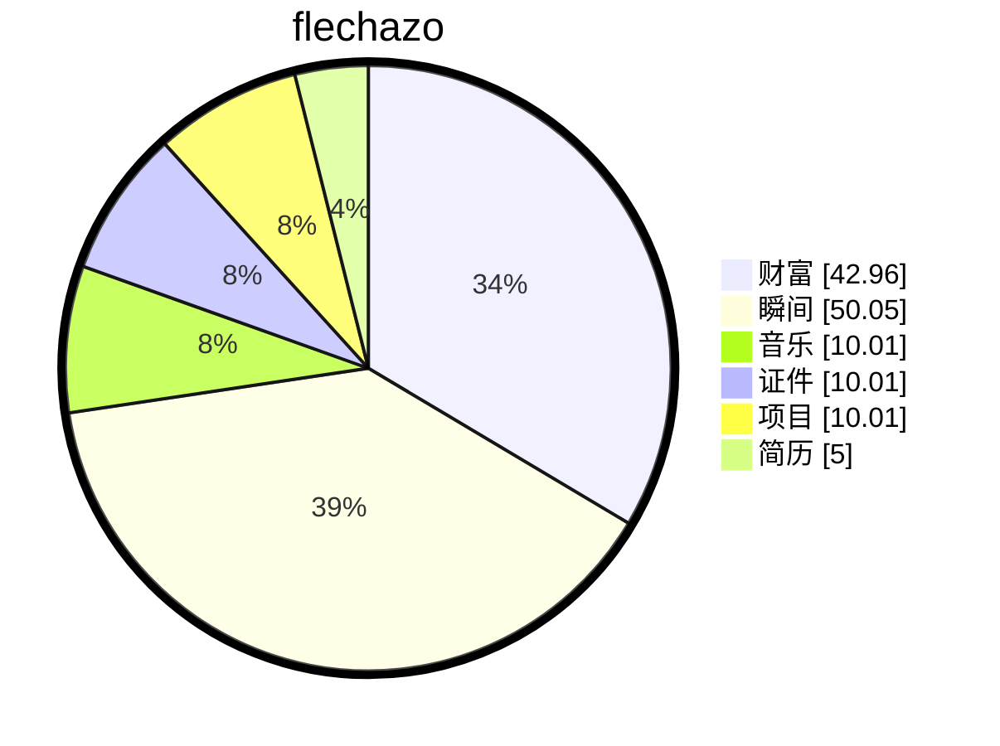

# 缘起

<details open>
    <summary>梦🫧开始的地方</summary>
<p>一切从这里开始</p>
<p>想要把人生梳理的井井有条💮</p>
</details>
# 过往


```plan

{
	"tags": "计划",
    "title": "英语学习",
    "author": "flechazo",
    "description": " ",
    "url": "http://localhost:3000/",
    "timeline": [
        {"time":"2026-03-17", "status":"remember"},
    ],
},
{
	"tags": "计划",
    "title": "学习HipHop舞蹈",
    "author": "flechazo",
    "description": " ",
    "url": "http://localhost:3000/",
    "timeline": [
        {"time":"2026-03-17", "status":"remember"},
    ],
},
{
	"tags": "计划",
    "title": "兴趣班",
    "author": "flechazo",
    "description": "每次假期可以报名一个兴趣班，或者参加一个体验课，或是户外运动",
    "url": "http://localhost:3000/",
    "timeline": [
        {"time":"2026-03-17", "status":"remember"},
    ],
},
{
	"tags": "计划",
    "title": "定期理财",
    "author": "flechazo",
    "description": "坚持到利息可以覆盖生活支出",
    "url": "http://localhost:3000/",
    "timeline": [
        {"time":"2026-03-17", "status":"remember"},
    ],
},
{
	"tags": "计划",
    "title": "个人项目",
    "author": "flechazo",
    "description": "实现自己的个人项目",
    "url": "http://localhost:3000/",
    "timeline": [
        {"time":"2026-03-17", "status":"remember"},
    ],
},
{
	"tags": "计划",
    "title": "考证",
    "author": "flechazo",
    "description": "参加各种考试,证书越多越好",
    "url": "http://localhost:3000/",
    "timeline": [
        {"time":"2026-03-17", "status":"remember"},
    ],
},
{
	"tags": "计划",
    "title": "创业",
    "author": "flechazo",
    "description": "在政府提供的创业平台上就可以拿到资金。如微信小程序《临港创客之家》",
    "url": "http://localhost:3000/",
    "timeline": [
        {"time":"2026-05-10", "status":"remember"},
    ],
},

```


# 缘落


