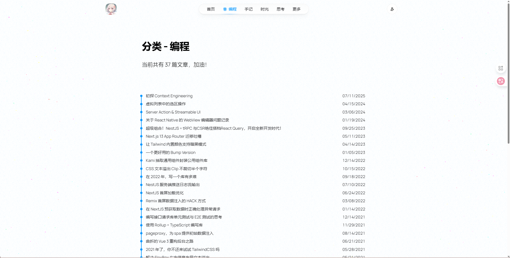
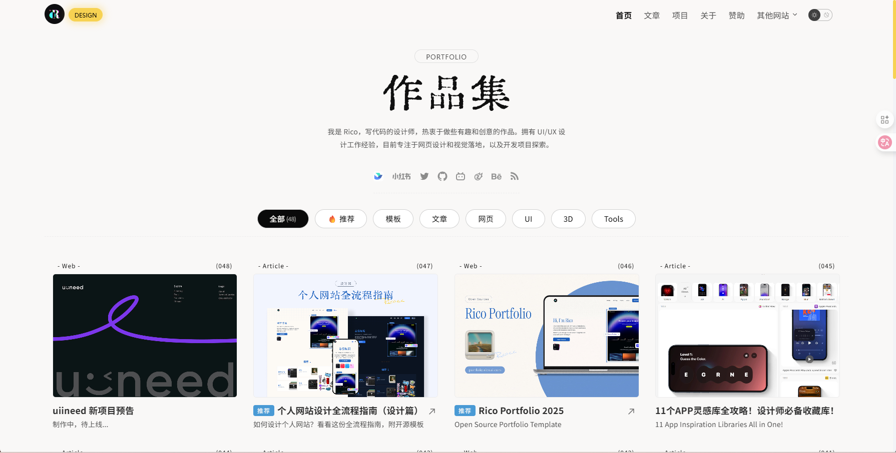
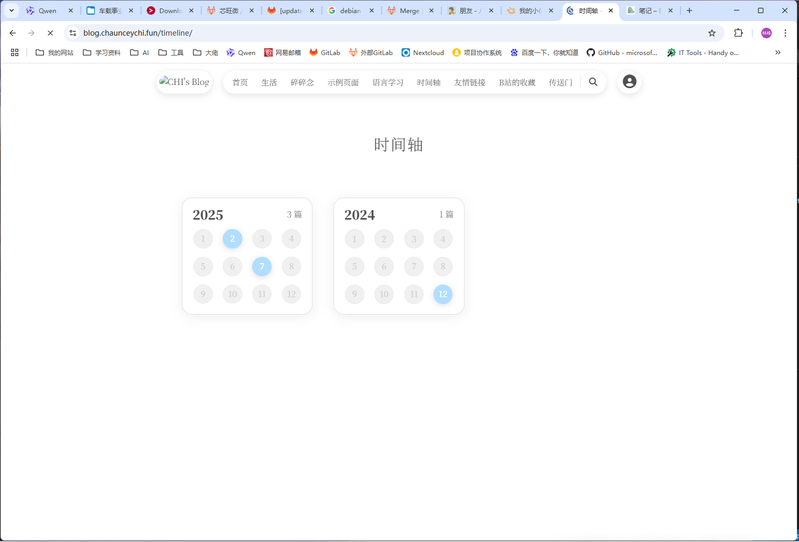
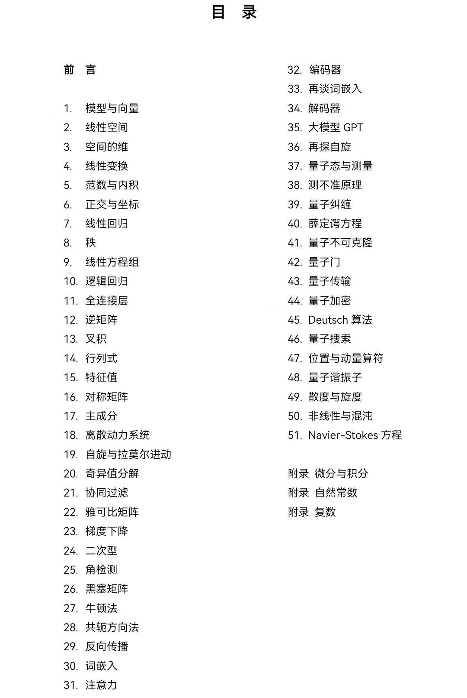
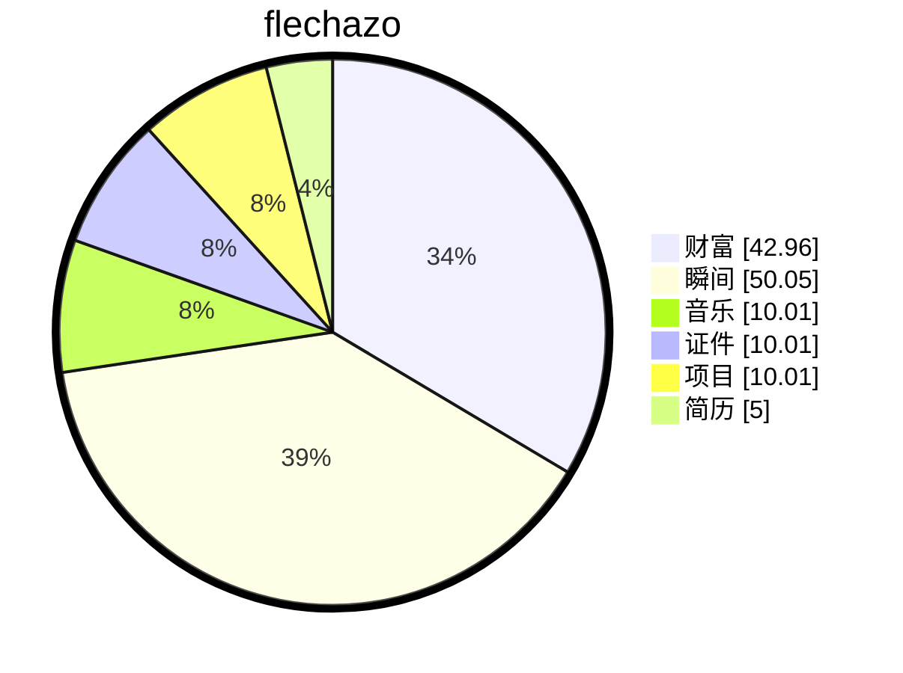

# 缘起

    
梦🫧开始的地方

一切从这里开始

想要把人生梳理的井井有条💮

# 计划

## 英语

- [x] 英语学习

  - [x] 墨墨背单词继续坚持

## 事业

- [x] 个人博客的blog首页可以上面是几个常用的页面导航，下面是我的个人简历
- [x] 加一个markdown的头部元素检查补全工具
- [x] 文章关联一下map页面的地点
- [x] 买一个服务器，搭建内网穿透，最后本地电脑搭建gitea，cloudreve
- [ ] CCOS中实现DH算法
  - [ ] 先开始移植到STM32F103吧
  - [ ] https://xiaolincoding.com/network/2_http/https_ecdhe.html#dh-%E7%AE%97%E6%B3%95实现一下
  - [ ] https://www.cnblogs.com/qiuluoyuweiliang/category/2237744.html这里的算法C语言实现一下
  - [ ] 关于一个定时保护的机制实现，也就是说每个线程都会有一个记录值，这个值根据卡尔曼滤波来预测或者说去计算当前的运行事件，当运行超过10次之后，会有一个曲线，那用户可定义这个事件的突然变长异常的情况，也可以用户输入预期执行时长
  - [ ] 写一个树的机制
  - [ ] 既然有了数学中的各种计算方法，那么神奇的时候来了，我可以实现很多种高效的数学算法
    - [ ] 公式化简
    - [ ] 等效替换
    - [ ] 求解方程
    - [ ] 画图
    - [ ] 求极限
    - [ ] 求导数
  
- [ ] 继续我之前的cCar项目，拆解了多个模块，这些都拆分为单独的项目，今后复用
  - [x] 电源模块
    - [x] 原理图设计
    - [x] 打板子
    - [x] 调试
    - [ ] 加一个控制引脚，用来控制是否对外供电（为了方便后期远程控制）
    
  - [ ] 拓展坞模块
    - [x] 重新用CH634X画
    - [x] 打板子
    - [ ] 焊接调试
  - [ ] 无刷电机
    - [x] 这里我画的板子有问题，重新参考官方的参考电路
    - [x] 打板子
    - [ ] 焊接调试
  - [ ] 按键模块
    - [x] 按键版本
      - [ ] 打板子
    - [x] 触摸版本
      - [x] 打板子
      - [ ] 焊接调试
  - [ ] 通信模块
    - [x] USB转串口
      - [ ] 打板子

    - [ ] USB转网口

- [ ] 整理OS的特性，然后重构CCOS，灵活、轻便、服务化等等
- [ ] 坚持优化我的cblog
  - [ ] 开源一下我的个人博客，写一下readme，截屏一下博客的功能
  - [ ] 大佬https://innei.in/
  - [x] 滚动轴优化
  - [ ] 侧边栏添加一个收起的按钮
  - [ ] 分类页面可以搞成这样，简单清晰民了
  - [ ] 文章列表页面可以优化成这样

- [ ] 博客时间轴样式优化加入一些图片（不加也行）

  - [ ] 
- [ ] 写一个日志或者说性能运行分析库，可以在终端上显示各种信息
- [ ] 可以做一个好的MBTI界面
- [ ] 穿戴式AI眼镜
- [ ] 任意聊天软件，可以在命令行聊天，需要验证，搜索好友等等一系列功能
- [ ] 可以序列化数据以及功能，刚才试了一下，AI可以按照要求获取用户输入然后输出对应的json格式数据，那有了json之后就需要解析一下，然后拿到里面的指令去执行就好了，这一点是可以实现的，所以我的重点就在要创建一个映射的方式，一个配置，告诉AI我有哪些功能是给到它的，那么他就可以根据用户的自然语言给我生成一组json或者其他格式的数据，我就可以按照它返回的数据去执行，之后就可以研究一下怎么用嵌入式板子跑一下小的AI
- [ ] 准备用git submodule重构所有的项目

## 工作

- [ ] 以太网学习

  - [ ] 这里ISO7层模型全部都学习一下，找一些视频看一下吧
  - [ ] 把ISO网络七层模型吃透，出一个系列吧
- [ ] SOA学习SOME/IP或者DDS以及ROS这些

  - [ ] 这里主要是学习各种服务发现
  - [ ] https://some-ip.com/standards.shtml 把这里的协议下载一下学习
- [ ] 多接触一下C++吧
- [ ] 激光雷达，摄像头，等等各种传感器玩一下

  - [ ] 这个看看到时候还是买一个linux开发板，或者买模块玩一下

## 爱好

- [ ] 公共营养师，心理咨询师，全媒体运营师，执业药师
- [ ] 下次假期可以报一个短期的兴趣培训班，学习一个有意义的技能
- [ ] 直接开始开店做一个普通的灯开始，然后做一个磁悬浮灯
- [ ] 我可以思考一下，设计一套流程来规范函数的实现，去生成模板，或者说去通过函数映射执行
- [ ] 就是说要用ai帮我筛选信息，替代平台的恶心的算法，做一款抖音精选，ai去抖音里找对应的优质内容，用户选择自己的喜好，ai破除知识茧房
- [ ] 给自己考虑止盈5个点吧，不要追求多，只要每次都涨了5个点就卖，最终是赚钱的
- [ ] 1.早上7点00，起床锻炼20分钟
  2.早上7点30，英语口语30分钟
  3.晚上8点00，学习跳舞30分钟
  4.晚上10点00，代码2小时软考，自己的开源项目，博客
- [ ] 做一个计划清单，然后每次做完一个计划就把那个计划清单打上勾之后呢？那个计划清单可以链接到对应的文章。文章里面是我们去做这个项目做的拍的照片。
- [ ] 数学学习

# 缘落

