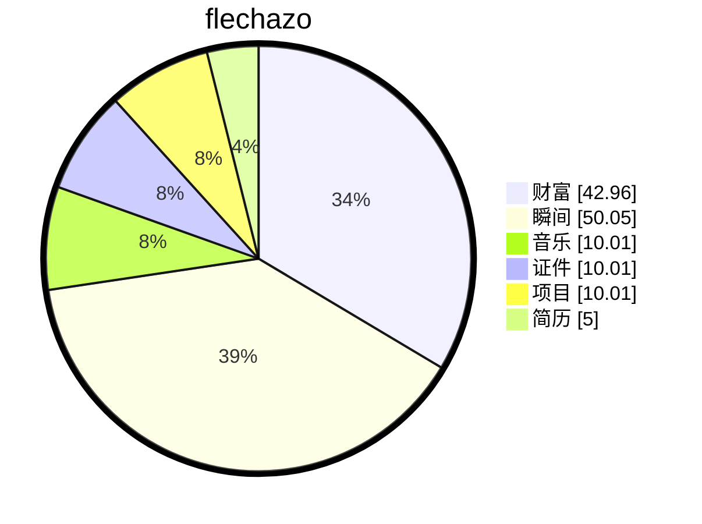

# 缘起

    
梦🫧开始的地方

一切从这里开始

想要把人生梳理的井井有条💮

# 计划

> 参考2025计划

## 个人提升

### 英语

- [x] 墨墨背单词继续坚持
- [ ] 跟读英语句子

### 情商与口才

- [x] 每天看一遍情商笔记
- [ ] 每晚拍视频念稿子
- [ ] 每晚拍摄脱稿分享视频

### 跳舞与健身

- [x] 每天早上仰卧起坐20个俯卧撑20个
- [x] 每天晚上跟练舞蹈一个

## 事业

### CCOS

- [ ] 整理OS的特性，然后重构CCOS，灵活、轻便、服务化等等
  - [ ] 函数接口都实现成一个list，支持用户注入多个初始化序列

- [x] 实现DH算法RSA
- [ ] 优化命令行交互
- [x] 加一下版本号机制
- [x] 引出一个mainfunction到各个模块
- [x] 每一个模块内部实现自己的cmd，然后由cmd模块统一调用，或者注册
- [x] 先开始移植到STM32F103吧
- [x] https://xiaolincoding.com/network/2_http/https_ecdhe.html#dh-%E7%AE%97%E6%B3%95实现一下
- [ ] https://www.cnblogs.com/qiuluoyuweiliang/category/2237744.html这里的算法C语言实现一下
- [ ] 关于一个定时保护的机制实现，也就是说每个线程都会有一个记录值，这个值根据卡尔曼滤波来预测或者说去计算当前的运行事件，当运行超过10次之后，会有一个曲线，那用户可定义这个事件的突然变长异常的情况，也可以用户输入预期执行时长
- [ ] 写一个树的机制
- [ ] 既然有了数学中的各种计算方法，那么神奇的时候来了，我可以实现很多种高效的数学算法
  - [ ] 公式化简
    - [ ] 等效替换
    - [ ] 求解方程
    - [ ] 画图
    - [ ] 求极限
    - [ ] 求导数
- [ ] 写一个日志或者说性能运行分析库，可以在终端上显示各种信息
- [ ] 每个服务要有一个基本的自测接口，然后内核提供一个接口可以直接执行指定服务的自测
- [ ] 可以搞一个flash的环形存储printf来记录日志，之后可以通过工具读出
- [ ] 模式切换的时候可以搞一个事件通知列表去给其他模块注册
- [ ] 多重用一些代码，优化
  - [ ] 依赖注入列表
  - [ ] 初始化列表注入
  - [ ] 周期函数列表注入
  - [ ] 列表排序
  - [ ] 根据结构体中的某个元素排序

### cCar

- [ ] 决定先快速把原型做出来吧，不纠结完全自研
  
- [x] 电源模块
  - [x] 加一个控制引脚，用来控制是否对外供电（为了方便后期远程控制）
    - [ ] cCar_PowerV4.0等待焊接测试
  
- [x] 拓展坞模块
  - [x] 焊接调试
  - [x] 目前UP和P1交换之后就可以用了
  - [x] 下次调整时候，记得把芯片扭一下，引线会顺畅很多
  - [ ] cCar_USBHubV2.0待焊接测试
- [x] 无刷电机
  - [x] 焊接调试
  - [x] DRV8303画的有问题，电和地直接就是短路的（这里应该没问题）
  - [ ] DRV8313板子待贴片测试
- [ ] 按键模块
  - [x] 按键版本
    - [ ] 打板子
  - [x] 触摸版本
    - [x] 焊接调试

- [ ] 通信模块
  - [x] USB转串口
    - [ ] 打板子
  
  - [ ] USB转网口

### cblog

- [x] 右下角加一个配置选项吧
- [x] 侧边栏添加一个收起的按钮
- [ ] 把颜色抽取一下，从我的颜色库里取
- [ ] 分类页面优化一下，清晰明了
- [ ] 文章列表页面优化
- [ ] 博客时间轴样式优化
- [ ] cblog可以加入一些小工具
  1、税后收入计算器
  2、ASCII转换
  3、各种好看的颜色取值
- [x] 加一下艾宾浩斯遗忘曲线，来记录事情，视频，感悟等等
  - [ ] 创建一个手机软件界面
  - [ ] 主要功能就是记录日常生活中遇到的所有值得记录的事情
  - [ ] 痛点是当今社会很多短视频看了就忘，很多知识过了就忘记，很多计划列出来就吃灰
  - [ ] 1、主界面，包含一句精美的励志的短句，然后下面有一个最近需要复习的艾宾浩斯计划
  - [ ] 2、列表，可以按照日期或者类型或者重要级别来筛选已经加入艾宾浩斯遗忘曲线记忆的事件
  - [ ] 3、分类，可以添加管理分类
  - [ ] 4、AI，支持AI一键导入记忆
  - [ ] 5、我的，支持查看我的等级，积分，会员，好友，朋友圈等等信息
  - [ ] 6、支持读取手机剪切板，然后解析对应剪切板里的内容，快速生成一个待加入艾宾浩斯列表让用户去确认

- [x] 添加一个日程页面
- [x] 实现一个日程邮箱提醒
  - [ ] 这个要直接创建5个，然后没次都是日程的前5天开始每天都要提醒的

- [ ] 加一下右键
- [ ] 做一个计划清单，然后每次做完一个计划就把那个计划清单打上勾之后呢？那个计划清单可以链接到对应的文章。文章里面是我们去做这个项目做的拍的照片。
- [ ] 可以做一个好的MBTI界面
- [ ] 给博客加上后台管理系统
- [ ] https://liruifengv.com/posts/amon-announce/这个颜色很护眼可以的

### 其他

- [ ] 回头去找医院找中医推拿一下
- [ ] 研究研究，给淘宝店接入AI
- [ ] 研究一下AI视频吧，融合最近很火的角色，弄一个可爱搞笑版本的，每次出新的火的角色，就让这个大家庭加一个新的成员
- [ ] 研究一下USB协议吧，看看把桌面上带线束的全部砍掉，弄成无线的
- [ ] 穿戴式AI眼镜
- [ ] 任意聊天软件，可以在命令行聊天，需要验证，搜索好友等等一系列功能
- [ ] 可以序列化数据以及功能，刚才试了一下，AI可以按照要求获取用户输入然后输出对应的json格式数据，那有了json之后就需要解析一下，然后拿到里面的指令去执行就好了，这一点是可以实现的，所以我的重点就在要创建一个映射的方式，一个配置，告诉AI我有哪些功能是给到它的，那么他就可以根据用户的自然语言给我生成一组json或者其他格式的数据，我就可以按照它返回的数据去执行，之后就可以研究一下怎么用嵌入式板子跑一下小的AI
- [ ] 准备用git submodule重构所有的项目
- [ ] 开饭店可以加一个座位传感器和灯牌，远程就能查看座位有没有人，可以远程预定座位，直接点好餐去吃
- [ ] AI可以做个人全面管家

  - [ ] 我要做一个AI平台，用户可以自己接入设备，比如手环，手机，电脑，体重秤啊然后根据这些输入，AI实时的推理

  - 感知层：手机/手表（位置、步数、心率）、摄像头/麦克风（姿态、场景）、室内传感器（运动、温湿度）、电脑端插件（写代码/
    工作状态）

  - 事件与上下文层：把“原始数据”变成事件（久坐>60min、用药时间到、正在做饭等），并做多源融合

  - 个人知识库：结构化存储你的资料（生日、作息、过敏史、习惯）和长期趋势（皮肤状态、睡眠、运动）

  - 推理与策略层：规则 + 机器学习混合，决定“是否提醒、何时提醒、用什么方式提醒”

  - 执行层：调用日程、闹铃、智能家居、机器人、手机通知
- 模块复用，功能独立等等，做出来的大多数东西都要做到抽取复用
- 拆架构，一方面可以分工合作，职责分明，单独升级
- 整体：微服务
  主体：功能模块＋生命周期
  按照，时间，空间，去设计模式切换
- 模式切换，注意高并发，重入，缓冲序列，等
- 构建好一个自动化测试脚本，搞好CICD
- 研究一下figma设计的直接融入react博客
- 做一个hex合并工具吧
- 之前的cbyte工具开源一下
- 项目开始，可以有3天阅读文档学习时间，之后2天大家交流讲解各自看的内容
- 做一个AI记事本，主打一个方便记录，IG，或者AIBen，语音输入，然后AI分析，然后返回记录的内容，记账或者记事超级方便，打开软件，自然语言说一遍，AI分析完成之后，就可以自动记录
- 做事情之前，先梳理好架构，不要太偏，AI梳理，人工确认，最后去并行推进
- 一个系统，终将走向复杂，所以最开始可以不实现，但是不能没有架子，可以先搭出来，不去实现

## 工作

- [x] 以太网学习

  - [ ] 这里ISO7层模型全部都学习一下，找一些视频看一下吧
  - [ ] 把ISO网络七层模型吃透，出一个系列吧
- [ ] SOA学习SOME/IP或者DDS以及ROS这些

  - [ ] 这里主要是学习各种服务发现
  - [ ] https://some-ip.com/standards.shtml 把这里的协议下载一下学习
- [ ] 多接触一下C++吧
- [ ] 激光雷达，摄像头，等等各种传感器玩一下

  - [ ] 这个看看到时候还是买一个linux开发板，或者买模块玩一下

## 爱好

- [ ] 公共营养师，心理咨询师，全媒体运营师，执业药师
- [ ] 下次假期可以报一个短期的兴趣培训班，学习一个有意义的技能
- [ ] 直接开始开店做一个普通的灯开始，然后做一个磁悬浮灯
- [ ] 我可以思考一下，设计一套流程来规范函数的实现，去生成模板，或者说去通过函数映射执行
- [ ] 就是说要用ai帮我筛选信息，替代平台的恶心的算法，做一款抖音精选，ai去抖音里找对应的优质内容，用户选择自己的喜好，ai破除知识茧房
- [ ] 给自己考虑止盈5个点吧，不要追求多，只要每次都涨了5个点就卖，最终是赚钱的
- [ ] 数学学习

# 缘落

